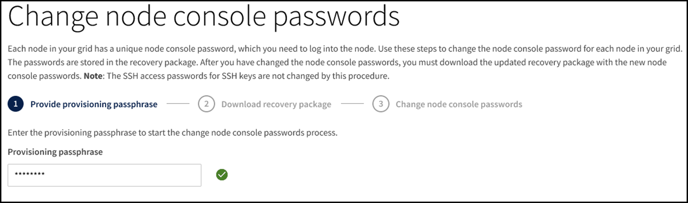

= Ändern der Passwörter für die Node-Konsole
:allow-uri-read: 
:icons: font
:imagesdir: ../media/

[role="lead"]
Jeder Node in Ihrem Raster verfügt über ein eindeutiges Node-Konsolenpasswort, das Sie sich beim Node einloggen müssen. Verwenden Sie diese Schritte, um jedes eindeutige Node-Konsolenpasswort für jeden Node im Raster zu ändern.

.Was Sie benötigen
* Sie sind mit einem bei Grid Manager angemeldet xref:../admin/web-browser-requirements.adoc[Unterstützter Webbrowser].
* Sie haben die Berechtigung Wartung oder Stammzugriff.
* Sie haben die aktuelle Provisionierungs-Passphrase.

.Über diese Aufgabe
Verwenden Sie das Node-Konsolenpasswort, um sich mit SSH bei einem Knoten als „admin“ oder beim Root-Benutzer einer VM/physischen Konsolenverbindung anzumelden. Mit dem Passwort für die Änderungsknotenkonsole werden für jeden Knoten in der Tabelle neue Passwörter erstellt und die Passwörter in einem aktualisierten System gespeichert `Passwords.txt` Datei im Wiederherstellungspaket. Die Passwörter sind in der Spalte Passwort in der Datei Passwords.txt aufgelistet.

NOTE: Separate SSH-Zugriffskennwörter für die SSH-Schlüssel, die für die Kommunikation zwischen den Nodes verwendet werden. Die SSH-Zugriffskennwörter werden durch dieses Verfahren nicht geändert.

== Greifen Sie auf den Assistenten zu

. Wählen Sie *KONFIGURATION* *Zugriffskontrolle* *Grid-Passwörter*.
+
image::../media/grid_password_change_node_console.png[Grid-Passwörter]

. Wählen Sie * Ändern* unter *Ändern Knotenkonsolenpasswörter*.

== Geben Sie die Provisionierungs-Passphrase ein

. Geben Sie Ihre Provisionierungs-Passphrase ein.
+

. Wählen Sie *Weiter*.

== Laden Sie das aktuelle Wiederherstellungspaket herunter

. Wählen Sie *Wiederherstellungspaket herunterladen*.
+
Sie können die alten Passwörter im aktuellen Wiederherstellungspaket verwenden, wenn der Passwortänderungsprozess für jeden Knoten fehlschlägt.

+
image::../media/node-console-download-current-recovery-package.png[Laden Sie das aktuelle Wiederherstellungspaket herunter]

. Kopieren Sie die Recovery Package-Datei (.zip) an zwei sichere und getrennte Speicherorte.
+

CAUTION: Die Recovery Package-Datei muss gesichert sein, weil sie Verschlüsselungsschlüssel und Passwörter enthält, die zum Abrufen von Daten vom StorageGRID-System verwendet werden können.

. Wählen Sie *Weiter*.

== Ändern der Passwörter für die Node-Konsole

. Wählen Sie *Ja* aus, um zu bestätigen, dass Sie die Passwörter für die Knotenkonsole ändern möchten.
+
image::../media/node-console-start-passwords-change.png[Kennwortänderung starten]

+
Wenn Sie *Ja* wählen, wird mit den neuen Kennwörtern ein neues Wiederherstellungspaket generiert. Es kann einige Minuten dauern, bis das neue Wiederherstellungspaket mit den neuen Passwörtern generiert wird.

+
Wenn Sie *Abbrechen* wählen, kehren Sie zur vorherigen Seite zurück.

. Wählen Sie *Neues Wiederherstellungspaket herunterladen*.
+
image::../media/node-console-download-new-recovery-package.png[Neue Wiederherstellung package.png herunterladen]

. Wenn der Download abgeschlossen ist:
+
.. Öffnen Sie die ZIP-Datei.
.. Extrahieren Sie den Inhalt der ZIP-Datei.
.. Bestätigen Sie, dass Sie den öffnen können `Passwords.txt` Und dass der Inhalt lesbar ist.

. Kopieren Sie die neue Recovery Package-Datei (.zip) an zwei sichere und getrennte Speicherorte.
+

CAUTION: Überschreiben Sie das alte Wiederherstellungspaket nicht.

+
Sie sollten entweder nur die anzeigen `Passwords.txt` Datei oder falls dies nicht möglich ist, löschen Sie die extrahierten Dateien `Passwords.txt` Datei vor dem Kopieren des Wiederherstellungspakets an die zwei separaten sicheren Speicherorte. Die Recovery Package-Datei muss gesichert sein, weil sie Verschlüsselungsschlüssel und Passwörter enthält, die zum Abrufen von Daten vom StorageGRID-System verwendet werden können.

. Aktivieren Sie das Kontrollkästchen, um anzugeben, dass Sie das neue Wiederherstellungspaket heruntergeladen und den Inhalt überprüft haben.
. Wählen Sie *Passwort der Knotenkonsole ändern* aus, und warten Sie, bis alle Knotenpasswörter aktualisiert werden. Dies kann einige Minuten dauern.
+
Wenn Passwörter für alle Nodes geändert werden, wird ein grünes Erfolgsbanner angezeigt. Fahren Sie mit dem nächsten Schritt fort.

+
Wenn während des Aktualisierungsvorgangs ein Fehler auftritt, zeigt eine Bannermeldung die Anzahl der Knoten an, bei denen die Passwörter nicht geändert wurden. Das System wiederholt den Prozess automatisch auf jedem Knoten, bei dem das Kennwort nicht geändert wurde. Wenn der Prozess endet, wenn einige Knoten noch kein geändertes Kennwort haben, wird die Schaltfläche *Wiederholen* angezeigt.

+
Wenn die Kennwortaktualisierung für einen oder mehrere Knoten fehlgeschlagen ist:

+
.. Überprüfen Sie die in der Tabelle aufgeführten Fehlermeldungen.
.. Beheben Sie die Probleme.
.. Wählen Sie *Wiederholen*.
+

NOTE: Beim erneuten Versuch werden nur die Kennwörter der Knotenkonsole auf den Knoten geändert, die bei früheren Kennwortänderungsversuchen fehlgeschlagen sind.

. Löschen Sie das alte Wiederherstellungspaket, nachdem die Kennwörter der Knotenkonsole für alle Knoten geändert wurden.
. Verwenden Sie optional den Link *Recovery Package*, um eine zusätzliche Kopie des neuen Recovery Package herunterzuladen.

