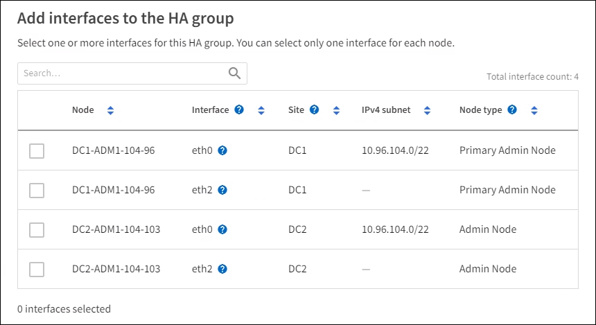
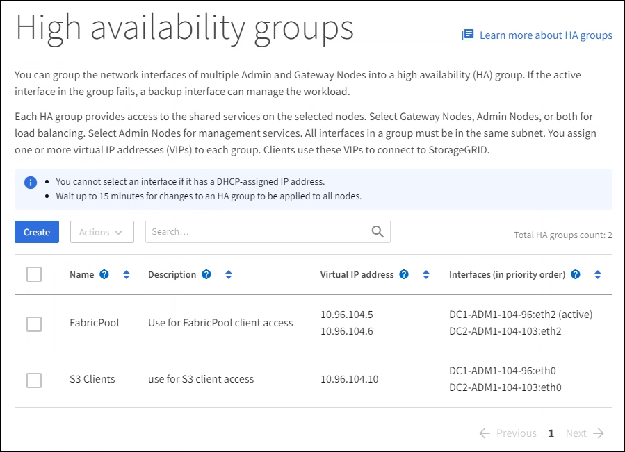

= Konfigurieren Sie Hochverfügbarkeitsgruppen
:allow-uri-read: 
:icons: font
:imagesdir: ../media/

[role="lead"]
Sie können Hochverfügbarkeitsgruppen (High Availability groups, HA-Gruppen) konfigurieren, um hochverfügbaren Zugriff auf die Services in Admin-Nodes oder Gateway-Nodes bereitzustellen.

.Was Sie und#8217;ll benötigen
* Sie sind mit einem bei Grid Manager angemeldet xref:../admin/web-browser-requirements.adoc[Unterstützter Webbrowser].
* Sie haben die Root-Zugriffsberechtigung.
* Wenn Sie eine VLAN-Schnittstelle in einer HA-Gruppe verwenden möchten, haben Sie die VLAN-Schnittstelle erstellt. Siehe xref:../admin/configure-vlan-interfaces.adoc[Konfigurieren Sie die VLAN-Schnittstellen].
* Wenn Sie eine Zugriffsoberfläche für einen Node in einer HA-Gruppe verwenden möchten, haben Sie die Schnittstelle erstellt:
+
** *Red hat Enterprise Linux oder CentOS (vor der Installation des Knotens)*: xref:../rhel/creating-node-configuration-files.adoc[Erstellen von Node-Konfigurationsdateien]
** *Ubuntu oder Debian (vor der Installation des Knotens)*: xref:../ubuntu/creating-node-configuration-files.adoc[Erstellen von Node-Konfigurationsdateien]
** *Linux (nach der Installation des Knotens)*: xref:../maintain/linux-adding-trunk-or-access-interfaces-to-node.adoc[Linux: Hinzufügen von Trunk- oder Zugriffsschnittstellen zu einem Node]
** *VMware (nach der Installation des Knotens)*: xref:../maintain/vmware-adding-trunk-or-access-interfaces-to-node.adoc[VMware: Hinzufügen von Trunk- oder Zugriffsschnittstellen zu einem Node]

== Erstellen Sie eine Hochverfügbarkeitsgruppe

Wenn Sie eine Hochverfügbarkeitsgruppe erstellen, wählen Sie eine oder mehrere Schnittstellen aus und organisieren sie in Prioritätsreihenfolge. Anschließend weisen Sie der Gruppe eine oder mehrere VIP-Adressen zu.

Eine Schnittstelle muss lauten, damit ein Gateway-Node oder ein Admin-Node in einer HA-Gruppe enthalten sein kann. Eine HA-Gruppe kann nur eine Schnittstelle für jeden angegebenen Node verwenden. Jedoch können andere Schnittstellen für denselben Node in anderen HA-Gruppen verwendet werden.

=== Greifen Sie auf den Assistenten zu

. Wählen Sie *KONFIGURATION* *Netzwerk* *Hochverfügbarkeitsgruppen*.
. Wählen Sie *Erstellen*.

=== Geben Sie Details für die HA-Gruppe ein

. Geben Sie einen eindeutigen Namen für die HA-Gruppe ein.
+
image::../media/ha-group-create-wizard.png[Erstellen Sie den Assistenten FÜR HA-Gruppen]

. Geben Sie optional eine Beschreibung für die HA-Gruppe ein.
. Wählen Sie *Weiter*.

=== Fügen Sie der HA-Gruppe Schnittstellen hinzu

. Wählen Sie eine oder mehrere Schnittstellen aus, die dieser HA-Gruppe hinzugefügt werden sollen.
+
Verwenden Sie die Spaltenüberschriften, um die Zeilen zu sortieren, oder geben Sie einen Suchbegriff ein, um Schnittstellen schneller zu finden.

+

+

NOTE: Warten Sie nach dem Erstellen einer VLAN-Schnittstelle bis zu 5 Minuten, bis die neue Schnittstelle in der Tabelle angezeigt wird.

+
.Richtlinien für die Auswahl von Schnittstellen
** Sie müssen mindestens eine Schnittstelle auswählen.
** Sie können nur eine Schnittstelle für einen Node auswählen.
** Wenn die HA-Gruppe den HA-Schutz von Admin Node-Services bietet, zu denen der Grid Manager und der MandantenManager gehören, wählen Sie nur Schnittstellen zu Admin-Nodes aus.
** Wenn die HA-Gruppe einen HA-Schutz für den Client-Datenverkehr von S3 oder Swift bietet, wählen Sie Schnittstellen an Admin-Nodes, Gateway Nodes oder beiden.
** Wenn die HA-Gruppe den HA-Schutz des veralteten CLB-Service bietet, wählen Sie nur Schnittstellen auf Gateway-Nodes aus.
** Wenn Sie Schnittstellen für verschiedene Node-Typen auswählen, wird ein Informationshinweis angezeigt. Sie werden daran erinnert, dass bei einem Failover Dienste, die vom zuvor aktiven Knoten bereitgestellt werden, möglicherweise auf dem neu aktiven Knoten nicht verfügbar sind. Beispielsweise kann ein Backup-Gateway-Node keinen HA-Schutz für Admin-Node-Services bereitstellen. Ebenso kann ein Backup-Admin-Node nicht alle Wartungsvorgänge ausführen, die der primäre Admin-Node bereitstellen kann.
** Wenn Sie keine Schnittstelle auswählen können, ist das Kontrollkästchen deaktiviert. Der QuickInfo enthält weitere Informationen.
+
image::../media/vlan_parent_interface_tooltip.png[Tipp des VLAN Interface-Tools]

** Sie können keine Schnittstelle auswählen, wenn ihr Subnetz-Wert oder Gateway mit einer anderen ausgewählten Schnittstelle in Konflikt steht.
** Sie können keine konfigurierte Schnittstelle auswählen, wenn sie keine statische IP-Adresse hat.

. Wählen Sie *Weiter*.

=== Legen Sie die Prioritätsreihenfolge fest

. Ermitteln Sie die primäre Schnittstelle und alle Backup-Schnittstellen (Failover) für diese HA-Gruppe.
+
Ziehen Sie Zeilen per Drag-and-Drop, um die Werte in der Spalte *Priority Order* zu ändern.

+
image::../media/ha_group_determine_failover.png[HA-Gruppen bestimmen die Prioritätsreihenfolge]

+

IMPORTANT: Wenn die HA-Gruppe Zugriff auf den Grid Manager bietet, müssen Sie eine Schnittstelle am primären Admin-Node als primäre Schnittstelle auswählen. Einige Wartungsvorgänge können nur vom primären Admin-Node ausgeführt werden.

+
Die erste Schnittstelle in der Liste ist die primäre Schnittstelle. Die primäre Schnittstelle ist die aktive Schnittstelle, sofern kein Fehler auftritt.

+
Wenn die HA-Gruppe mehr als eine Schnittstelle umfasst und die primäre Schnittstelle ausfällt, verschieben die VIP-Adressen auf die verfügbare Schnittstelle mit der höchsten Priorität. Wenn diese Schnittstelle ausfällt, werden die VIP-Adressen zur nächsten verfügbaren Schnittstelle mit der höchsten Priorität usw. verschoben.

. Wählen Sie *Weiter*.

=== Geben Sie die IP-Adressen ein

. Geben Sie im Feld *Subnetz CIDR* das VIP-Subnetz in CIDR-Notation an - eine IPv4-Adresse gefolgt von einem Schrägstrich und der Subnetz-Länge (0-32).
+
Die Netzwerkadresse darf keine Host-Bits festgelegt haben. Beispiel: `192.16.0.0/22`.

+

NOTE: Wenn Sie ein 32-Bit-Präfix verwenden, dient die VIP-Netzwerkadresse auch als Gateway-Adresse und VIP-Adresse.

+
image::../media/ha_group_select_virtual_ips.png[HA-Gruppen geben VIPs ein]

. Wenn auf diese VIP-Adressen von S3-, Swift-, Administrations- oder Mandantenclients aus einem anderen Subnetz zugegriffen wird, geben Sie die *Gateway IP-Adresse* ein. Die Gateway-Adresse muss sich im VIP-Subnetz befinden.
+
Client- und Admin-Benutzer verwenden dieses Gateway, um auf die virtuellen IP-Adressen zuzugreifen.

. Geben Sie eine oder mehrere *virtuelle IP-Adressen* für die HA-Gruppe ein. Sie können bis zu 10 IP-Adressen hinzufügen. Alle VIPs müssen sich im VIP-Subnetz befinden.
+
Sie müssen mindestens eine IPv4-Adresse angeben. Optional können Sie weitere IPv4- und IPv6-Adressen angeben.

. Wählen Sie *HA-Gruppe erstellen* und wählen Sie *Fertig*.
+
Die HA-Gruppe wird erstellt. Sie können jetzt die konfigurierten virtuellen IP-Adressen verwenden.

NOTE: Warten Sie bis zu 15 Minuten, bis Änderungen an einer HA-Gruppe auf alle Nodes angewendet werden.

=== Nächste Schritte

Wenn Sie diese HA-Gruppe zum Lastausgleich verwenden möchten, erstellen Sie einen Endpunkt zum Load Balancer, um den Port und das Netzwerkprotokoll zu ermitteln und die erforderlichen Zertifikate anzuschließen. Siehe xref:configuring-load-balancer-endpoints.adoc[Konfigurieren von Load Balancer-Endpunkten].

== Bearbeiten Sie eine Hochverfügbarkeitsgruppe

Sie können eine HA-Gruppe (High Availability, Hochverfügbarkeit) bearbeiten, um ihren Namen und ihre Beschreibung zu ändern, Schnittstellen hinzuzufügen oder zu entfernen, die Prioritätsreihenfolge zu ändern oder virtuelle IP-Adressen hinzuzufügen oder zu aktualisieren.

Beispielsweise müssen Sie möglicherweise eine HA-Gruppe bearbeiten, wenn Sie den Node, der einer ausgewählten Schnittstelle zugeordnet ist, entfernen möchten, wenn Sie ihn an einem Standort ausmustern oder einem Node entfernen möchten.

.Schritte
. Wählen Sie *KONFIGURATION* *Netzwerk* *Hochverfügbarkeitsgruppen*.
+
Auf der Seite „Hochverfügbarkeitsgruppen“ werden alle vorhandenen HA-Gruppen angezeigt.

+

. Aktivieren Sie das Kontrollkästchen für die HA-Gruppe, die Sie bearbeiten möchten.
. Führen Sie einen der folgenden Schritte aus, je nachdem, was Sie aktualisieren möchten:
+
** Wählen Sie *Aktionen* *virtuelle IP-Adresse bearbeiten*, um VIP-Adressen hinzuzufügen oder zu entfernen.
** Wählen Sie *Aktionen* *HA-Gruppe bearbeiten* aus, um den Namen oder die Beschreibung der Gruppe zu aktualisieren, Schnittstellen hinzuzufügen oder zu entfernen, die Prioritätsreihenfolge zu ändern oder VIP-Adressen hinzuzufügen oder zu entfernen.

. Wenn Sie *virtuelle IP-Adresse bearbeiten* ausgewählt haben:
+
.. Aktualisieren Sie die virtuellen IP-Adressen für die HA-Gruppe.
.. Wählen Sie *Speichern*.
.. Wählen Sie *Fertig*.

. Wenn Sie *HA-Gruppe bearbeiten* ausgewählt haben:
+
.. Optional können Sie den Namen oder die Beschreibung der Gruppe aktualisieren.
.. Aktivieren Sie optional die Kontrollkästchen, um Schnittstellen hinzuzufügen oder zu entfernen.
+

NOTE: Wenn die HA-Gruppe Zugriff auf den Grid Manager bietet, müssen Sie eine Schnittstelle am primären Admin-Node als primäre Schnittstelle auswählen. Einige Wartungsvorgänge können nur vom primären Admin-Node ausgeführt werden

.. Ziehen Sie optional Zeilen mit Drag-and-Drop, um die Prioritätsreihenfolge der primären Schnittstelle und aller Backup-Schnittstellen für diese HA-Gruppe zu ändern.
.. Optional können Sie die virtuellen IP-Adressen aktualisieren.
.. Wählen Sie *Speichern* und dann *Fertig stellen*.

NOTE: Warten Sie bis zu 15 Minuten, bis Änderungen an einer HA-Gruppe auf alle Nodes angewendet werden.

== Entfernen Sie eine Hochverfügbarkeitsgruppe

Sie können eine oder mehrere HA-Gruppen (High Availability, Hochverfügbarkeit) gleichzeitig entfernen. Sie können jedoch keine HA-Gruppe entfernen, wenn sie an einen oder mehrere Load Balancer-Endpunkte gebunden ist.

Um Client-Unterbrechungen zu vermeiden, aktualisieren Sie die betroffenen S3- oder Swift-Client-Applikationen, bevor Sie eine HA-Gruppe entfernen. Aktualisieren Sie jeden Client, um eine Verbindung über eine andere IP-Adresse herzustellen, z. B. die virtuelle IP-Adresse einer anderen HA-Gruppe oder die IP-Adresse, die während der Installation für eine Schnittstelle konfiguriert wurde.

.Schritte
. Wählen Sie *KONFIGURATION* *Netzwerk* *Hochverfügbarkeitsgruppen*.
. Aktivieren Sie das Kontrollkästchen für jede HA-Gruppe, die Sie entfernen möchten. Wählen Sie dann *Aktionen* *HA-Gruppe entfernen*.
. Überprüfen Sie die Nachricht und wählen Sie *HA-Gruppe löschen*, um Ihre Auswahl zu bestätigen.
+
Alle von Ihnen ausgewählten HA-Gruppen werden entfernt. Ein grünes Banner wird auf der Seite „Hochverfügbarkeitsgruppen“ angezeigt.

