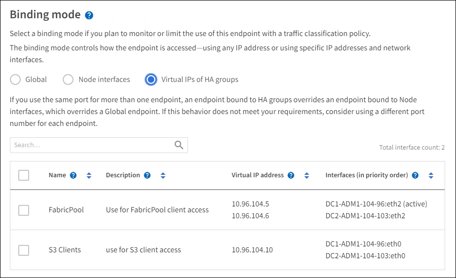

= Konfigurieren von Load Balancer-Endpunkten
:allow-uri-read: 
:icons: font
:imagesdir: ../media/

[role="lead"]
Load Balancer-Endpunkte bestimmen die Ports und Netzwerkprotokolle S3 und Swift-Clients können beim Herstellen einer Verbindung zum StorageGRID Load Balancer auf Gateway und Admin-Nodes verwendet werden.

.Was Sie und#8217;ll benötigen
* Sie sind mit einem bei Grid Manager angemeldet xref:../admin/web-browser-requirements.adoc[Unterstützter Webbrowser].
* Sie haben die Root-Zugriffsberechtigung.
* Wenn Sie zuvor einen Port neu zugeordnet haben, den Sie für den Load Balancer-Endpunkt verwenden möchten, haben Sie diesen xref:../maintain/removing-port-remaps.adoc[Port-Remap wurde entfernt].
* Sie haben alle Hochverfügbarkeitsgruppen (High Availability groups, die Sie verwenden möchten, erstellt. HA-Gruppen werden empfohlen, jedoch nicht erforderlich. Siehe xref:managing-high-availability-groups.adoc[Management von Hochverfügbarkeitsgruppen].
* Wenn der Endpunkt des Load Balancer von verwendet wird xref:../admin/manage-s3-select-for-tenant-accounts.adoc[S3 Mandanten für S3 Select], Es darf die IP-Adressen oder FQDNs von Bare-Metal-Knoten nicht verwenden. Für die bei S3 Select verwendeten Load Balancer-Endpunkte sind nur SG100- oder SG1000-Appliances und VMware-basierte Software-Nodes zulässig.
* Sie haben alle VLAN-Schnittstellen konfiguriert, die Sie verwenden möchten. Siehe xref:configure-vlan-interfaces.adoc[Konfigurieren Sie die VLAN-Schnittstellen].
* Wenn Sie einen HTTPS-Endpunkt erstellen (empfohlen), haben Sie die Informationen für das Serverzertifikat.
+

NOTE: Änderungen an einem Endpunktzertifikat können bis zu 15 Minuten dauern, bis sie auf alle Knoten angewendet werden können.

+
** Zum Hochladen eines Zertifikats benötigen Sie das Serverzertifikat, den privaten Zertifikatschlüssel und optional ein CA-Bundle.
** Zum Generieren eines Zertifikats benötigen Sie alle Domain-Namen und IP-Adressen, die S3- oder Swift-Clients für den Zugriff auf den Endpunkt verwenden. Sie müssen auch das Thema (Distinguished Name) kennen.
** Wenn Sie das StorageGRID S3- und Swift-API-Zertifikat verwenden möchten (das auch für direkte Verbindungen zu Speicherknoten verwendet werden kann), haben Sie das Standardzertifikat bereits durch ein benutzerdefiniertes Zertifikat ersetzt, das von einer externen Zertifizierungsstelle signiert ist. Siehexref:../admin/configuring-custom-server-certificate-for-storage-node-or-clb.adoc[Konfigurieren von S3- und Swift-API-Zertifikaten].
+
Das Zertifikat kann Platzhalter verwenden, um die vollständig qualifizierten Domänennamen aller Admin-Nodes und Gateway-Nodes darzustellen, auf denen der Load Balancer Service ausgeführt wird. Beispiel: `*.storagegrid._example_.com` Verwendet den Platzhalter * für die Darstellung `adm1.storagegrid._example_.com` Und `gn1.storagegrid._example_.com`. Siehe xref:configuring-s3-api-endpoint-domain-names.adoc[Konfigurieren von S3-API-Endpunkt-Domain-Namen].

== Erstellen Sie einen Endpunkt für den Load Balancer

Jeder Load Balancer-Endpunkt gibt einen Port, einen Client-Typ (S3 oder Swift) und ein Netzwerkprotokoll (HTTP oder HTTPS) an.

=== Greifen Sie auf den Assistenten zu

. Wählen Sie *KONFIGURATION* *Netzwerk* *Load Balancer-Endpunkte* aus.
. Wählen Sie *Erstellen*.

=== Geben Sie Details zu Endpunkten ein

. Geben Sie Details für den Endpunkt ein.
+
image::../media/load_balancer_endpoint_create_http.png[LB-Endpunkt erstellen]

+
[cols="1a,3a"]
|===
| Feld | Beschreibung 

 a| 
Name
 a| 
Ein beschreibbarer Name für den Endpunkt, der in der Tabelle auf der Seite Load Balancer Endpunkte angezeigt wird.

 a| 
Port
 a| 
Die Port-Clients werden zum Herstellen einer Verbindung zum Load Balancer-Service auf Admin-Nodes und Gateway-Nodes verwendet.

Akzeptieren Sie die vorgeschlagene Portnummer oder geben Sie einen externen Port ein, der nicht von einem anderen Grid-Service verwendet wird. Geben Sie einen Wert zwischen 1 und 65535 ein.

Wenn Sie *80* oder *443* eingeben, wird der Endpunkt nur auf Gateway-Knoten konfiguriert. Diese Ports sind für Admin-Nodes reserviert.

Siehe xref:../network/index.adoc[Netzwerkrichtlinien] Weitere Informationen zu externen Ports.

 a| 
Client-Typ
 a| 
Der Typ der Client-Anwendung, die diesen Endpunkt verwenden wird, entweder *S3* oder *Swift*.

 a| 
Netzwerkprotokoll
 a| 
Das Netzwerkprotokoll, das Clients bei der Verbindung mit diesem Endpunkt verwenden werden.

** Wählen Sie *HTTPS* für sichere, TLS verschlüsselte Kommunikation (empfohlen). Sie müssen ein Sicherheitszertifikat anhängen, bevor Sie den Endpunkt speichern können.
** Wählen Sie *HTTP* für eine weniger sichere, unverschlüsselte Kommunikation. Verwenden Sie HTTP nur für ein Grid, das nicht produktionsbereit ist.

|===
. Wählen Sie *Weiter*.

=== Wählen Sie den Bindungsmodus aus

. Wählen Sie einen Bindungsmodus für den Endpunkt aus, um den Zugriff auf den Endpunkt zu steuern.
+
[cols="1a,3a"]
|===
| Option | Beschreibung 

 a| 
Global (Standard)
 a| 
Clients können über einen vollständig qualifizierten Domänennamen (FQDN), die IP-Adresse eines beliebigen Gateway-Node oder Admin-Nodes oder die virtuelle IP-Adresse einer beliebigen HA-Gruppe in einem beliebigen Netzwerk auf den Endpunkt zugreifen.

Verwenden Sie die *Global*-Einstellung (Standard), es sei denn, Sie müssen die Zugriffsmöglichkeiten dieses Endpunkts einschränken.

 a| 
Node-Schnittstellen
 a| 
Clients müssen die IP-Adresse eines ausgewählten Knotens und einer ausgewählten Netzwerkschnittstelle verwenden, um auf diesen Endpunkt zugreifen zu können.

 a| 
Virtuelle IPs von HA-Gruppen
 a| 
Clients müssen für den Zugriff auf diesen Endpunkt eine virtuelle IP-Adresse einer HA-Gruppe verwenden.

Endpunkte mit diesem Bindungsmodus können alle dieselbe Portnummer verwenden, solange sich die für die Endpunkte ausgewählten HA-Gruppen nicht überschneiden.

Endpunkte mit diesem Modus können alle dieselbe Portnummer verwenden, solange sich die für die Endpunkte ausgewählten Schnittstellen nicht überschneiden.

|===
+

NOTE: Wenn Sie denselben Port für mehrere Endpunkte verwenden, überschreibt ein Endpunkt mit *Virtual IPs of HA groups* Mode einen Endpunkt mithilfe des *Node Interfaces*-Modus, der einen Endpunkt im *Global*-Modus überschreibt.

. Wenn Sie *Node-Schnittstellen* ausgewählt haben, wählen Sie für jeden Admin-Node oder Gateway-Node eine oder mehrere Node-Schnittstellen aus, die mit diesem Endpunkt verknüpft werden sollen.
+
image::../media/load_balancer_endpoint_node_interfaces_binding_mode.png[Bindungsmodus Für Endpoint Node-Schnittstellen]

. Wenn Sie *virtuelle IPs von HA-Gruppen* ausgewählt haben, wählen Sie eine oder mehrere HA-Gruppen aus.
+

. Wenn Sie einen *HTTP*-Endpunkt erstellen, müssen Sie kein Zertifikat anhängen. Wählen Sie *Erstellen*, um den neuen Load Balancer-Endpunkt hinzuzufügen. Fahren Sie dann mit fort ,Nachdem Sie fertig sind. Andernfalls wählen Sie *Weiter*, um das Zertifikat anzuhängen.

=== Zertifikat anhängen

. Wenn Sie einen *HTTPS*-Endpunkt erstellen, wählen Sie den Typ des Sicherheitszertifikats aus, das Sie an den Endpunkt anhängen möchten.
+
Das Zertifikat sichert die Verbindungen zwischen S3- und Swift-Clients und dem Load Balancer-Service auf Admin-Node oder Gateway-Nodes.

+
** *Zertifikat hochladen*. Wählen Sie diese Option aus, wenn Sie über benutzerdefinierte Zertifikate zum Hochladen verfügen.
** *Zertifikat generieren*. Wählen Sie diese Option aus, wenn Sie über die Werte verfügen, die zum Generieren eines benutzerdefinierten Zertifikats erforderlich sind.
** *Verwenden Sie StorageGRID S3 und Swift Zertifikat*. Wählen Sie diese Option aus, wenn Sie das globale S3- und Swift-API-Zertifikat verwenden möchten, das auch für direkte Verbindungen zu Storage-Nodes verwendet werden kann.
+
Sie können diese Option nur auswählen, wenn Sie das von der Grid-CA signierte S3- und Swift-API-Standardzertifikat durch ein benutzerdefiniertes Zertifikat ersetzt haben, das von einer externen Zertifizierungsstelle signiert ist. Siehexref:../admin/configuring-custom-server-certificate-for-storage-node-or-clb.adoc[Konfigurieren von S3- und Swift-API-Zertifikaten].

. Wenn Sie das StorageGRID S3- und Swift-Zertifikat nicht verwenden, laden Sie das Zertifikat hoch oder generieren Sie es.
+
[role="tabbed-block"]
====
.Zertifikat hochladen
--
.. Wählen Sie *Zertifikat hochladen*.
.. Laden Sie die erforderlichen Serverzertifikatdateien hoch:
+
*** *Server-Zertifikat*: Die benutzerdefinierte Server-Zertifikatdatei in PEM-Kodierung.
*** *Zertifikat privater Schlüssel*: Die benutzerdefinierte Server Zertifikat private Schlüssel Datei (`.key`).
+

NOTE: Private EC-Schlüssel müssen 224 Bit oder größer sein. RSA Private Keys müssen mindestens 2048 Bit groß sein.

*** *CA-Paket*: Eine einzelne optionale Datei, die die Zertifikate jeder Intermediate-Zertifizierungsstelle (CA) enthält. Die Datei sollte alle PEM-kodierten CA-Zertifikatdateien enthalten, die in der Reihenfolge der Zertifikatskette verkettet sind.

.. Erweitern Sie *Zertifikatdetails*, um die Metadaten für jedes hochgeladene Zertifikat anzuzeigen. Wenn Sie ein optionales CA-Paket hochgeladen haben, wird jedes Zertifikat auf seiner eigenen Registerkarte angezeigt.
+
*** Wählen Sie *Zertifikat herunterladen*, um die Zertifikatdatei zu speichern, oder wählen Sie *CA-Paket herunterladen*, um das Zertifikatspaket zu speichern.
+
Geben Sie den Namen der Zertifikatdatei und den Speicherort für den Download an. Speichern Sie die Datei mit der Erweiterung `.pem`.

+
Beispiel: `storagegrid_certificate.pem`

*** Wählen Sie *Zertifikat kopieren PEM* oder *CA-Paket kopieren PEM* aus, um den Zertifikatinhalt zum Einfügen an eine andere Stelle zu kopieren.

.. Wählen Sie *Erstellen*. + der Endpunkt des Load Balancer wird erstellt. Das individuelle Zertifikat wird für alle nachfolgenden neuen Verbindungen zwischen S3 und Swift Clients und dem Endpunkt verwendet.

--
.Zertifikat wird generiert
--
.. Wählen Sie *Zertifikat erstellen*.
.. Geben Sie die Zertifikatsinformationen an:
+
*** *Domain-Name*: Ein oder mehrere vollqualifizierte Domain-Namen, die in das Zertifikat enthalten sind. Verwenden Sie ein * als Platzhalter, um mehrere Domain-Namen darzustellen.
*** *IP*: Eine oder mehrere IP-Adressen, die in das Zertifikat enthalten sind.
*** *Betreff*: X.509 Betreff oder Distinguished Name (DN) des Zertifikatbesitzers.
*** *Tage gültig*: Anzahl der Tage nach der Erstellung, dass das Zertifikat abläuft.

.. Wählen Sie *Erzeugen*.
.. Wählen Sie *Zertifikatdetails* aus, um die Metadaten für das generierte Zertifikat anzuzeigen.
+
*** Wählen Sie *Zertifikat herunterladen*, um die Zertifikatdatei zu speichern.
+
Geben Sie den Namen der Zertifikatdatei und den Speicherort für den Download an. Speichern Sie die Datei mit der Erweiterung `.pem`.

+
Beispiel: `storagegrid_certificate.pem`

*** Wählen Sie *Zertifikat kopieren PEM* aus, um den Zertifikatinhalt zum Einfügen an eine andere Stelle zu kopieren.

.. Wählen Sie *Erstellen*.
+
Der Endpunkt des Load Balancer wird erstellt. Das individuelle Zertifikat wird für alle nachfolgenden neuen Verbindungen zwischen S3 und Swift Clients und diesem Endpunkt verwendet.

--
====

=== Nachdem Sie fertig sind

. Wenn Sie ein Domain Name System (DNS) verwenden, stellen Sie sicher, dass der DNS einen Datensatz enthält, um den vollqualifizierten StorageGRID-Domänennamen jeder IP-Adresse zuzuordnen, die von Clients zum Herstellen von Verbindungen verwendet wird.
+
Die IP-Adresse, die Sie im DNS-Datensatz eingeben, hängt davon ab, ob Sie eine HA-Gruppe von Load-Balancing-Nodes verwenden:

+
** Wenn Sie eine HA-Gruppe konfiguriert haben, stellt Clients eine Verbindung mit den virtuellen IP-Adressen dieser HA-Gruppe her.
** Wenn Sie keine HA-Gruppe verwenden, stellen die Clients eine Verbindung zum StorageGRID Load Balancer Service her. Dabei wird die IP-Adresse eines Gateway-Node oder eines Admin-Nodes verwendet.
+
Außerdem müssen Sie sicherstellen, dass der DNS-Datensatz alle erforderlichen Endpunkt-Domain-Namen referenziert, einschließlich Platzhalternamen.

. S3- und Swift-Clients erhalten die für die Verbindung mit dem Endpunkt erforderlichen Informationen:
+
** Port-Nummer
** Vollständig qualifizierter Domain-Name oder IP-Adresse
** Alle erforderlichen Zertifikatsdetails

== Load Balancer-Endpunkte anzeigen und bearbeiten

Sie können Details zu vorhandenen Load Balancer-Endpunkten anzeigen, einschließlich der Zertifikatmetadaten für einen gesicherten Endpunkt. Sie können auch den Namen oder den Bindungsmodus eines Endpunkts ändern und alle zugehörigen Zertifikate aktualisieren.

Sie können den Servicetyp (S3 oder Swift), den Port oder das Protokoll (HTTP oder HTTPS) nicht ändern.

* Um grundlegende Informationen für alle Load Balancer-Endpunkte anzuzeigen, lesen Sie die Tabelle auf der Seite Load Balancer Endpunkte durch.
+
image::../media/load_balancer_endpoint_table.png[Endpunkttabelle für Load Balancer]

* Um alle Details zu einem bestimmten Endpunkt einschließlich Zertifikatmetadaten anzuzeigen, wählen Sie in der Tabelle den Namen des Endpunkts aus.
+
image::../media/load_balancer_endpoint_details.png[Details zum Endpunkt der Load Balancer]

* Um einen Endpunkt zu bearbeiten, verwenden Sie das Menü *Aktionen* auf der Seite Load Balancer Endpoints oder die Detailseite für einen bestimmten Endpunkt.
+

IMPORTANT: Nach dem Bearbeiten eines Endpunkts müssen Sie möglicherweise bis zu 15 Minuten warten, bis Ihre Änderungen auf alle Nodes angewendet werden.

+
[cols="1a, 2a,2a"]
|===
| Aufgabe | Menü „Aktionen“ | Detailseite 

 a| 
Endpunktname bearbeiten
 a| 
.. Aktivieren Sie das Kontrollkästchen für den Endpunkt.
.. Wählen Sie *Aktionen* *Endpunktname bearbeiten* aus.
.. Geben Sie den neuen Namen ein.
.. Wählen Sie *Speichern*.

 a| 
.. Wählen Sie den Endpunktnamen aus, um die Details anzuzeigen.
.. Wählen Sie das Bearbeitungssymbol image:../media/icon_edit_tm.png["Symbol bearbeiten"].
.. Geben Sie den neuen Namen ein.
.. Wählen Sie *Speichern*.

 a| 
Endpunktbindungsmodus bearbeiten
 a| 
.. Aktivieren Sie das Kontrollkästchen für den Endpunkt.
.. Wählen Sie *Aktionen* *Endpunktbindungsmodus bearbeiten*.
.. Aktualisieren Sie den Bindungsmodus, falls erforderlich.
.. Wählen Sie *Änderungen speichern*.

 a| 
.. Wählen Sie den Endpunktnamen aus, um die Details anzuzeigen.
.. Wählen Sie *Bindungsmodus bearbeiten*.
.. Aktualisieren Sie den Bindungsmodus, falls erforderlich.
.. Wählen Sie *Änderungen speichern*.

 a| 
Endpunktzertifikat bearbeiten
 a| 
.. Aktivieren Sie das Kontrollkästchen für den Endpunkt.
.. Wählen Sie *Aktionen* *Endpunktzertifikat bearbeiten* aus.
.. Laden Sie ein neues benutzerdefiniertes Zertifikat hoch oder erstellen Sie es, falls erforderlich, mit der Verwendung des globalen S3- und Swift-Zertifikats.
.. Wählen Sie *Änderungen speichern*.

 a| 
.. Wählen Sie den Endpunktnamen aus, um die Details anzuzeigen.
.. Wählen Sie die Registerkarte *Zertifikat* aus.
.. Wählen Sie *Zertifikat bearbeiten*.
.. Laden Sie ein neues benutzerdefiniertes Zertifikat hoch oder erstellen Sie es, falls erforderlich, mit der Verwendung des globalen S3- und Swift-Zertifikats.
.. Wählen Sie *Änderungen speichern*.

|===

== Entfernen Sie Load Balancer-Endpunkte

Sie können einen oder mehrere Endpunkte über das Menü *Aktionen* entfernen oder einen einzelnen Endpunkt von der Detailseite entfernen.

IMPORTANT: Um Client-Unterbrechungen zu vermeiden, aktualisieren Sie die betroffenen S3- oder Swift-Client-Applikationen, bevor Sie einen Load Balancer-Endpunkt entfernen. Aktualisieren Sie jeden Client, um eine Verbindung über einen Port herzustellen, der einem anderen Load Balancer-Endpunkt zugewiesen ist. Aktualisieren Sie auch die erforderlichen Zertifikatsinformationen.

* So entfernen Sie einen oder mehrere Endpunkte:
+
.. Aktivieren Sie auf der Seite Load Balancer das Kontrollkästchen für jeden zu entfernenden Endpunkt.
.. Wählen Sie *Aktionen* *Entfernen*.
.. Wählen Sie *OK*.

* So entfernen Sie einen Endpunkt auf der Detailseite:
+
.. Auf der Seite Load Balancer. Wählen Sie den Endpunktnamen aus.
.. Wählen Sie auf der Detailseite * Entfernen.
.. Wählen Sie *OK*.

