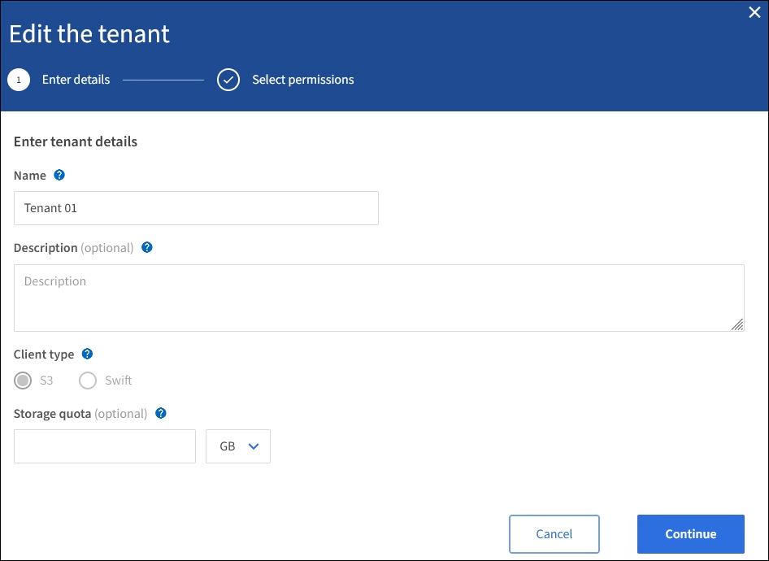

= Mandantenkonto bearbeiten
:allow-uri-read: 
:icons: font
:imagesdir: ../media/

[role="lead"]
Sie können ein Mandantenkonto bearbeiten, um den Anzeigenamen zu ändern, die Einstellung für die Identitätsquelle zu ändern, Plattformservices zu ermöglichen oder zu verlassen oder ein Speicherkontingent einzugeben.

.Was Sie benötigen
* Sie sind mit einem bei Grid Manager angemeldet xref:../admin/web-browser-requirements.adoc[Unterstützter Webbrowser].
* Sie haben spezifische Zugriffsberechtigungen.

.Schritte
. Wählen Sie *MIETER*.
+
image::../media/tenant_accounts_page.png[Seite „Mandantenkonten“]

. Wählen Sie das Mandantenkonto aus, das Sie bearbeiten möchten.
+
Verwenden Sie das Suchfeld, um nach einem Mandantenkonto nach Name oder Mandanten-ID zu suchen.

. Wählen Sie aus der Dropdown-Liste Aktionen die Option *Bearbeiten* aus.
+
Dieses Beispiel gilt für ein Raster, in dem keine SSO (Single Sign On) verwendet wird. Dieses Mandantenkonto hat keine eigene Identitätsquelle konfiguriert.

+

. Ändern Sie die Werte für diese Felder nach Bedarf:
+
** *Name*
** *Beschreibung*
** *Client-Typ*
** *Speicherquote*

. Wählen Sie *Weiter*.
. Wählen Sie die Berechtigungen für das Mandantenkonto aus, oder heben Sie die Auswahl auf.
+
** Wenn Sie *Platform Services* für einen Mandanten deaktivieren, der diese bereits nutzt, werden die Dienste, die er für seine S3-Buckets konfiguriert hat, nicht mehr funktionieren. Es wird keine Fehlermeldung an den Mandanten gesendet. Wenn der Mandant beispielsweise die Replizierung von CloudMirror für einen S3-Bucket konfiguriert hat, können sie Objekte weiterhin im Bucket speichern, doch werden Kopien dieser Objekte nicht mehr im externen S3-Bucket erstellt, den sie als Endpunkt konfiguriert haben.
** Ändern Sie das Kontrollkästchen *nutzt eigene Identitätsquelle*, um zu bestimmen, ob das Mandantenkonto eine eigene Identitätsquelle oder die für den Grid Manager konfigurierte Identitätsquelle verwendet.
+
Wenn das Kontrollkästchen * eigene Identitätsquelle verwendet*:

+
*** Deaktiviert und überprüft, hat der Mandant bereits seine eigene Identitätsquelle aktiviert. Ein Mandant muss seine Identitätsquelle deaktivieren, bevor er die für den Grid Manager konfigurierte Identitätsquelle verwenden kann.
*** Deaktiviert und deaktiviert ist, ist SSO für das StorageGRID System aktiviert. Der Mandant muss die Identitätsquelle verwenden, die für den Grid Manager konfiguriert wurde.

** Aktiviert oder deaktiviert *S3 Select* nach Bedarf. Siehe xref:manage-s3-select-for-tenant-accounts.adoc[Management von S3 Select für Mandantenkonten].

. Wählen Sie *Speichern*.

.Verwandte Informationen
* xref:manage-platform-services-for-tenants.adoc[Management von Plattform-Services für S3-Mandantenkonten]
* xref:../tenant/index.adoc[Verwenden Sie ein Mandantenkonto]

