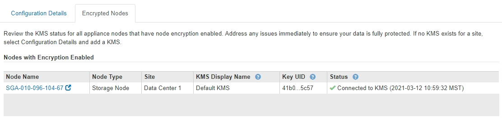

= Verschlüsselte Nodes anzeigen
:allow-uri-read: 
:icons: font
:imagesdir: ../media/

[role="lead"]
Sie können Informationen zu den Appliance-Knoten in Ihrem StorageGRID-System anzeigen, bei denen die Einstellung *Node-Verschlüsselung* aktiviert ist.

.Schritte
. Wählen Sie *KONFIGURATION* *Sicherheit* *Schlüsselverwaltungsserver*.
+
Die Seite Key Management Server wird angezeigt. Auf der Registerkarte Konfigurationsdetails werden alle konfigurierten Schlüsselverwaltungsserver angezeigt.

+
image::../media/kms_configuration_details_table.png[KMS-Konfigurationsdetails KMS-Tabelle]

. Wählen Sie oben auf der Seite die Registerkarte *verschlüsselte Knoten* aus.
+
image::../media/kms_encrypted_nodes_tab.png[Registerkarte „VERSCHLÜSSELTE KMS-Knoten“]

+
Auf der Registerkarte verschlüsselte Knoten werden die Geräteknoten in Ihrem StorageGRID-System aufgelistet, bei denen die Einstellung *Knotenverschlüsselung* aktiviert ist.

+

. Überprüfen Sie die Informationen in der Tabelle für jeden Appliance-Node.
+
[cols="1a,2a"]
|===
| Spalte | Beschreibung 

 a| 
Node-Name
 a| 
Der Name des Appliance-Node.

 a| 
Node-Typ
 a| 
Der Node-Typ: Storage, Admin oder Gateway.

 a| 
Standort
 a| 
Der Name der StorageGRID-Site, auf der der Node installiert ist.

 a| 
KMS-Anzeigename
 a| 
Der beschreibende Name des für den Knoten verwendeten KMS.

Wenn kein KMS aufgeführt ist, wählen Sie die Registerkarte Konfigurationsdetails aus, um einen KMS hinzuzufügen.

xref:kms-adding.adoc[Hinzufügen eines Verschlüsselungsmanagement-Servers (KMS)]

 a| 
Schlüssel-UID
 a| 
Die eindeutige ID des Verschlüsselungsschlüssels, der zur Verschlüsselung und Entschlüsselung von Daten auf dem Appliance-Node verwendet wird. Wenn Sie eine vollständige Schlüssel-UID anzeigen möchten, bewegen Sie den Mauszeiger über die Zelle.

Ein Bindestrich (-) gibt an, dass die Schlüssel-UID unbekannt ist, möglicherweise wegen eines Verbindungsproblem zwischen dem Appliance-Node und dem KMS.

 a| 
Status
 a| 
Der Status der Verbindung zwischen dem KMS und dem Appliance-Node. Wenn der Knoten verbunden ist, wird der Zeitstempel alle 30 Minuten aktualisiert. Nach einer Änderung der KMS-Konfiguration kann es mehrere Minuten dauern, bis der Verbindungsstatus aktualisiert wird.

*Hinweis:* Sie müssen Ihren Webbrowser aktualisieren, um die neuen Werte zu sehen.

|===
. Wenn in der Spalte Status ein KMS-Problem angezeigt wird, beheben Sie das Problem sofort.
+
Während normaler KMS-Vorgänge wird der Status *mit KMS* verbunden. Wenn ein Knoten von der Tabelle getrennt wird, wird der Verbindungsstatus des Knotens angezeigt (administrativ ausgefallen oder unbekannt).

+
Andere Statusmeldungen entsprechen StorageGRID Meldungen mit denselben Namen:

+
** KMS-Konfiguration konnte nicht geladen werden
** KMS-Verbindungsfehler
** DER VERSCHLÜSSELUNGSSCHLÜSSELNAME VON KMS wurde nicht gefunden
** DIE Drehung des VERSCHLÜSSELUNGSSCHLÜSSELS ist fehlgeschlagen
** KMS-Schlüssel konnte ein Appliance-Volume nicht entschlüsseln
** KM ist nicht konfiguriert

+
Die empfohlenen Aktionen für diese Warnmeldungen finden Sie in den Anweisungen für xref:../monitor/index.adoc[StorageGRID zur Überwachung und Fehlerbehebung].

IMPORTANT: Sämtliche Probleme müssen sofort behoben werden, um einen vollständigen Schutz Ihrer Daten zu gewährleisten.
