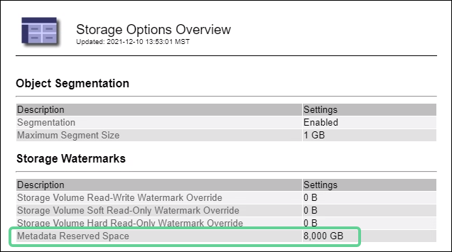
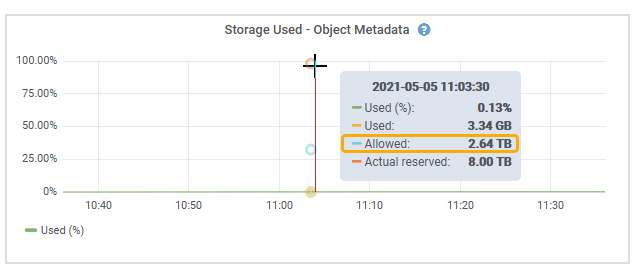

= Management von Objekt-Metadaten-Storage
:allow-uri-read: 
:icons: font
:imagesdir: ../media/

[role="lead"]
Die Kapazität der Objektmetadaten eines StorageGRID Systems steuert die maximale Anzahl an Objekten, die auf diesem System gespeichert werden können. Um sicherzustellen, dass Ihr StorageGRID System über ausreichend Platz zum Speichern neuer Objekte verfügt, müssen Sie wissen, wo und wie StorageGRID Objekt-Metadaten speichert.

== Was sind Objekt-Metadaten?

Objektmetadaten sind alle Informationen, die ein Objekt beschreiben. StorageGRID verwendet Objektmetadaten, um die Standorte aller Objekte im Grid zu verfolgen und den Lebenszyklus eines jeden Objekts mit der Zeit zu managen.

Für ein Objekt in StorageGRID enthalten die Objektmetadaten die folgenden Informationstypen:

* Systemmetadaten, einschließlich einer eindeutigen ID für jedes Objekt (UUID), dem Objektnamen, dem Namen des S3-Buckets oder Swift-Containers, dem Mandanten-Kontonamen oder -ID, der logischen Größe des Objekts, dem Datum und der Uhrzeit der ersten Erstellung des Objekts Und Datum und Uhrzeit der letzten Änderung des Objekts.
* Alle mit dem Objekt verknüpften Schlüssel-Wert-Paare für benutzerdefinierte Benutzer-Metadaten.
* Bei S3-Objekten sind alle dem Objekt zugeordneten Objekt-Tag-Schlüsselwert-Paare enthalten.
* Der aktuelle Storage-Standort jeder Kopie für replizierte Objektkopien
* Für Objektkopien mit Erasure-Coding-Verfahren wird der aktuelle Speicherort der einzelnen Fragmente gespeichert.
* Bei Objektkopien in einem Cloud Storage Pool befindet sich der Speicherort des Objekts, einschließlich des Namens des externen Buckets und der eindeutigen Kennung des Objekts.
* Für segmentierte Objekte und mehrteilige Objekte, Segment-IDs und Datengrößen.

== Wie werden Objekt-Metadaten gespeichert?

StorageGRID speichert Objektmetadaten in einer Cassandra-Datenbank, die unabhängig von Objektdaten gespeichert werden. Um Redundanz zu gewährleisten und Objekt-Metadaten vor Verlust zu schützen, speichert StorageGRID drei Kopien der Metadaten für alle Objekte im System an jedem Standort. Die drei Kopien der Objektmetadaten werden gleichmäßig auf alle Storage-Nodes an jedem Standort verteilt.

Diese Abbildung zeigt die Speicherknoten an zwei Standorten. Jeder Standort verfügt über die gleiche Menge an Objektmetadaten, die auf die Storage-Nodes an diesem Standort verteilt werden.

image::../media/metadata_space_across_sites.png[Metadatenspeicherplatz Über Mehrere Standorte Hinweg]

== Wo werden Objekt-Metadaten gespeichert?

Diese Abbildung zeigt die Storage Volumes für einen einzelnen Storage-Node.

image::../media/metadata_space_storage_node.png[Metadaten-Speicherplatz-Storage-Node]

Wie in der Abbildung dargestellt, reserviert StorageGRID Speicherplatz für Objekt-Metadaten auf dem Storage Volume 0 jedes Storage-Nodes. Sie verwendet den reservierten Speicherplatz zum Speichern von Objektmetadaten und zum Ausführen wichtiger Datenbankvorgänge. Alle übrigen Speicherplatz auf dem Storage Volume 0 und allen anderen Storage Volumes im Storage Node werden ausschließlich für Objektdaten (replizierte Kopien und nach Datenkonsistenz) verwendet.

Die Menge an Speicherplatz, die für Objektmetadaten auf einem bestimmten Storage-Node reserviert ist, hängt von einer Reihe von Faktoren ab, die im Folgenden beschrieben werden.

== Einstellung für reservierten Speicherplatz für Metadaten

Die Einstellung _Metadaten Reserved Space_ stellt die Menge an Speicherplatz dar, die für Metadaten auf Volume 0 jedes Storage-Node reserviert wird. Wie in der Tabelle dargestellt, basiert der Standardwert dieser Einstellung für StorageGRID 11.6 auf dem folgenden:

* Die Softwareversion, die Sie bei der Erstinstallation von StorageGRID verwendet haben.
* Die RAM-Menge auf jedem Storage-Node.

[cols="1a,1a,1a"]
|===
| Für die Erstinstallation von StorageGRID verwendete Version | RAM-Größe auf Speicherknoten | Standardeinstellung für reservierten Speicherplatz bei Metadaten für StorageGRID 11.6 

 a| 
11.5/11.6
 a| 
128 GB oder mehr auf jedem Storage-Node im Grid
 a| 
8 TB (8,000 GB)

 a| 
 a| 
Weniger als 128 GB auf jedem Storage-Node im Grid
 a| 
3 TB (3,000 GB)

 a| 
11.1 bis 11.4
 a| 
128 GB oder mehr auf jedem Speicherknoten an einem beliebigen Standort
 a| 
4 TB (4,000 GB)

 a| 
 a| 
Weniger als 128 GB auf jedem Speicherknoten an jedem Standort
 a| 
3 TB (3,000 GB)

 a| 
11.0 oder früher
 a| 
Beliebiger Betrag
 a| 
2 TB (2,000 GB)

|===
So zeigen Sie die Einstellung für den reservierten Metadatenspeicherplatz für Ihr StorageGRID-System an:

. Wählen Sie *KONFIGURATION* *System* *Speicheroptionen*.
. Suchen Sie in der Tabelle Speicherwasserzeichen *Metadatenreservierter Speicherplatz*.
+

Im Screenshot beträgt der Wert *Metadaten reservierter Speicherplatz* 8,000 GB (8 TB). Dies ist die Standardeinstellung für eine neue StorageGRID 11.6-Installation, bei der jeder Speicherknoten 128 GB oder mehr RAM hat.

== Tatsächlich reservierter Speicherplatz für Metadaten

Im Gegensatz zur Einstellung „systemweiter reservierter Speicherplatz für Metadaten“ wird für jeden Storage-Node der_tatsächlich reservierte Speicherplatz_ für Objektmetadaten ermittelt. Für jeden bestimmten Storage-Node hängt der tatsächlich reservierte Speicherplatz für Metadaten von der Größe des Volumes 0 für den Node und der systemweiten Einstellung *Metadaten reservierter Speicherplatz* ab.

[cols="1a,1a"]
|===
| Größe von Volume 0 für den Node | Tatsächlich reservierter Speicherplatz für Metadaten 

 a| 
Weniger als 500 GB (nicht in der Produktion)
 a| 
10% des Volumens 0

 a| 
500 GB oder mehr
 a| 
Die kleineren Werte:

* Lautstärke 0
* Einstellung für reservierten Speicherplatz für Metadaten

|===
So zeigen Sie den tatsächlich reservierten Speicherplatz für Metadaten auf einem bestimmten Speicherknoten an:

. Wählen Sie im Grid Manager *NODES* *_Storage Node_* aus.
. Wählen Sie die Registerkarte *Storage* aus.
. Bewegen Sie den Cursor über das Diagramm verwendete Speicherdaten -- Objektmetadaten und suchen Sie den Wert *tatsächlich reserviert*.
+
image::../media/storage_used_object_metadata_actual_reserved.png[Verwendeter Speicher - Objektmetadaten - Ist Reserviert]

Im Screenshot beträgt der *tatsächliche reservierte* Wert 8 TB. Dieser Screenshot ist für einen großen Speicherknoten in einer neuen StorageGRID 11.6 Installation. Da die Einstellung für den systemweiten reservierten Speicherplatz für Metadaten kleiner als das Volume 0 für diesen Storage-Node ist, entspricht der tatsächlich reservierte Speicherplatz für diesen Node der Einstellung für den reservierten Speicherplatz.

== Beispiel für den tatsächlich reservierten Metadatenspeicherplatz

Angenommen, Sie installieren ein neues StorageGRID System unter Verwendung der Version 11.6. Nehmen Sie in diesem Beispiel an, dass jeder Speicherknoten mehr als 128 GB RAM und dieses Volume 0 von Speicherknoten 1 (SN1) 6 TB hat. Basierend auf diesen Werten:

* Der systemweite *Metadaten reservierter Platz* ist auf 8 TB eingestellt. (Dies ist der Standardwert für eine neue StorageGRID 11.6-Installation, wenn jeder Speicherknoten über mehr als 128 GB RAM verfügt.)
* Der tatsächlich reservierte Speicherplatz für Metadaten von SN1 beträgt 6 TB. (Das gesamte Volume ist reserviert, da Volume 0 kleiner ist als die Einstellung *Metadaten reservierter Speicherplatz*.)

== Zulässiger Metadatenspeicherplatz

Der tatsächlich reservierte Speicherplatz jedes Storage-Node für Metadaten wird in den Speicherplatz für Objekt-Metadaten (den „ _zulässigen Metadatenspeicherplatz_“) und den Platzbedarf für wichtige Datenbankvorgänge (wie Data-Compaction und Reparatur) sowie zukünftige Hardware- und Software-Upgrades unterteilt. Der zulässige Metadatenspeicherplatz bestimmt die gesamte Objektkapazität.

image::../media/metadata_allowed_space_volume_0.png[Platz für Volume 0 durch Metadaten zulässig]

Die folgende Tabelle zeigt, wie StorageGRID den *zulässigen Metadatenspeicherplatz* für verschiedene Storage-Nodes berechnet, basierend auf der Speichermenge für den Node und dem tatsächlich reservierten Speicherplatz für Metadaten.

[cols="1a,1a,2a,2a"]
|===

 a| 
 a| 
 a| 
*Speichermenge auf Speicherknoten*

 a| 
 a| 
 a| 
lt; 128 GB
 a| 
gt;= 128 GB

 a| 
*Tatsächlich reservierter Platz für Metadaten*
 a| 
lt;= 4 TB
 a| 
60 % des tatsächlich reservierten Speicherplatzes für Metadaten maximal 1.32 TB
 a| 
60 % des tatsächlich reservierten Speicherplatzes für Metadaten maximal 1.98 TB

 a| 
gt; 4 TB
 a| 
(Tatsächlicher reservierter Speicherplatz für Metadaten − 1 TB) × 60 %, bis zu einem Maximum von 1.32 TB
 a| 
(Tatsächlicher reservierter Speicherplatz für Metadaten − 1 TB) × 60 %, bis zu einem Maximum von 3.96 TB

|===
So zeigen Sie den zulässigen Metadatenspeicherplatz für einen Speicherknoten an:

. Wählen Sie im Grid Manager die Option *NODES* aus.
. Wählen Sie den Speicherknoten aus.
. Wählen Sie die Registerkarte *Storage* aus.
. Bewegen Sie den Cursor über das Diagramm verwendete Speicherdaten -- Objektmetadaten und suchen Sie den Wert *zulässig*.
+

Im Screenshot beträgt der *zulässige*-Wert 3.96 TB, was der maximale Wert für einen Storage Node ist, dessen tatsächlicher reservierter Speicherplatz für Metadaten mehr als 4 TB beträgt.

Der *zulässige*-Wert entspricht dieser Prometheus-Metrik:

`storagegrid_storage_utilization_metadata_allowed_bytes`

== Beispiel für zulässigen Metadatenspeicherplatz

Angenommen, Sie installieren ein StorageGRID System mit Version 11.6. Nehmen Sie in diesem Beispiel an, dass jeder Speicherknoten mehr als 128 GB RAM und dieses Volume 0 von Speicherknoten 1 (SN1) 6 TB hat. Basierend auf diesen Werten:

* Der systemweite *Metadaten reservierter Platz* ist auf 8 TB eingestellt. (Dies ist der Standardwert für StorageGRID 11.6, wenn jeder Speicherknoten mehr als 128 GB RAM hat.)
* Der tatsächlich reservierte Speicherplatz für Metadaten von SN1 beträgt 6 TB. (Das gesamte Volume ist reserviert, da Volume 0 kleiner ist als die Einstellung *Metadaten reservierter Speicherplatz*.)
* Der zulässige Speicherplatz für Metadaten auf SN1 beträgt 3 TB, basierend auf der im angegebenen Berechnung <<table-allowed-space-for-metadata,Tabelle für zulässigem Speicherplatz für Metadaten>>: (Tatsächlich reservierter Platz für Metadaten − 1 TB) × 60%, bis zu einem Maximum von 3.96 TB.

== Storage-Nodes unterschiedlicher Größen beeinflussen die Objektkapazität

Wie oben beschrieben, verteilt StorageGRID Objektmetadaten gleichmäßig über Storage-Nodes an jedem Standort. Wenn ein Standort Storage-Nodes unterschiedlicher Größen enthält, bestimmt der kleinste Node am Standort die Metadaten-Kapazität des Standorts.

Beispiel:

* Sie haben ein Raster mit drei Storage Nodes unterschiedlicher Größe an einem einzigen Standort.
* Die Einstellung *Metadaten reservierter Platz* beträgt 4 TB.
* Die Storage-Nodes haben die folgenden Werte für den tatsächlich reservierten Metadatenspeicherplatz und den zulässigen Metadatenspeicherplatz.
+
[cols="1a,1a,1a,1a"]
|===
| Storage-Node | Größe von Volumen 0 | Tatsächlich reservierter Metadatenspeicherplatz | Zulässiger Metadatenspeicherplatz 

 a| 
SN1
 a| 
2.2 TB
 a| 
2.2 TB
 a| 
1.32 TB

 a| 
SN2
 a| 
5 TB
 a| 
4 TB
 a| 
1.98 TB

 a| 
SN3
 a| 
6 TB
 a| 
4 TB
 a| 
1.98 TB

|===

Da Objektmetadaten gleichmäßig auf die Storage-Nodes an einem Standort verteilt werden, kann jeder Node in diesem Beispiel nur 1.32 TB Metadaten enthalten. Der zusätzlich zulässige Metadatenspeicherplatz von 0.66 TB für SN2 und SN3 kann nicht verwendet werden.

image::../media/metadata_space_three_storage_nodes.png[Metadaten Platz Drei Storage-Nodes]

Da StorageGRID alle Objektmetadaten für ein StorageGRID System an jedem Standort speichert, wird die Gesamtkapazität der Metadaten eines StorageGRID Systems durch die Objektmetadaten des kleinsten Standorts bestimmt.

Und da die Objektmetadaten die maximale Objektanzahl steuern, wenn einem Node die Metadatenkapazität ausgeht, ist das Grid effektiv voll.

.Verwandte Informationen
* Informationen zum Monitoring der Objektmetadaten für jeden Storage-Node finden Sie unter xref:../monitor/index.adoc[Monitoring und Fehlerbehebung].
* Um die Kapazität der Objektmetadaten für Ihr System zu erhöhen, fügen Sie neue Storage-Nodes hinzu. Gehen Sie zu xref:../expand/index.adoc[Erweitern Sie Ihr Raster].

