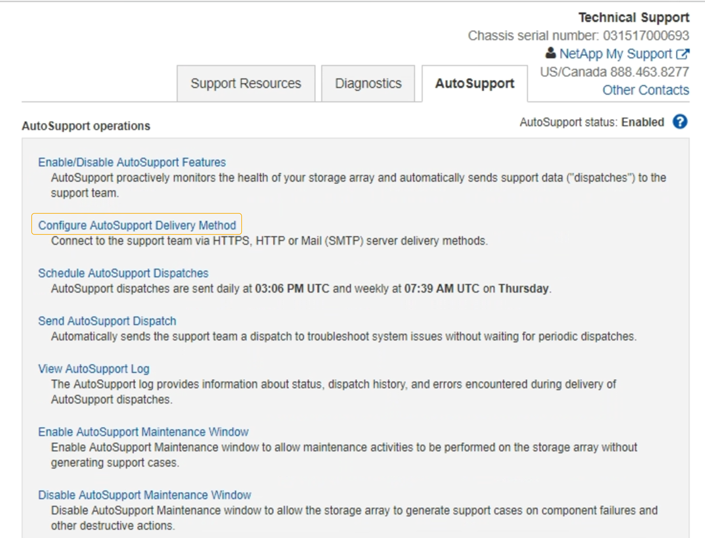

= Senden Sie AutoSupport Nachrichten aus der E-Series über StorageGRID
:allow-uri-read: 
:icons: font
:imagesdir: ../media/

[role="lead"]
Sie können AutoSupport Meldungen von E-Series SANtricity System Manager über einen StorageGRID Admin-Node anstelle des Storage Appliance Management-Ports an den technischen Support senden.

.Was Sie benötigen
* Sie sind im Grid Manager mit einem angemeldet xref:../admin/web-browser-requirements.adoc[Unterstützter Webbrowser].
* Sie verfügen über die Berechtigung zum Administrator oder Root-Zugriff.

NOTE: Sie müssen über die SANtricity-Firmware 8.70 (11.7) oder höher verfügen, um mithilfe des Grid-Managers auf den SANtricity-System-Manager zuzugreifen.

.Über diese Aufgabe
E-Series AutoSupport-Meldungen enthalten Details zur Storage Hardware und sind spezifischer als andere AutoSupport-Meldungen, die vom StorageGRID System gesendet werden.

Konfigurieren Sie eine spezielle Proxy-Server-Adresse in SANtricity System Manager, damit die AutoSupport-Meldungen ohne Verwendung des Managementports der Appliance über einen StorageGRID-Admin-Node übertragen werden. Auf diese Weise übertragene AutoSupport-Nachrichten gelten für die Proxyeinstellungen für bevorzugte Sender und Admin, die möglicherweise im Grid Manager konfiguriert wurden.

Informationen zum Konfigurieren des Admin-Proxyservers in Grid Manager finden Sie unter xref:configuring-admin-proxy-settings.adoc[Konfigurieren Sie die Administrator-Proxy-Einstellungen].

NOTE: Dieses Verfahren dient nur zur Konfiguration eines StorageGRID-Proxyservers für AutoSupport-Meldungen der E-Serie. Weitere Informationen zur Konfiguration der E-Series AutoSupport finden Sie unter https://["NetApp E-Series und SANtricity Dokumentation"^].

.Schritte
. Wählen Sie im Grid Manager die Option *NODES* aus.
. Wählen Sie in der Liste der Knoten links den Speicher-Appliance-Node aus, den Sie konfigurieren möchten.
. Wählen Sie *SANtricity System Manager*.
+
Die Startseite von SANtricity System Manager wird angezeigt.

+
image::../media/autosupport_santricity_home_page.png[Startseite von AutoSupport SANtricity]

. Wählen Sie *SUPPORT* *Support Center* *AutoSupport*.
+
Die Seite AutoSupport-Vorgänge wird angezeigt.

+

. Wählen Sie *AutoSupport-Bereitstellungsmethode konfigurieren*.
+
Die Seite AutoSupport-Bereitstellungsmethode konfigurieren wird angezeigt.

+
image::../media/autosupport_configure_delivery_santricity.png[AutoSupport konfigurieren AutoSupport-Bereitstellungsmethode SANtricity]

. Wählen Sie *HTTPS* für die Liefermethode aus.
+

NOTE: Das Zertifikat, das das HTTPS-Protokoll aktiviert, ist vorinstalliert.

. Wählen Sie *über Proxy-Server*.
. Eingabe `tunnel-host` Für die *Host-Adresse*.
+
`tunnel-host` Hat die besondere Adresse, um einen Admin-Node zum Senden von E-Series AutoSupport Meldungen zu verwenden.

. Eingabe `10225` Für die * Portnummer*.
+
`10225` Ist die Portnummer auf dem StorageGRID Proxy-Server, der AutoSupport Meldungen vom E-Series Controller in der Appliance empfängt.

. Wählen Sie *Testkonfiguration* aus, um die Routing- und Konfigurationseinstellungen Ihres AutoSupport Proxy-Servers zu testen.
+
Falls richtig, erscheint eine Meldung in einem grünen Banner: „`Ihre AutoSupport-Konfiguration wurde verifiziert.`“

+
Wenn der Test fehlschlägt, wird eine Fehlermeldung in einem roten Banner angezeigt. Überprüfen Sie Ihre StorageGRID DNS-Einstellungen und Netzwerke. Stellen Sie sicher, dass der bevorzugte Sender Admin-Node eine Verbindung zur NetApp Support-Website herstellen kann, und versuchen Sie es erneut.

. Wählen Sie *Speichern*.
+
Die Konfiguration wird gespeichert, und es wird eine Bestätigungsmeldung angezeigt: „`AutoSupport-Bereitstellungsmethode wurde konfiguriert.`“

