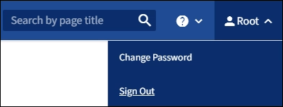

= Melden Sie sich vom Grid Manager ab
:allow-uri-read: 
:icons: font
:imagesdir: ../media/

[role="lead"]
Wenn Sie mit dem Grid-Manager arbeiten, müssen Sie sich anmelden, um sicherzustellen, dass nicht autorisierte Benutzer nicht auf das StorageGRID-System zugreifen können. Wenn Sie Ihren Browser schließen, werden Sie möglicherweise aufgrund der Cookie-Einstellungen des Browsers nicht aus dem System abgesendet.

.Schritte
. Wählen Sie oben rechts Ihren Benutzernamen aus.
+

. Wählen Sie *Abmelden*.
+
[cols="1a,1a"]
|===
| Option | Beschreibung 

 a| 
SSO wird nicht verwendet
 a| 
Sie sind vom Admin-Knoten abgemeldet.

Die Anmeldeseite des Grid Manager wird angezeigt.

*Hinweis:* Wenn Sie sich bei mehr als einem Admin-Knoten angemeldet haben, müssen Sie sich von jedem Knoten abmelden.

 a| 
SSO aktiviert
 a| 
Sie sind von allen Admin-Knoten abgemeldet, auf die Sie zugreifen konnten. Die Seite StorageGRID-Anmeldung wird angezeigt. *Grid Manager* wird standardmäßig im Dropdown-Menü *Letzte Konten* aufgeführt, und im Feld *Konto-ID* wird 0 angezeigt.

*Hinweis:* Wenn SSO aktiviert ist und Sie auch beim Mandantenmanager angemeldet sind, müssen Sie sich ebenfalls vom Mandantenkonto abzeichnen, um sich von SSO abzumelden.

|===

.Verwandte Informationen
* xref:configuring-sso.adoc[Konfigurieren Sie Single Sign-On]
* xref:../tenant/index.adoc[Verwenden Sie ein Mandantenkonto]

