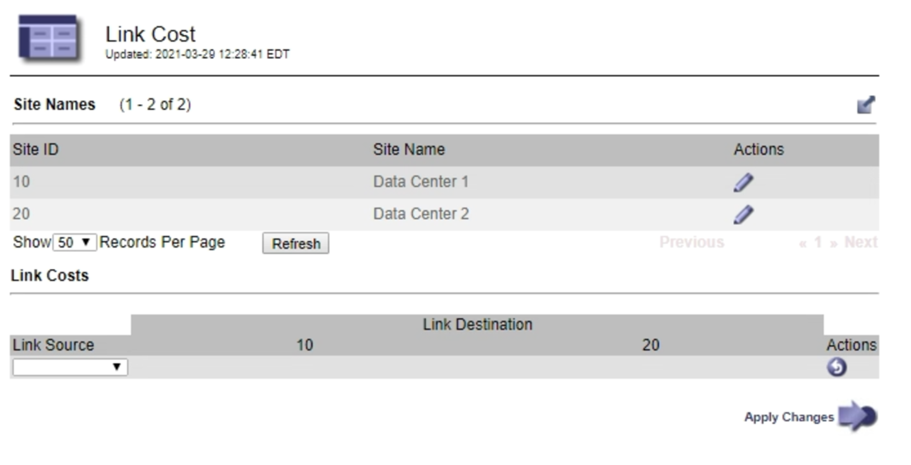

= Verbindungskosten aktualisieren
:allow-uri-read: 
:icons: font
:imagesdir: ../media/

[role="lead"]
Sie können die Verbindungskosten zwischen Datacenter-Standorten aktualisieren, um die Latenz zwischen Standorten wiederzugeben.

.Was Sie und#8217;ll benötigen
* Sie sind mit einem bei Grid Manager angemeldet xref:../admin/web-browser-requirements.adoc[Unterstützter Webbrowser].
* Sie haben die Berechtigung für die Konfiguration der Seite Grid Topology.

.Schritte
. Wählen Sie *KONFIGURATION* *Netzwerk* *Link Cost*.
+

. Wählen Sie eine Website unter *Link Source* aus, und geben Sie unter *Link Destination* einen Kostenwert zwischen 0 und 100 ein.
+
Sie können die Verbindungskosten nicht ändern, wenn die Quelle mit dem Ziel identisch ist.

+
Um Änderungen abzubrechen, wählen Sie „ image:../media/nms_revert.gif["Symbol rückgängig machen"]*Zurücksetzen*.

. Wählen Sie *Änderungen Anwenden*.

