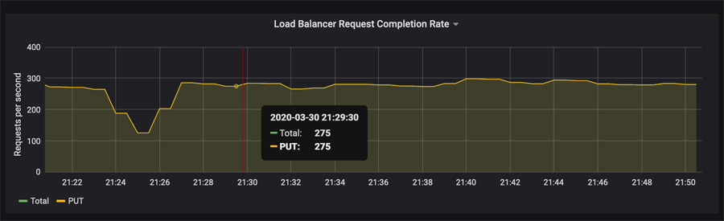

= Zeigen Sie Metriken zum Netzwerkverkehr an
:allow-uri-read: 
:icons: font
:imagesdir: ../media/

[role="lead"]
Sie können den Netzwerkverkehr überwachen, indem Sie die Diagramme aufrufen, die auf der Seite Richtlinien zur Klassifizierung von Verkehrsmeldungen verfügbar sind.

.Was Sie benötigen
* Sie sind mit einem bei Grid Manager angemeldet xref:../admin/web-browser-requirements.adoc[Unterstützter Webbrowser].
* Sie verfügen über die Berechtigung Root Access oder die Berechtigungen für Mandantenkonten.

.Über diese Aufgabe
Für alle vorhandenen Traffic-Klassifizierungsrichtlinien können Sie Kennzahlen für den Load Balancer-Service anzeigen, um festzustellen, ob die Richtlinie den Datenverkehr im Netzwerk erfolgreich einschränkt. Anhand der Daten in den Diagrammen können Sie bestimmen, ob Sie die Richtlinie anpassen müssen.

Auch wenn für eine Richtlinie zur Klassifizierung von Datenverkehr keine Grenzen gesetzt wurden, werden Kennzahlen erfasst und die Diagramme bieten nützliche Informationen zum Verständnis von Verkehrstrends.

.Schritte
. Wählen Sie *KONFIGURATION* *Netzwerk* *Verkehrsklassifizierung*.
+
Die Seite Richtlinien zur Klassifizierung von Verkehrsdaten wird angezeigt, und die vorhandenen Richtlinien sind in der Tabelle aufgeführt.

+
image::../media/traffic_classification_policies_main_screen_w_examples.png[Beispiel für eine Verkehrsrichtlinie für Grafik]

+

NOTE: Die Schaltflächen *Erstellen*, *Bearbeiten* und *Entfernen* sind deaktiviert, wenn Sie über die Berechtigung für Mandantenkonten verfügen, aber nicht über die Berechtigung Root-Zugriff verfügen.

. Wählen Sie das Optionsfeld links neben der Richtlinie, für die Sie Metriken anzeigen möchten.
. Wählen Sie *Metriken*.
+
Es wird ein neues Browserfenster geöffnet, und die Diagramme der Richtlinie zur Klassifizierung von Datenverkehr werden angezeigt. Die Diagramme zeigen Metriken nur für den Datenverkehr an, der mit der ausgewählten Richtlinie übereinstimmt.

+
Sie können andere Richtlinien auswählen, die Sie anzeigen möchten, indem Sie das Pulldown-Menü *Policy* verwenden.

+
image::../media/traffic_classification_policy_graph.png[Grafik Des Netzwerkverkehrs]

+
Die folgenden Diagramme sind auf der Webseite enthalten.

+
** Load Balancer Request Traffic: Dieses Diagramm liefert einen 3-minütigen Moving Average des Durchsatzes von Daten, die zwischen Load Balancer Endpunkten und den Clients, die die Anforderungen bearbeiten, in Bits pro Sekunde übertragen werden.
** Abschlusssatz für Lastbalancer-Anfragen: Dieses Diagramm bietet einen 3-minütigen Moving-Durchschnitt der Anzahl der abgeschlossenen Anfragen pro Sekunde, aufgeschlüsselt nach Anforderungstyp (GET, PUT, HEAD, DELETE). Dieser Wert wird aktualisiert, wenn die Kopfzeilen einer neuen Anfrage validiert wurden.
** Fehlerantwortzrate: Dieses Diagramm zeigt einen 3-minütigen Moving Average der Anzahl der an Kunden pro Sekunde zurückgegebenen Fehlerantworten, aufgeschlüsselt nach dem Fehlercode.
** Durchschnittliche Anfragedauer (nicht-Fehler): Dieses Diagramm bietet einen 3-minütigen Moving Average of Request durations, aufgeschlüsselt nach Anforderungstyp (GET, PUT, HEAD, DELETE). Jede Anforderungsdauer beginnt, wenn eine Anforderungs-Kopfzeile vom Lastbalancer-Dienst analysiert wird und endet, wenn der vollständige Antwortkörper an den Client zurückgesendet wird.
** Schreibanforderungsrate nach Objektgröße: Diese Heatmap bietet einen Moving Average von 3 Minuten für die Geschwindigkeit, mit der Schreibanforderungen basierend auf Objektgröße abgeschlossen werden. In diesem Zusammenhang beziehen sich Schreibanforderungen nur auf PUT-Anforderungen.
** Leseanforderungsrate nach Objektgröße: Dieser Heatmap bietet einen 3-minütigen Moving-Durchschnitt der Rate, mit der Leseanforderungen anhand der Objektgröße abgeschlossen werden. In diesem Zusammenhang beziehen sich Leseanforderungen nur auf ANFORDERUNGEN, DIE ABGERUFEN werden sollen. Die Farben in der Heatmap zeigen die relative Frequenz einer Objektgröße innerhalb eines einzelnen Diagramms an. Die kühleren Farben (z. B. violett und blau) zeigen niedrigere relative Raten an, und die wärmeren Farben (z. B. Orange und Rot) zeigen höhere relative Raten an.

. Bewegen Sie den Cursor über ein Liniendiagramm, um ein Popup-Fenster mit Werten auf einem bestimmten Teil des Diagramms anzuzeigen.
+

. Bewegen Sie den Mauszeiger über eine Heatmap, um ein Popup-Fenster mit Datum und Uhrzeit der Probe, Objektgrößen, die in die Anzahl aggregiert werden, und die Anzahl der Anfragen pro Sekunde in diesem Zeitraum anzuzeigen.
+
image::../media/traffic_classification_policy_heatmap_closeup.png[Popup-Werte Für Verkehrsleistendiagramm]

. Verwenden Sie das Pull-down-Menü *Policy* oben links, um eine andere Richtlinie auszuwählen.
+
Die Diagramme für die ausgewählte Richtlinie werden angezeigt.

. Alternativ können Sie über das Menü * SUPPORT* auf die Diagramme zugreifen.
+
.. Wählen Sie *SUPPORT* *Tools* *Kennzahlen* aus.
.. Wählen Sie im Abschnitt *Grafana* der Seite die Option *Traffic Classification Policy* aus.
.. Wählen Sie die Richtlinie aus der Dropdown-Liste oben links auf der Seite aus.
+
Richtlinien für die Verkehrsklassifizierung werden anhand ihrer ID identifiziert. Richtlinien-IDs sind auf der Seite Richtlinien zur Klassifizierung von Verkehrsdaten aufgeführt.

. Analysieren Sie die Diagramme, um zu ermitteln, wie oft die Richtlinie den Datenverkehr einschränkt und ob Sie die Richtlinie anpassen müssen.

.Verwandte Informationen
xref:../monitor/index.adoc[Monitoring und Fehlerbehebung]
