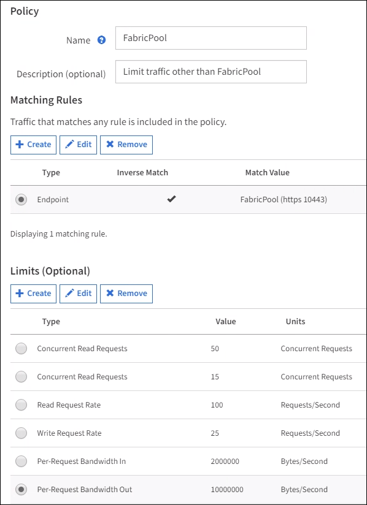

= Erstellen einer Traffic-Klassifizierungsrichtlinie für FabricPool
:allow-uri-read: 
:icons: font
:imagesdir: ../media/

[role="lead"]
Optional können Sie eine StorageGRID Traffic-Klassifizierungsrichtlinie entwerfen, um die Servicequalität für den FabricPool-Workload zu optimieren.

.Was Sie und#8217;ll benötigen
* Sie sind mit einem bei Grid Manager angemeldet xref:../admin/web-browser-requirements.adoc[Unterstützter Webbrowser].
* Sie haben die Berechtigung Root Access.

Die Best Practices für das Erstellen einer Traffic-Klassifizierungsrichtlinie für FabricPool hängen vom Workload ab:

* Wenn Sie einen Tiering von primären FabricPool-Workload-Daten zu StorageGRID planen, sollten Sie sicherstellen, dass der FabricPool-Workload den Großteil der Bandbreite hat. Sie können eine Traffic-Klassifizierungsrichtlinie erstellen, um alle anderen Workloads einzuschränken.
+

NOTE: Im Allgemeinen sind FabricPool-Lesevorgänge wichtiger als Schreibvorgänge.

+
Wenn beispielsweise andere S3-Clients dieses StorageGRID-System verwenden, sollten Sie eine Traffic-Klassifizierungsrichtlinie erstellen. Der Netzwerk-Traffic kann für die anderen Buckets, Mandanten, IP-Subnetze oder Load Balancer Endpunkte begrenzt werden.

* Im Allgemeinen sollten keine Grenzen für die Servicequalität für jeden FabricPool Workload gesetzt werden, sondern lediglich die anderen Workloads begrenzt werden.
* Die Einschränkungen, die für andere Workloads gelten, sollten das Verhalten dieser Workloads berücksichtigen. Die auferlegten Einschränkungen hängen auch von der Größe und den Funktionen des Grids und der erwarteten Auslastung ab.

Weitere Informationen: xref:../admin/managing-traffic-classification-policies.adoc[Verwalten von Richtlinien zur Verkehrsklassifizierung]

.Schritte
. Wählen Sie *KONFIGURATION* *Netzwerk* *Verkehrsklassifizierung*.
. Geben Sie einen Namen und eine Beschreibung ein.
. Erstellen Sie im Abschnitt Regeln für die Abgleich mindestens eine Regel.
+
.. Wählen Sie *Erstellen*.
.. Wählen Sie *Endpunkt* aus, und wählen Sie den für FabricPool erstellten Load Balancer-Endpunkt aus.
+
Sie können auch das FabricPool-Mandantenkonto oder den Bucket auswählen.

.. Wenn diese Verkehrsrichtlinie den Datenverkehr für die anderen Endpunkte einschränken soll, wählen Sie *Inverse Übereinstimmung*.

. Optional können Sie eine oder mehrere Limits erstellen.
+

NOTE: Auch wenn für eine Traffic-Klassifizierungsrichtlinie keine Grenzen festgelegt sind, werden Kennzahlen erfasst, um Verkehrstrends zu verstehen.

+
.. Wählen Sie *Erstellen*.
.. Wählen Sie den zu begrenzenden Verkehrstyp und die anzuwählenden Grenzwerte aus.
+
In diesem Beispiel zeigt die FabricPool Traffic-Klassifizierungsrichtlinie die Typen des zu begrenzenden Netzwerkverkehrs sowie die Arten von Werten an, die Sie auswählen können. Die Grenzwerte für eine tatsächliche Richtlinie basieren auf Ihren spezifischen Anforderungen.

+

. Wählen Sie nach dem Erstellen der Traffic-Klassifizierungsrichtlinie die Richtlinie aus und wählen Sie dann *Metriken* aus, um festzustellen, ob die Richtlinie den Datenverkehr wie erwartet begrenzt.
+
image::../media/traffic_classification_metrics_fabricpool.png[Kennzahlen-FabricPool für die Verkehrsklassifizierung]

