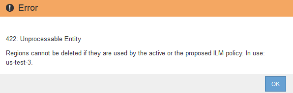

= Regionen konfigurieren (nur optional und S3)
:allow-uri-read: 
:icons: font
:imagesdir: ../media/

[role="lead"]
ILM-Regeln können Objekte auf Basis der Bereiche filtern, in denen S3-Buckets erstellt werden, und so Objekte aus verschiedenen Regionen an unterschiedlichen Storage-Standorten speichern. Wenn Sie einen S3-Bucket-Bereich als Filter in einer Regel verwenden möchten, müssen Sie zuerst die Regionen erstellen, die von den Buckets in Ihrem System verwendet werden können.

.Was Sie und#8217;ll benötigen
* Sie sind mit einem bei Grid Manager angemeldet xref:../admin/web-browser-requirements.adoc[Unterstützter Webbrowser].
* Sie haben spezifische Zugriffsberechtigungen.

Beim Erstellen eines S3-Buckets können Sie angeben, dass er in einer bestimmten Region erstellt wird. Wenn Sie eine Region angeben, kann der Bucket sich in geografischer Nähe zu seinen Benutzern befinden, um die Latenz zu optimieren, Kosten zu minimieren und gesetzliche Anforderungen zu erfüllen.

Wenn Sie eine ILM-Regel erstellen, möchten Sie die Region, die einem S3-Bucket zugeordnet ist, möglicherweise als erweiterten Filter verwenden. Sie können zum Beispiel eine Regel entwerfen, die sich nur auf Objekte bezieht, die in den in uns-West-2 erstellten S3-Buckets gelten. Sie können dann angeben, die Kopien dieser Objekte an Storage-Nodes an einem Datacenter-Standort innerhalb dieser Region platziert werden, um die Latenz zu optimieren.

Befolgen Sie bei der Konfiguration von Regionen die folgenden Richtlinien:

* Standardmäßig gehören alle Buckets zu US-East-1-Region.
* Sie müssen die Regionen mit dem Grid Manager erstellen, bevor Sie beim Erstellen von Buckets mithilfe der Mandanten-Manager- oder Mandantenmanagement-API oder mit dem LocationConstraint-Anforderungselement für S3 PUT-Bucket-API-Anforderungen eine nicht standardmäßige Region angeben können. Ein Fehler tritt auf, wenn eine PUT-Bucket-Anforderung eine Region verwendet, die nicht in StorageGRID definiert wurde.
* Sie müssen beim Erstellen des S3-Buckets den genauen Regionalnamen verwenden. Bei regionalen Namen wird zwischen Groß- und Kleinschreibung unterschieden. Das Unternehmen muss mindestens 2 und nicht mehr als 32 Zeichen enthalten. Gültige Zeichen sind Zahlen, Buchstaben und Bindestriche.
+

NOTE: Die EU gilt nicht als ein Alias für eu-West-1. Wenn Sie die Region EU oder eu-West-1 nutzen möchten, müssen Sie den genauen Namen verwenden.

* Eine Region kann nicht gelöscht oder geändert werden, wenn sie derzeit in der aktiven ILM-Richtlinie oder der vorgeschlagenen ILM-Richtlinie verwendet wird.
* Wenn die Region, die als erweiterter Filter in einer ILM-Regel verwendet wird, ungültig ist, kann diese Regel noch zur vorgeschlagenen Richtlinie hinzugefügt werden. Es tritt jedoch ein Fehler auf, wenn Sie versuchen, die vorgeschlagene Richtlinie zu speichern oder zu aktivieren. (Eine ungültige Region kann dazu führen, dass Sie eine Region als erweiterten Filter in einer ILM-Regel verwenden, diese Region später jedoch löschen oder wenn Sie die Grid Management API verwenden, um eine Regel zu erstellen und eine Region anzugeben, die Sie nicht definiert haben.)
* Wenn Sie eine Region löschen, nachdem Sie sie zum Erstellen eines S3-Buckets verwendet haben, müssen Sie die Region erneut hinzufügen, wenn Sie den erweiterten Filter Speicherungsbedingung verwenden möchten, um Objekte in diesem Bucket zu finden.

.Schritte
. Wählen Sie *ILM* *Regionen* aus.
+
Die Seite Regionen wird angezeigt, wobei die derzeit definierten Regionen aufgelistet sind. *Region 1* zeigt die Standardregion, `us-east-1`, Die nicht geändert oder entfernt werden kann.

+
image::../media/ilm_regions.gif[Regionen]

. So fügen Sie eine Region hinzu:
+
.. Wählen Sie das Einfügesymbol aus image:../media/icon_plus_sign_black_on_white.gif["Symbol einfügen"] Rechts neben dem letzten Eintrag.
.. Geben Sie den Namen einer Region ein, die Sie beim Erstellen von S3-Buckets verwenden möchten.
+
Sie müssen diesen genauen Regionalnamen als LocationConstraint Request Element verwenden, wenn Sie den entsprechenden S3-Bucket erstellen.

. Um eine nicht verwendete Region zu entfernen, wählen Sie das Löschsymbol aus image:../media/icon_nms_delete_new.gif["Symbol Löschen"].
+
Wenn Sie versuchen, eine Region zu entfernen, die derzeit in der aktiven Richtlinie oder der vorgeschlagenen Richtlinie verwendet wird, wird eine Fehlermeldung angezeigt.

+

. Wenn Sie Änderungen vorgenommen haben, wählen Sie *Speichern*.
+
Sie können diese Regionen nun aus der Liste *Location Constraint* auf der Seite Advanced Filtering des Assistenten Create ILM rule auswählen. Siehexref:using-advanced-filters-in-ilm-rules.adoc[Verwenden Sie erweiterte Filter in ILM-Regeln].

