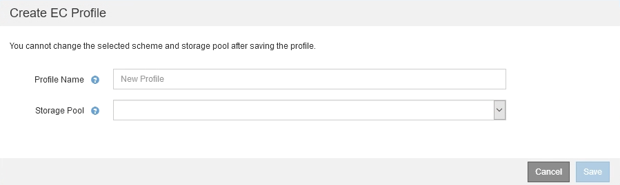

= Erstellen Sie ein Erasure Coding-Profil
:allow-uri-read: 
:icons: font
:imagesdir: ../media/

[role="lead"]
Um ein Erasure Coding-Profil zu erstellen, verknüpfen Sie einen Speicherpool mit Storage-Nodes mit einem Codierungsschema zur Fehlerkorrektur. Diese Verknüpfung bestimmt die Anzahl der erstellten Daten und Paritäts-Fragmente und wo das System diese Fragmente verteilt.

.Was Sie und#8217;ll benötigen
* Sie sind mit einem bei Grid Manager angemeldet xref:../admin/web-browser-requirements.adoc[Unterstützter Webbrowser].
* Sie haben spezifische Zugriffsberechtigungen.
* Sie haben einen Speicherpool erstellt, der genau einen Standort oder einen Speicherpool umfasst, der drei oder mehr Standorte umfasst. Für einen Storage Pool mit nur zwei Standorten stehen keine Erasure Coding-Schemata zur Verfügung.

Die in Erasure Coding-Profilen verwendeten Storage-Pools müssen exakt einen oder drei oder mehr Standorte umfassen. Wenn Sie Standortredundanz bereitstellen möchten, muss der Speicherpool mindestens drei Standorte aufweisen.

NOTE: Sie müssen einen Speicherpool auswählen, der Speicherknoten enthält. Sie können Archiv-Knoten nicht zum Löschen codierter Daten verwenden.

.Schritte
. Wählen Sie *ILM* *Erasure Coding* aus.
+
Die Seite Erasure Coding Profiles wird angezeigt.

+
image::../media/ec_profiles_page.png[Seite „Profile Für Codierungsverfahren Zur Fehlerkorrektur“]

. Wählen Sie *Erstellen*.
+
Das Dialogfeld EC-Profil erstellen wird angezeigt.

+

. Geben Sie einen eindeutigen Namen für das Erasure Coding-Profil ein.
+
Profilnamen müssen eindeutig sein. Ein Validierungsfehler tritt auf, wenn Sie den Namen eines vorhandenen Profils verwenden, auch wenn dieses Profil deaktiviert wurde.

+

NOTE: Der Name des Erasure Coding-Profils wird an den Namen des Speicherpools in der Platzierungsanweisung für eine ILM-Regel angehängt.

+
image::../media/storage_pool_and_erasure_coding_profile.png[Storage-Pool und EC-Profilname]

. Wählen Sie den Speicherpool aus, den Sie für dieses Erasure Coding-Profil erstellt haben.
+

NOTE: Wenn Ihr Grid derzeit nur einen Standort enthält, können Sie den Standardspeicherpool, alle Speicherknoten oder einen beliebigen Speicherpool, der den Standardstandort, Alle Standorte enthält, nicht verwenden. Dieses Verhalten verhindert, dass das Erasure Coding-Profil ungültig wird, wenn ein zweiter Standort hinzugefügt wird.

+

NOTE: Wenn ein Speicherpool genau zwei Standorte umfasst, kann er nicht für Erasure Coding verwendet werden. Für einen Speicherpool mit zwei Standorten stehen keine Erasure Coding-Schemata zur Verfügung.

+
Wenn Sie einen Speicherpool auswählen, wird die Liste der verfügbaren Erasure-Coding-Schemata angezeigt, basierend auf der Anzahl der Speicherknoten und Standorte im Pool.

+
image::../media/create_ec_profile_three_sites.png[Erstellen Sie EC-Profil drei Standorte]

+
Die folgenden Informationen sind für jedes verfügbare Erasure Coding-Schema aufgeführt:

+
** *Erasure Code*: Der Name des Erasure-Codierungsschemas im folgenden Format: Datenfragmente + Paritätsfragmente.
** *Storage Overhead (%)*: Der zusätzliche Speicher, der für Paritäts-Fragmente im Verhältnis zur Datengröße des Objekts benötigt wird. Storage Overhead = Gesamtzahl der Parity-Fragmente / Gesamtzahl an Datenfragmenten
** *Speicherknoten-Redundanz*: Die Anzahl der Speicherknoten, die verloren gehen können, während weiterhin die Fähigkeit, Objektdaten abzurufen.
** *Standortredundanz*: Ob der ausgewählte Löschcode die Objektdaten bei Verlust eines Standorts abrufen lässt.
+
Um Standortredundanz zu unterstützen, muss der ausgewählte Speicherpool mehrere Standorte umfassen, von denen jeder über genügend Storage-Nodes verfügt, damit jeder Standort verloren geht. Beispielsweise muss der ausgewählte Speicherpool mindestens drei Standorte mit mindestens drei Storage-Nodes an jedem Standort enthalten, um die Standortredundanz mithilfe eines Erasure Coding-Schemas von 6+3 zu unterstützen.

+
In den folgenden Fällen werden Meldungen angezeigt:

+
** Der ausgewählte Speicherpool bietet keine Standortredundanz. Die folgende Meldung wird erwartet, wenn der ausgewählte Speicherpool nur einen Standort umfasst. Sie können dieses Erasure Coding-Profil in ILM-Regeln verwenden, um sich vor Node-Ausfällen zu schützen.
+
image::../media/create_ec_profile_no_site_redundancy.png[EC-Profil erstellen Keine Standortredundanz]

** Der ausgewählte Speicherpool erfüllt nicht die Anforderungen für ein Erasure Coding-Schema. Zum Beispiel wird die folgende Meldung erwartet, wenn der ausgewählte Speicherpool genau zwei Standorte umfasst. Um Objektdaten mit Erasure Coding zu sichern, müssen Sie einen Storage-Pool mit genau einem Standort oder einem Storage-Pool mit drei oder mehr Standorten auswählen.
+
image::../media/ec_profile_error.png[Fehler Beim Erasure Coding-Profil]

** Das Grid enthält nur einen Standort, und Sie haben den Standardspeicherpool, alle Speicherknoten oder einen beliebigen Speicherpool ausgewählt, der den Standardstandort, Alle Standorte enthält.
+
image::../media/ilm_ec_profile_all_storage_nodes_warning.png[ILM EC-Profil Alle Storage-Nodes Warnung]

** Das von Ihnen ausgewählte Erasure Coding-Schema und der ausgewählte Speicherpool überschneiden sich mit einem anderen Erasure Coding-Profil.
+
image::../media/ilm_ec_profile_ec_scheme_warning.png[Warnung: ILM EC Profile Erasure Coding Scheme]

+
In diesem Beispiel wird eine Warnmeldung angezeigt, weil ein anderes Erasure Coding-Profil das 2+1-Schema verwendet und der Speicherpool für das andere Profil auch einen der Standorte im Speicherpool Alle 3 Standorte verwendet.

+
Obwohl Sie nicht daran gehindert werden, dieses neue Profil zu erstellen, müssen Sie sehr vorsichtig sein, wenn Sie es in der ILM-Richtlinie verwenden. Wird dieses neue Profil auf vorhandene Objekte angewendet, die mit Erasure-Coding-Verfahren versehen sind und bereits durch das andere Profil geschützt sind, erstellt StorageGRID einen völlig neuen Satz von Objektfragmenten. Die vorhandenen 2+1-Fragmente werden nicht wiederverwendet. Bei der Migration von einem Erasure Coding-Profil zum anderen können Ressourcenprobleme auftreten, auch wenn die Erasure Coding-Schemata identisch sind.

. Wenn mehr als ein Erasure-Coding-Schema aufgeführt ist, wählen Sie das gewünschte Schema aus.
+
Bei der Entscheidung, welches Erasure-Coding-Schema verwendet werden soll, sollten Sie die Fehlertoleranz (die durch mehr Paritätssegmente erzielt wird) mit den Anforderungen des Netzwerkverkehrs für Reparaturen abgleichen (mehr Fragmente entsprechen mehr Netzwerkverkehr). Wenn Sie beispielsweise zwischen einem Schema 4+2 und 6+3 entscheiden, wählen Sie das Schema 6+3 aus, wenn zusätzliche Parität und Fehlertoleranz erforderlich sind. Wählen Sie das Schema 4+2 aus, wenn die Netzwerkressourcen eingeschränkt sind, um den Netzwerkverbrauch bei Node-Reparaturen zu reduzieren.

. Wählen Sie *Speichern*.

