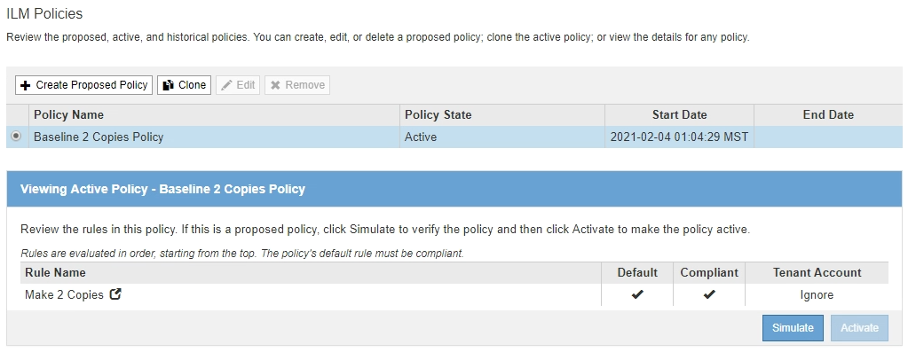

= Erstellen Sie eine ILM-Richtlinie, nachdem S3 Object Lock aktiviert ist
:allow-uri-read: 
:icons: font
:imagesdir: ../media/

[role="lead"]
Wenn die globale S3-Objektsperre aktiviert ist, unterscheiden sich die Schritte zum Erstellen einer Richtlinie geringfügig. Sie müssen sicherstellen, dass die ILM-Richtlinie die Anforderungen von Buckets erfüllt, für die S3 Object Lock aktiviert ist.

.Was Sie benötigen
* Sie sind mit einem bei Grid Manager angemeldet xref:../admin/web-browser-requirements.adoc[Unterstützter Webbrowser].
* Sie haben spezifische Zugriffsberechtigungen.
* Die globale S3-Objektsperre ist für das StorageGRID-System bereits aktiviert.
+

NOTE: Wenn die globale S3-Objektsperre nicht aktiviert wurde, verwenden Sie die allgemeinen Anweisungen für xref:creating-proposed-ilm-policy.adoc[Erstellen einer vorgeschlagenen ILM-Richtlinie].

* Sie haben die konformen und nicht konformen ILM-Regeln erstellt, die Sie zur vorgeschlagenen Richtlinie hinzufügen möchten. Bei Bedarf können Sie eine vorgeschlagene Richtlinie speichern, zusätzliche Regeln erstellen und die vorgeschlagene Richtlinie bearbeiten, um die neuen Regeln hinzuzufügen. Siehexref:example-7-compliant-ilm-policy-for-s3-object-lock.adoc[Beispiel 7: Konforme ILM-Richtlinie für S3 Object Lock].
* Das ist schon xref:creating-default-ilm-rule.adoc[Eine Standard-ILM-Regel wurde erstellt] Für die Richtlinie, die konform ist.
* Optional haben Sie sich das Video angesehen: https://["Video: StorageGRID ILM-Richtlinien"^]
+
[link=https://netapp.hosted.panopto.com/Panopto/Pages/Viewer.aspx?id=c929e94e-353a-4375-b112-acc5013c81c7]
image::../media/video-screenshot-ilm-policies.png[Video: StorageGRID ILM-Richtlinien]

.Schritte
. Wählen Sie *ILM* *Richtlinien* aus.
+
Die Seite ILM-Richtlinien wird angezeigt. Wenn die globale S3-Objektsperreneinstellung aktiviert ist, zeigt die Seite ILM-Richtlinien an, welche ILM-Regeln konform sind.

+

. Geben Sie im Feld *Name* einen eindeutigen Namen für die vorgeschlagene Richtlinie ein.
+
Sie müssen mindestens 1 und nicht mehr als 64 Zeichen eingeben.

. Geben Sie im Feld *Grund für Änderung* den Grund für die Erstellung einer neuen Policy ein.
+
Sie müssen mindestens 1 und nicht mehr als 128 Zeichen eingeben.

. Um der Richtlinie Regeln hinzuzufügen, wählen Sie *Regeln auswählen*.
+
Das Dialogfeld Regeln für Richtlinie auswählen wird angezeigt, in dem alle definierten Regeln aufgeführt sind.

+
** Im Abschnitt Standardregel auswählen werden die Regeln aufgeführt, die für eine konforme Richtlinie standardmäßig gelten können. Es enthält konforme Regeln, die keine Filter oder die nicht aktuelle Referenzzeit verwenden.
** Im Abschnitt andere Regeln auswählen werden die anderen für diese Richtlinie ausgewählten Compliance- und nicht-konformen Regeln aufgeführt.
+
image::../media/ilm_policy_select_rules_for_compliant_policy.png[ILM Policy Select Rules for Compliant Policy]

. Wählen Sie einen Regelnamen oder das Symbol für weitere Details aus image:../media/icon_nms_more_details.gif["Weitere Details"] So zeigen Sie die Einstellungen für diese Regel an:
. Wählen Sie im Abschnitt *Standardregel auswählen* eine Standardregel für die vorgeschlagene Richtlinie aus.
+
In der Tabelle in diesem Abschnitt werden nur die Regeln aufgeführt, die kompatibel sind und keine Filter verwenden.

+

NOTE: Wenn im Abschnitt Standardregel auswählen keine Regel aufgeführt ist, müssen Sie die Seite für die ILM-Richtlinie und beenden xref:creating-default-ilm-rule.adoc[Erstellen einer Standard-ILM-Regel] Die Compliance-Anforderungen erfüllt.

+

IMPORTANT: Verwenden Sie die Regel „2-Kopien-Bestand erstellen“ nicht als Standardregel für eine Richtlinie. Die Regel 2 Kopien erstellen verwendet einen einzelnen Speicherpool, alle Speicherknoten, der alle Standorte enthält. Wenn Sie diese Regel verwenden, können mehrere Kopien eines Objekts auf demselben Standort platziert werden.

. Wählen Sie im Abschnitt *Weitere Regeln* alle weiteren Regeln aus, die Sie in die Richtlinie aufnehmen möchten.
+
.. Wenn Sie für Objekte in nicht-konformen S3-Buckets eine andere „`default`“-Regel benötigen, wählen Sie optional eine nicht konforme Regel aus, die keinen Filter verwendet.
+
Beispielsweise möchten Sie einen Cloud-Storage-Pool oder einen Archiv-Node verwenden, um Objekte in Buckets zu speichern, in denen die S3-Objektsperre nicht aktiviert ist.

+

NOTE: Sie können nur eine nicht kompatible Regel auswählen, die keinen Filter verwendet. Sobald Sie eine Regel auswählen, wird in der Spalte *ist wählbar* *Nein* für alle anderen nicht-konformen Regeln ohne Filter angezeigt.

.. Wählen Sie alle anderen konformen oder nicht konformen Regeln aus, die Sie in der Richtlinie verwenden möchten.
+
Die anderen Regeln müssen mindestens einen Filter verwenden (Mandantenkonto, Bucket-Name oder erweiterte Filter, wie Objektgröße).

. Wenn Sie die Regeln ausgewählt haben, wählen Sie *Anwenden*.
+
Die ausgewählten Regeln werden aufgelistet. Die Standardregel ist am Ende, mit den anderen Regeln darüber. Wenn Sie auch eine nicht-konforme Regel „`default`“ ausgewählt haben, wird diese Regel als zweite zu letzte Regel in der Richtlinie hinzugefügt.

+
In diesem Beispiel ist die letzte Regel, 2 Kopien 2 Rechenzentren, die Standardregel: Sie ist kompatibel und hat keine Filter. Die zweite bis letzte Regel – Cloud Storage Pool – verfügt ebenfalls über keine Filter, ist aber nicht konform.

+
image::../media/ilm_policies_selected_rules_compliant.png[ILM-Richtlinien erfüllt ausgewählte Regeln]

. Ziehen Sie die Zeilen für die nicht standardmäßigen Regeln per Drag-and-Drop, um die Reihenfolge zu bestimmen, in der diese Regeln ausgewertet werden.
+
Sie können die Standardregel oder die nicht-konforme Regel „`default`“ nicht verschieben.

+

IMPORTANT: Sie müssen sich vergewissern, dass die ILM-Regeln in der richtigen Reihenfolge sind. Wenn die Richtlinie aktiviert ist, werden neue und vorhandene Objekte anhand der Regeln in der angegebenen Reihenfolge bewertet, die oben beginnen.

. Wählen Sie bei Bedarf das Löschsymbol aus image:../media/icon_nms_delete_new.gif["Symbol Löschen"] Löschen von Regeln, die in der Richtlinie nicht enthalten sein sollen, oder *Regeln auswählen*, um weitere Regeln hinzuzufügen.
. Wenn Sie fertig sind, wählen Sie *Speichern*.
+
Die Seite ILM-Richtlinien wird aktualisiert:

+
** Die von Ihnen gespeicherte Richtlinie wird als Vorschlag angezeigt. Die vorgeschlagenen Richtlinien haben kein Start- und Enddatum.
** Die Schaltflächen *Simulate* und *Activate* sind aktiviert.
+
image::../media/ilm_policy_proposed_policy_s3_object_lock.png[Vorgeschlagene Richtlinie für ILM-Richtlinie S3 Objektsperre]

. Gehen Sie zu xref:simulating-ilm-policy.adoc[Simulation einer ILM-Richtlinie].

