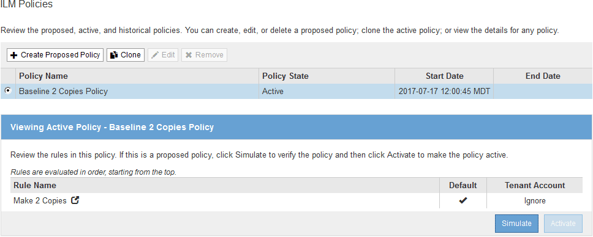
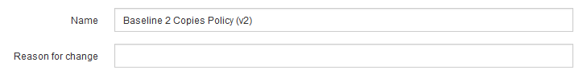
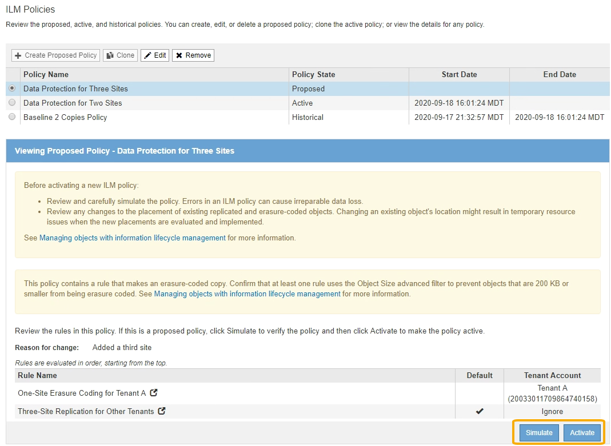

= Erstellen einer vorgeschlagenen ILM-Richtlinie
:allow-uri-read: 
:icons: font
:imagesdir: ../media/

[role="lead"]
Sie können eine vorgeschlagene ILM-Richtlinie von Grund auf erstellen oder die aktuelle aktive Richtlinie klonen, wenn Sie mit demselben Regelsatz beginnen möchten.

NOTE: Wenn die globale S3-Objektsperre aktiviert wurde, gehen Sie stattdessen wie folgt vor: xref:creating-ilm-policy-after-s3-object-lock-is-enabled.adoc[Erstellen Sie eine ILM-Richtlinie, nachdem S3 Object Lock aktiviert ist].

.Was Sie benötigen
* Sie sind mit einem bei Grid Manager angemeldet xref:../admin/web-browser-requirements.adoc[Unterstützter Webbrowser].
* Sie haben spezifische Zugriffsberechtigungen.
* Sie haben die ILM-Regeln erstellt, die Sie der vorgeschlagenen Richtlinie hinzufügen möchten. Bei Bedarf können Sie eine vorgeschlagene Richtlinie speichern, zusätzliche Regeln erstellen und die vorgeschlagene Richtlinie bearbeiten, um die neuen Regeln hinzuzufügen.
* Das ist schon xref:creating-default-ilm-rule.adoc[Eine Standard-ILM-Regel wurde erstellt] Für die Richtlinie, die keine Filter enthält.
* Optional haben Sie sich das Video angesehen: https://netapp.hosted.panopto.com/Panopto/Pages/Viewer.aspx?id=c929e94e-353a-4375-b112-acc5013c81c7["Video: StorageGRID ILM-Richtlinien"^]
+
[link=https://netapp.hosted.panopto.com/Panopto/Pages/Viewer.aspx?id=c929e94e-353a-4375-b112-acc5013c81c7]
image::../media/video-screenshot-ilm-policies.png[Video: StorageGRID ILM-Richtlinien]

.Über diese Aufgabe
Typische Gründe für die Erstellung einer vorgeschlagenen ILM-Richtlinie sind:

* Sie haben einen neuen Standort hinzugefügt und müssen neue ILM-Regeln verwenden, um Objekte an diesem Standort zu platzieren.
* Sie müssen einen Standort außer Betrieb nehmen und alle Regeln, die sich auf den Standort beziehen, entfernen.
* Sie haben einen neuen Mandanten mit besonderen Anforderungen an die Datensicherheit hinzugefügt.
* Sie haben damit begonnen, einen Cloud-Storage-Pool zu verwenden.

IMPORTANT: Verwenden Sie die integrierte Systemrichtlinie Basis-2-Kopien-Richtlinie nur in Testsystemen. Die Regel 2 Kopien erstellen in dieser Richtlinie verwendet den Speicherpool Alle Speicherknoten, der alle Standorte enthält. Wenn Ihr StorageGRID System über mehrere Standorte verfügt, können zwei Kopien eines Objekts an demselben Standort platziert werden.

.Schritte
. Wählen Sie *ILM* *Richtlinien* aus.
+
Die Seite ILM-Richtlinien wird angezeigt. Auf dieser Seite können Sie die Liste der vorgeschlagenen, aktiven und historischen Richtlinien überprüfen; erstellen, bearbeiten, Oder entfernen Sie eine vorgeschlagene Richtlinie, klonen Sie die aktive Richtlinie oder lesen Sie die Details zu einer Richtlinie.

+

. Legen Sie fest, wie Sie die vorgeschlagene ILM-Richtlinie erstellen möchten.
+
[cols="1a,2a"]
|===
| Option | Schritte 

 a| 
Erstellen Sie eine neue vorgeschlagene Richtlinie, für die keine Regeln bereits ausgewählt sind
 a| 
.. Wenn derzeit eine vorgeschlagene ILM-Richtlinie vorhanden ist, wählen Sie diese Richtlinie aus, und wählen Sie *Entfernen* aus.
+
Sie können keine neue vorgeschlagene Richtlinie erstellen, wenn eine vorgeschlagene Richtlinie bereits vorhanden ist.

.. Wählen Sie *Vorgeschlagene Richtlinie Erstellen*.

 a| 
Erstellen Sie eine vorgeschlagene Richtlinie auf der Grundlage der aktiven Richtlinie
 a| 
.. Wenn derzeit eine vorgeschlagene ILM-Richtlinie vorhanden ist, wählen Sie diese Richtlinie aus, und wählen Sie *Entfernen* aus.
+
Sie können die aktive Richtlinie nicht klonen, wenn eine vorgeschlagene Richtlinie bereits vorhanden ist.

.. Wählen Sie die aktive Richtlinie aus der Tabelle aus.
.. Wählen Sie *Clone*.

 a| 
Bearbeiten Sie die vorhandene vorgeschlagene Richtlinie
 a| 
.. Wählen Sie die vorgeschlagene Richtlinie aus der Tabelle aus.
.. Wählen Sie *Bearbeiten*.

|===
+
Das Dialogfeld ILM-Richtlinie konfigurieren wird angezeigt.

+
Wenn Sie eine neue vorgeschlagene Richtlinie erstellen, sind alle Felder leer und es werden keine Regeln ausgewählt.

+
image::../media/ilm_policies_configure_ilm_policy.png[ILM-Richtlinien konfigurieren die ILM-Richtlinie]

+
Wenn Sie die aktive Richtlinie klonen, zeigt das Feld *Name* den Namen der aktiven Richtlinie an, der durch eine Versionsnummer („`v2`" im Beispiel angehängt wird. Die in der aktiven Richtlinie verwendeten Regeln werden ausgewählt und in ihrer aktuellen Reihenfolge angezeigt.

+

. Geben Sie im Feld *Name* einen eindeutigen Namen für die vorgeschlagene Richtlinie ein.
+
Sie müssen mindestens 1 und nicht mehr als 64 Zeichen eingeben. Wenn Sie die aktive Richtlinie klonen, können Sie den aktuellen Namen mit der angehängerten Versionsnummer verwenden oder einen neuen Namen eingeben.

. Geben Sie im Feld *Grund für Änderung* den Grund für die Erstellung einer neuen Policy ein.
+
Sie müssen mindestens 1 und nicht mehr als 128 Zeichen eingeben.

. Um der Richtlinie Regeln hinzuzufügen, wählen Sie *Regeln auswählen*.
+
Das Dialogfeld Regeln für Richtlinie auswählen wird angezeigt, in dem alle definierten Regeln aufgeführt sind. Beim Klonen einer Richtlinie:

+
** Die von der Richtlinie, die Sie klonen, verwendeten Regeln sind ausgewählt.
** Wenn die Richtlinie, die Sie klonen, Regeln ohne Filter verwendet hat, die nicht die Standardregel waren, werden Sie aufgefordert, alle Regeln außer einer dieser Regeln zu entfernen.
** Wenn die Standardregel einen Filter oder die nicht aktuelle Referenzzeit verwendet hat, werden Sie aufgefordert, eine neue Standardregel auszuwählen.
** Wenn die Standardregel nicht die letzte Regel war, können Sie mit einer Schaltfläche die Regel an das Ende der neuen Richtlinie verschieben.
+
image::../media/ilm_policies_select_rules_for_policy.png[ILM-Richtlinien: Regeln für die Richtlinie auswählen]

. Wählen Sie einen Regelnamen oder das Symbol für weitere Details aus image:../media/icon_nms_more_details.gif["Weitere Details"] So zeigen Sie die Einstellungen für diese Regel an:
+
Dieses Beispiel zeigt die Details einer ILM-Regel, die zwei Kopien an zwei Standorten erstellt.

+
image::../media/ilm_rule_summary_page.png[Zusammenfassungsseite für ILM-Regeln]

. Wählen Sie im Abschnitt *Standardregel auswählen* eine Standardregel für die vorgeschlagene Richtlinie aus.
+
Die Standardregel gilt für alle Objekte, die nicht mit einer anderen Regel in der Richtlinie übereinstimmen. Die Standardregel kann keine Filter verwenden und wird immer zuletzt ausgewertet.

+

NOTE: Wenn im Abschnitt Standardregel auswählen keine Regel aufgeführt ist, müssen Sie die Seite für die ILM-Richtlinie und beenden xref:creating-default-ilm-rule.adoc[Erstellen einer Standard-ILM-Regel].

+

IMPORTANT: Verwenden Sie die Regel „2-Kopien-Bestand erstellen“ nicht als Standardregel für eine Richtlinie. Die Regel 2 Kopien erstellen verwendet einen einzelnen Speicherpool, alle Speicherknoten, der alle Standorte enthält. Wenn Ihr StorageGRID System über mehrere Standorte verfügt, können zwei Kopien eines Objekts an demselben Standort platziert werden.

. Wählen Sie im Abschnitt *Weitere Regeln* alle weiteren Regeln aus, die Sie in die Richtlinie aufnehmen möchten.
+
Die anderen Regeln werden vor der Standardregel evaluiert und müssen mindestens einen Filter verwenden (Mandantenkonto, Bucket-Name, erweiterten Filter oder die nicht aktuelle Referenzzeit).

. Wenn Sie die Auswahl von Regeln abgeschlossen haben, wählen Sie *Anwenden*.
+
Die ausgewählten Regeln werden aufgelistet. Die Standardregel ist am Ende, mit den anderen Regeln darüber.

+
image::../media/ilm_policies_selected_rules.png[Ausgewählte ILM-Richtlinien]

+
[NOTE]
====
Eine Warnung wird angezeigt, wenn die Standardregel Objekte nicht dauerhaft enthält. Wenn Sie diese Richtlinie aktivieren, müssen Sie bestätigen, dass StorageGRID Objekte löschen soll, wenn die Platzierungsanweisungen für die Standardregel abgelaufen sind (es sei denn, ein Bucket-Lebenszyklus hält die Objekte länger).

image::../media/ilm_policy_default_rule_not_forever.png[ILM-Richtlinie Standardregel nicht für immer]

====
. Ziehen Sie die Zeilen für die nicht standardmäßigen Regeln per Drag-and-Drop, um die Reihenfolge zu bestimmen, in der diese Regeln ausgewertet werden.
+
Sie können die Standardregel nicht verschieben.

+

IMPORTANT: Sie müssen sich vergewissern, dass die ILM-Regeln in der richtigen Reihenfolge sind. Wenn die Richtlinie aktiviert ist, werden neue und vorhandene Objekte anhand der Regeln in der angegebenen Reihenfolge bewertet, die oben beginnen.

. Wählen Sie bei Bedarf das Löschsymbol aus image:../media/icon_nms_delete_new.gif["Symbol Löschen"] Wenn Sie Regeln löschen möchten, die in der Richtlinie nicht enthalten sein sollen, oder wählen Sie *Regeln auswählen*, um weitere Regeln hinzuzufügen.
. Wenn Sie fertig sind, wählen Sie *Speichern*.
+
Die Seite ILM-Richtlinien wird aktualisiert:

+
** Die von Ihnen gespeicherte Richtlinie wird als Vorschlag angezeigt. Die vorgeschlagenen Richtlinien haben kein Start- und Enddatum.
** Die Schaltflächen *Simulate* und *Activate* sind aktiviert.
+

. Gehen Sie zu xref:simulating-ilm-policy.adoc[Simulation einer ILM-Richtlinie].

.Verwandte Informationen
* xref:what-ilm-policy-is.adoc[Was ist eine ILM-Richtlinie]
* xref:managing-objects-with-s3-object-lock.adoc[Objekte managen mit S3 Object Lock]

