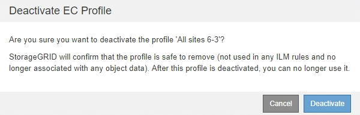

= Deaktivieren Sie ein Erasure Coding-Profil
:allow-uri-read: 
:icons: font
:imagesdir: ../media/

[role="lead"]
Sie können ein Erasure Coding-Profil deaktivieren, wenn Sie es nicht mehr verwenden möchten und wenn das Profil derzeit in keiner ILM-Regel verwendet wird.

.Was Sie und#8217;ll benötigen
* Sie sind mit einem bei Grid Manager angemeldet xref:../admin/web-browser-requirements.adoc[Unterstützter Webbrowser].
* Sie haben spezifische Zugriffsberechtigungen.
* Sie haben bestätigt, dass derzeit keine Reparatur- oder Deaktivierung von Daten mithilfe von Erasure Coding ausgeführt wird. Wenn Sie versuchen, ein Erasure Coding-Profil zu deaktivieren, während einer dieser Vorgänge ausgeführt wird, wird eine Fehlermeldung zurückgegeben.

Wenn Sie ein Erasure Coding-Profil deaktivieren, wird das Profil auf der Seite Erasure Coding Profiles weiterhin angezeigt, der Status ist jedoch *deactivated*.

image::../media/deactivated_ec_profile.png[EC-Profil deaktiviert]

Sie können kein deaktiviertes Erasure-Coding-Profil mehr verwenden. Ein deaktiviertes Profil wird nicht angezeigt, wenn Sie die Platzierungsanweisungen für eine ILM-Regel erstellen. Ein deaktiviertes Profil kann nicht reaktiviert werden.

StorageGRID verhindert, dass Sie ein Erasure-Coding-Profil deaktivieren können, wenn eine der folgenden Optionen zutrifft:

* Das Erasure Coding-Profil wird derzeit in einer ILM-Regel verwendet.
* Das Erasure Coding-Profil wird in keiner ILM-Regel mehr verwendet. Objektdaten und Paritätsfragmente für das Profil sind jedoch weiterhin vorhanden.

.Schritte
. Wählen Sie *ILM* *Erasure Coding* aus.
+
Die Seite Erasure Coding Profiles wird angezeigt. Die Schaltflächen *Umbenennen* und *Deaktivieren* sind beide deaktiviert.

. Überprüfen Sie in der Spalte *Status*, ob das zu deaktivierungssyquente Erasure-Coding-Profil nicht in ILM-Regeln verwendet wird.
+
Ein Erasure Coding-Profil kann nicht deaktiviert werden, wenn es in einer ILM-Regel verwendet wird. Im Beispiel wird das *2_1 EC-Profil* in mindestens einer ILM-Regel verwendet.

+
image::../media/ec_profile_used_in_ilm_rule.png[In der ILM-Regel verwendetes EC-Profil]

. Wenn das Profil in einer ILM-Regel verwendet wird, führen Sie die folgenden Schritte aus:
+
.. Wählen Sie *ILM* *Regeln*.
.. Wählen Sie für jede der aufgeführten Regeln das Optionsfeld aus, und überprüfen Sie das Aufbewahrungsdiagramm, um festzustellen, ob die Regel das Erasure-Coding-Profil verwendet, das Sie deaktivieren möchten.
+
Im Beispiel verwendet die Regel *drei Seiten-EC für größere Objekte* einen Speicherpool mit dem Namen *Alle 3 Standorte* und das Profil *Alle Standorte 6-3* Erasure Coding. Dieses Symbol repräsentiert die Profile von Erasure Coding: image:../media/icon_nms_erasure_coded.gif["EC-Profile-Symbol"]

+
image::../media/ilm_rule_ec_profile_used.png[Verwendetes ILM-Regel EC-Profil]

.. Wenn die ILM-Regel das Erasure Coding-Profil verwendet, das Sie deaktivieren möchten, stellen Sie fest, ob die Regel entweder in der aktiven ILM-Richtlinie oder in einer vorgeschlagenen Richtlinie verwendet wird.
+
Im Beispiel wird die Regel *drei Standorte EC für größere Objekte* in der aktiven ILM-Richtlinie verwendet.

.. Führen Sie die zusätzlichen Schritte in der Tabelle aus, wobei das Erasure Coding-Profil verwendet wird.
+
[cols="2a,3a,1a"]
|===
| Wo wurde das Profil verwendet? | Weitere Schritte, die vor dem Deaktivieren des Profils ausgeführt werden müssen | Beachten Sie diese zusätzlichen Anweisungen 

 a| 
Nie in einer ILM-Regel verwendet
 a| 
Weitere Schritte sind nicht erforderlich. Fahren Sie mit diesem Verfahren fort.
 a| 
_Keine_

 a| 
In einer ILM-Regel, die noch nie in einer ILM-Richtlinie verwendet wurde
 a| 
... Alle betroffenen ILM-Regeln bearbeiten oder löschen. Wenn Sie die Regel bearbeiten, entfernen Sie alle Platzierungen, die das Erasure Coding-Profil verwenden.
... Fahren Sie mit diesem Verfahren fort.

 a| 
xref:working-with-ilm-rules-and-ilm-policies.adoc[Arbeiten Sie mit ILM-Regeln und ILM-Richtlinien]

 a| 
In einer ILM-Regel, die sich derzeit in der aktiven ILM-Richtlinie befindet
 a| 
... Klonen der aktiven Richtlinie
... Entfernen Sie die ILM-Regel, die das Erasure Coding-Profil verwendet.
... Fügen Sie mindestens eine neue ILM-Regel hinzu, um die Sicherheit von Objekten zu gewährleisten.
... Speichern, simulieren und aktivieren Sie die neue Richtlinie.
... Warten Sie, bis die neue Richtlinie angewendet wird und vorhandene Objekte basierend auf den neuen Regeln, die Sie hinzugefügt haben, an neue Orte verschoben werden.
+
*Hinweis:* abhängig von der Anzahl der Objekte und der Größe Ihres StorageGRID-Systems kann es Wochen oder sogar Monate dauern, bis ILM-Vorgänge die Objekte auf der Grundlage der neuen ILM-Regeln an neue Orte verschieben.

+
Während Sie sicher versuchen können, ein Erasure-Coding-Profil zu deaktivieren, während es noch mit Daten verknüpft ist, schlägt die Deaktivierung fehl. Eine Fehlermeldung informiert Sie darüber, ob das Profil noch nicht deaktiviert werden kann.

... Bearbeiten oder löschen Sie die Regel, die Sie aus der Richtlinie entfernt haben. Wenn Sie die Regel bearbeiten, entfernen Sie alle Platzierungen, die das Erasure Coding-Profil verwenden.
... Fahren Sie mit diesem Verfahren fort.

 a| 
*** xref:creating-ilm-policy.adoc[ILM-Richtlinie erstellen]
*** xref:working-with-ilm-rules-and-ilm-policies.adoc[Arbeiten Sie mit ILM-Regeln und ILM-Richtlinien]

 a| 
In einer ILM-Regel, die sich derzeit in einer vorgeschlagenen ILM-Richtlinie befindet
 a| 
... Bearbeiten Sie die vorgeschlagene Richtlinie.
... Entfernen Sie die ILM-Regel, die das Erasure Coding-Profil verwendet.
... Fügen Sie ein oder mehrere neue ILM-Regeln hinzu, um sicherzustellen, dass alle Objekte geschützt sind.
... Speichern Sie die vorgeschlagene Richtlinie.
... Bearbeiten oder löschen Sie die Regel, die Sie aus der Richtlinie entfernt haben. Wenn Sie die Regel bearbeiten, entfernen Sie alle Platzierungen, die das Erasure Coding-Profil verwenden.
... Fahren Sie mit diesem Verfahren fort.

 a| 
*** xref:creating-ilm-policy.adoc[ILM-Richtlinie erstellen]
*** xref:working-with-ilm-rules-and-ilm-policies.adoc[Arbeiten Sie mit ILM-Regeln und ILM-Richtlinien]

 a| 
In einer ILM-Regel, die sich in einer historischen ILM-Richtlinie befindet
 a| 
... Bearbeiten oder löschen Sie die Regel. Wenn Sie die Regel bearbeiten, entfernen Sie alle Platzierungen, die das Erasure Coding-Profil verwenden. (Die Regel wird nun als historische Regel in der historischen Richtlinie angezeigt.)
... Fahren Sie mit diesem Verfahren fort.

 a| 
xref:working-with-ilm-rules-and-ilm-policies.adoc[Arbeiten Sie mit ILM-Regeln und ILM-Richtlinien]

|===
.. Aktualisieren Sie die Seite Erasure Coding Profiles, um sicherzustellen, dass das Profil nicht in einer ILM-Regel verwendet wird.

. Wenn das Profil nicht in einer ILM-Regel verwendet wird, aktivieren Sie das Optionsfeld und wählen Sie *Deaktivieren*.
+
Das Dialogfeld EC-Profil deaktivieren wird angezeigt.

+

. Wenn Sie sicher sind, dass Sie das Profil deaktivieren möchten, wählen Sie *Deactivate*.
+
** Wenn StorageGRID das Erasure-Coding-Profil deaktivieren kann, lautet sein Status *deaktiviert*. Sie können dieses Profil nicht mehr für eine ILM-Regel auswählen.
** Wenn StorageGRID das Profil nicht deaktivieren kann, wird eine Fehlermeldung angezeigt. Wenn Objektdaten weiterhin mit diesem Profil verknüpft sind, wird beispielsweise eine Fehlermeldung angezeigt. Sie müssen möglicherweise mehrere Wochen warten, bevor Sie den Deaktivierungsprozess erneut versuchen.

