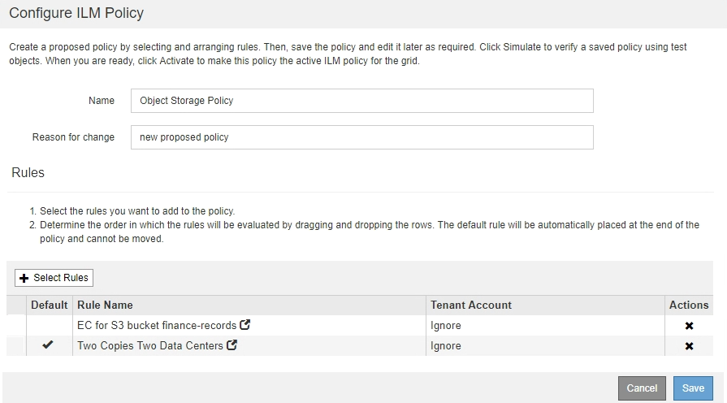

= Beispiel 1: ILM-Regeln und -Richtlinie für Objekt-Storage
:allow-uri-read: 
:icons: font
:imagesdir: ../media/

[role="lead"]
Die folgenden Beispielregeln und -Richtlinien dienen als Ausgangspunkt bei der Definition einer ILM-Richtlinie zur Erfüllung der Anforderungen an Objektschutz und -Aufbewahrung.

CAUTION: Die folgenden ILM-Regeln und -Richtlinien sind nur Beispiele. Es gibt viele Möglichkeiten zur Konfiguration von ILM-Regeln. Vor der Aktivierung einer neuen Richtlinie sollte die vorgeschlagene Richtlinie simuliert werden, um zu bestätigen, dass sie wie vorgesehen funktioniert, um Inhalte vor Verlust zu schützen.

== ILM-Regel 1 beispielsweise 1: Objektdaten in zwei Datacenter kopieren

Diese Beispiel-ILM-Regel kopiert Objektdaten in Storage-Pools in zwei Datacentern.

[cols="1a,2a"]
|===
| Regeldefinition | Beispielwert 

 a| 
Storage-Pools
 a| 
Zwei Speicherpools, jeweils in verschiedenen Datacentern, genannt Storage Pool DC1 und Storage Pool DC2.

 a| 
Regelname
 a| 
Zwei Kopien Zwei Datacenter

 a| 
Referenzzeit
 a| 
Aufnahmezeit

 a| 
Platzierung Von Inhalten
 a| 
Am Tag 0, behalten Sie zwei replizierte Kopien für immer - eins im Storage Pool DC1 und eine im Storage Pool DC2.

|===
image::../media/ilm_rule_two_copies_two_data_centers.png[ILM-Regel 1 beispielsweise 1: Objektdaten in zwei Datacenter kopieren]

== ILM-Regel 2 zum Beispiel 1: Erasure Coding-Profil mit Bucket-Übereinstimmung

In diesem Beispiel wird eine ILM-Regel verwendet ein Erasure Coding-Profil und einen S3-Bucket, um zu bestimmen, wo und wie lange das Objekt gespeichert wird.

[cols="1a,2a"]
|===
| Regeldefinition | Beispielwert 

 a| 
Verfahren Zur Einhaltung Von Datenkonsistenz
 a| 
* Ein Storage-Pool für drei Datacenter (alle 3 Standorte)
* Verwenden Sie das Erasure Coding-Schema für 6+3

 a| 
Regelname
 a| 
EC für S3-Bucket-Finanzdatensätze

 a| 
Referenzzeit
 a| 
Aufnahmezeit

 a| 
Platzierung Von Inhalten
 a| 
Erstellen Sie für Objekte im S3-Bucket mit Namen „Finance-Records“ eine Kopie mit Erasure-Coding-Verfahren im Pool, der durch das Erasure Coding-Profil festgelegt wird. Bewahren Sie diese Kopie für immer auf.

|===
image:../media/ilm_rule_ec_for_s3_bucket_finance_records.png["ILM-Regel 2 zum Beispiel 1: Erasure Coding-Profil mit Bucket-Übereinstimmung"]

== ILM-Richtlinie z. B. 1

Mit dem StorageGRID System entwickeln Sie ausgereifte und komplexe ILM-Richtlinien. In der Praxis sind jedoch die meisten ILM-Richtlinien einfach.

Eine typische ILM-Richtlinie für eine Topologie mit mehreren Standorten kann ILM-Regeln wie die folgenden umfassen:

* Bei der Aufnahme sollten Sie Verfahren zur Einhaltung von Datenkonsistenz (Erasure Coding) in 6+3 verwenden, um alle Objekte zu speichern, die dem S3-Bucket mit dem Namen gehören `finance-records` Über drei Datacenter verteilt.
* Wenn ein Objekt nicht mit der ersten ILM-Regel übereinstimmt, verwenden Sie die Standard-ILM-Regel der Richtlinie, zwei Kopien von zwei Rechenzentren, um eine Kopie dieses Objekts in zwei Rechenzentren zu speichern, DC1 und DC2.
+

