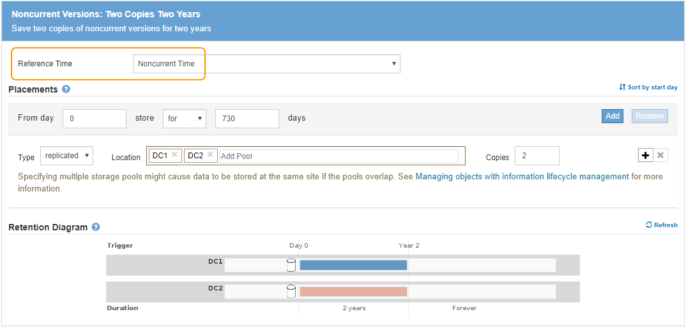

= Beispiel 4: ILM-Regeln und -Richtlinie für versionierte Objekte mit S3
:allow-uri-read: 
:icons: font
:imagesdir: ../media/

[role="lead"]
Wenn Sie einen S3-Bucket mit aktivierter Versionierung haben, können Sie die nicht aktuellen Objektversionen verwalten, indem Sie Regeln in Ihre ILM-Richtlinie einarbeiten, die *nicht aktuelle Zeit* als Referenzzeit verwenden.

Wie in diesem Beispiel dargestellt, können Sie den von versionierten Objekten verwendeten Storage mithilfe unterschiedlicher Anweisungen zur Platzierung von nicht aktuellen Objektversionen steuern.

CAUTION: Die folgenden ILM-Regeln und -Richtlinien sind nur Beispiele. Es gibt viele Möglichkeiten zur Konfiguration von ILM-Regeln. Vor der Aktivierung einer neuen Richtlinie sollte die vorgeschlagene Richtlinie simuliert werden, um zu bestätigen, dass sie wie vorgesehen funktioniert, um Inhalte vor Verlust zu schützen.

NOTE: Wenn Sie ILM-Richtlinien erstellen, um nicht aktuelle Objektversionen zu managen, beachten Sie, dass Sie zum Simulieren der Richtlinie die UUID oder CBID der Objektversion kennen müssen. Um die UUID und die CBID eines Objekts zu finden, verwenden Sie Object Metadata Lookup, während das Objekt noch aktuell ist. Siehe xref:verifying-ilm-policy-with-object-metadata-lookup.adoc[Überprüfen einer ILM-Richtlinie mit Objekt-Metadaten-Lookup].

.Verwandte Informationen
* xref:how-objects-are-deleted.adoc[So werden Objekte gelöscht]

== ILM-Regel 1 beispielsweise 4: Speichern Sie drei Kopien für 10 Jahre

In diesem Beispiel wird eine ILM-Regel für 10 Jahre eine Kopie jedes Objekts in drei Datacentern gespeichert.

Diese Regel gilt für alle Objekte, unabhängig davon, ob sie versioniert sind.

[cols="1a,2a"]
|===
| Regeldefinition | Beispielwert 

 a| 
Storage-Pools
 a| 
Drei Storage-Pools mit den Namen DC1, DC2 und DC3.

 a| 
Regelname
 a| 
Drei Kopien Zehn Jahre

 a| 
Referenzzeit
 a| 
Aufnahmezeit

 a| 
Platzierung Von Inhalten
 a| 
Am Tag 0 behalten Sie drei replizierte Kopien für 10 Jahre (3,652 Tage), eins in DC1, eins in DC2 und eins in DC3. Löschen Sie Ende 10 Jahre alle Kopien des Objekts.

|===
image::../media/ilm_rule_1_example_4.png[ILM-Regel 1 beispielsweise 4: Speichern Sie drei Kopien für 5 Jahre]

== ILM-Regel 2 beispielsweise 4: Speichern Sie zwei Kopien nicht aktueller Versionen für zwei Jahre

In diesem Beispiel wird eine ILM-Regel zwei Kopien der nicht aktuellen Versionen eines versionierten S3 Objekts für zwei Jahre gespeichert.

Da ILM-Regel 1 für alle Versionen des Objekts gilt, müssen Sie eine weitere Regel erstellen, um nicht aktuelle Versionen herauszufiltern. Diese Regel verwendet die Option *nicht aktuelle Zeit* für Referenzzeit.

In diesem Beispiel werden nur zwei Kopien der nicht aktuellen Versionen gespeichert und diese Kopien für zwei Jahre gespeichert.

[cols="1a,2a"]
|===
| Regeldefinition | Beispielwert 

 a| 
Storage-Pools
 a| 
Zwei Speicherpools mit den Namen DC1 und DC2 an verschiedenen Rechenzentren.

 a| 
Regelname
 a| 
Nicht Aktuelle Versionen: Zwei Kopien Zwei Jahre

 a| 
Referenzzeit
 a| 
Nicht Aktuelle Zeit

 a| 
Platzierung Von Inhalten
 a| 
Am Tag 0 im Verhältnis zur nicht aktuellen Zeit (d.h. ab dem Tag, an dem die Objektversion zur nicht aktuellen Version wird) zwei replizierte Kopien der nicht aktuellen Objektversionen für 2 Jahre (730 Tage), eines in DC1 und eines in DC2. Löschen Sie Ende 2 Jahre die nicht aktuellen Versionen.

|===

== ILM-Richtlinie z. B. 4: S3-versionierte Objekte

Wenn Sie ältere Versionen eines Objekts anders als die aktuelle Version verwalten möchten, müssen Regeln, die *nicht aktuelle Zeit* als Referenzzeit verwenden, in der ILM-Richtlinie vor Regeln erscheinen, die für die aktuelle Objektversion gelten.

Eine ILM-Richtlinie für S3-versionierte Objekte kann ILM-Regeln wie die folgenden umfassen:

* Bewahren Sie alle älteren (nicht aktuellen) Versionen jedes Objekts für 2 Jahre auf, beginnend mit dem Tag, an dem die Version nicht mehr aktuell wurde.
+

NOTE: Die nicht aktuellen Zeitregeln müssen in der Richtlinie vor den Regeln erscheinen, die für die aktuelle Objektversion gelten. Andernfalls werden die nicht aktuellen Objektversionen niemals mit der nicht aktuellen Zeitregel abgeglichen.

* Bei Aufnahme der Daten werden drei replizierte Kopien erstellt und eine Kopie an jedem der drei Datacenter gespeichert. Bewahren Sie 10 Jahre lang Kopien der aktuellen Objektversion auf.

image::../media/ilm_policy_example_4.png[ILM-Richtlinie z. B. 4]

Wenn Sie die Beispielrichtlinie simulieren, erwarten Sie, dass Testobjekte wie folgt bewertet werden:

* Alle nicht aktuellen Objektversionen würden mit der ersten Regel abgeglichen. Wenn eine nicht aktuelle Objektversion älter als zwei Jahre ist, wird diese durch ILM dauerhaft gelöscht (alle Kopien der nicht aktuellen Version, die aus dem Grid entfernt wurde).
+

NOTE: Um nicht aktuelle Objektversionen zu simulieren, müssen Sie die UUID oder CBID dieser Version verwenden. Während das Objekt noch aktuell ist, können Sie Object Metadata Lookup verwenden, um seine UUID und CBID zu finden.

* Die aktuelle Objektversion würde mit der zweiten Regel abgeglichen. Wenn die aktuelle Objektversion 10 Jahre lang gespeichert wurde, fügt der ILM-Prozess als aktuelle Version des Objekts eine Löschmarkierung hinzu und macht die vorherige Objektversion „`non current`“. Bei der nächsten ILM-Bewertung wird diese nicht aktuelle Version der ersten Regel zugeordnet. Dadurch wird die Kopie bei DC3 gelöscht und die beiden Kopien bei DC1 und DC2 für weitere 2 Jahre gespeichert.

