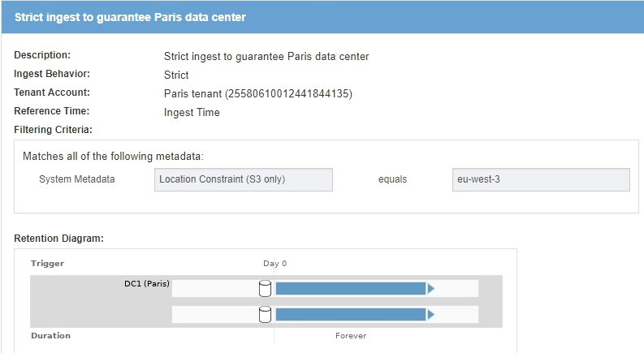
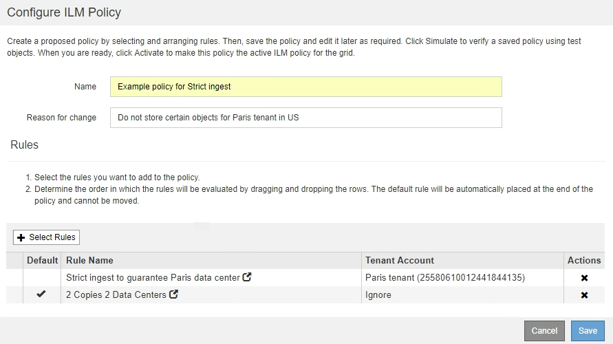

= Beispiel 5: ILM-Regeln und Richtlinie für striktes Ingest-Verhalten
:allow-uri-read: 
:icons: font
:imagesdir: ../media/

[role="lead"]
Ein Speicherortfilter und das strikte Aufnahmeverhalten in einer Regel verhindern, dass Objekte an einem bestimmten Datacenter-Standort gespeichert werden.

In diesem Beispiel will ein Mieter mit Sitz in Paris aufgrund von regulatorischen Bedenken einige Objekte nicht außerhalb der EU speichern. Andere Objekte, einschließlich aller Objekte aus anderen Mandantenkonten, können entweder im Rechenzentrum von Paris oder im Rechenzentrum der USA gespeichert werden.

CAUTION: Die folgenden ILM-Regeln und -Richtlinien sind nur Beispiele. Es gibt viele Möglichkeiten zur Konfiguration von ILM-Regeln. Vor der Aktivierung einer neuen Richtlinie sollte die vorgeschlagene Richtlinie simuliert werden, um zu bestätigen, dass sie wie vorgesehen funktioniert, um Inhalte vor Verlust zu schützen.

.Verwandte Informationen
* xref:data-protection-options-for-ingest.adoc[Datensicherungsoptionen für die Aufnahme]
* xref:step-3-of-3-define-ingest-behavior.adoc[Schritt 3 von 3: Definieren des Aufnahmeverhaltens]

== ILM-Regel 1 beispielsweise 5: Strenge Einspeisung für das Pariser Rechenzentrum

In diesem Beispiel verwendet die ILM-Regel das strikte Ingest-Verhalten, um zu gewährleisten, dass Objekte, die von einem in Paris ansässigen Mieter in S3-Buckets gespeichert werden, wobei die Region auf eu-West-3 Region (Paris) eingestellt ist, nie im US-Rechenzentrum gespeichert werden.

Diese Regel gilt für Objekte, die zum Pariser Mieter gehören und die S3-Bucket-Region auf eu-West-3 (Paris) eingestellt ist.

[cols="1a,2a"]
|===
| Regeldefinition | Beispielwert 

 a| 
Mandantenkonto
 a| 
Mieter von Paris

 a| 
Erweiterte Filterung
 a| 
Standortbeschränkung entspricht eu-West-3

 a| 
Storage-Pools
 a| 
DC1 (Paris)

 a| 
Regelname
 a| 
Strenge Einspeisung für ein Pariser Rechenzentrum

 a| 
Referenzzeit
 a| 
Aufnahmezeit

 a| 
Platzierung Von Inhalten
 a| 
Am Tag 0, zwei replizierte Kopien für immer in DC1 (Paris)

 a| 
Aufnahmeverhalten
 a| 
Streng. Verwenden Sie bei der Einspeisung immer die Platzierungen dieser Regel. Die Aufnahme schlägt fehl, wenn es nicht möglich ist, zwei Kopien des Objekts im Pariser Rechenzentrum zu speichern.

|===

== ILM-Regel 2 beispielsweise 5: Ausgewogene Aufnahme für andere Objekte

Diese Beispiel-ILM-Regel verwendet das ausgewogene Ingest-Verhalten, um optimale ILM-Effizienz für Objekte zu erzielen, die nicht der ersten Regel zugeordnet sind. Zwei Kopien aller Objekte, die dieser Regel entsprechen, werden gespeichert - eins im US-Rechenzentrum und eins im Pariser Rechenzentrum. Wenn die Regel nicht sofort erfüllt werden kann, werden an jedem verfügbaren Ort Zwischenkopien abgelegt.

Diese Regel gilt für Objekte, die einem beliebigen Mieter und einer beliebigen Region angehören.

[cols="1a,2a"]
|===
| Regeldefinition | Beispielwert 

 a| 
Mandantenkonto
 a| 
Ignorieren

 a| 
Erweiterte Filterung
 a| 
_Nicht angegeben_

 a| 
Storage-Pools
 a| 
DC1 (Paris) und DC2 (USA)

 a| 
Regelname
 a| 
2 Kopien 2 Datacenter

 a| 
Referenzzeit
 a| 
Aufnahmezeit

 a| 
Platzierung Von Inhalten
 a| 
Am Tag 0 werden zwei replizierte Kopien für immer in zwei Datacentern aufbewahrt

 a| 
Aufnahmeverhalten
 a| 
Ausgeglichen. Objekte, die dieser Regel entsprechen, werden nach Möglichkeit gemäß den Anweisungen zur Platzierung der Regel platziert. Andernfalls werden an jedem beliebigen Ort vorläufige Kopien angefertigt.

|===
image::../media/ilm_rule_2_example_5_two_copies_2_data_centers.png[ILM-Regel 2 zum Beispiel 5 - 2 Kopien 2 Datacenter]

== ILM-Richtlinie z. B. 5: Kombination von Aufnahmeverhalten

Die ILM-Beispielrichtlinie enthält zwei Regeln mit unterschiedlichen Aufnahmeverhalten.

Eine ILM-Richtlinie, die zwei unterschiedliche Aufnahmeverhalten nutzt, kann ILM-Regeln wie die folgenden umfassen:

* Speichern Sie Objekte, die zum Pariser Mieter gehören und die S3-Bucket-Region auf eu-West-3 (Paris) gesetzt ist, nur im Datacenter in Paris. Aufnahme fehlgeschlagen, wenn das Pariser Rechenzentrum nicht verfügbar ist.
* Speichern Sie alle anderen Objekte (einschließlich solcher, die zum Pariser Mieter gehören, jedoch über eine andere Bucket-Region verfügen) sowohl im US-Rechenzentrum als auch im Pariser Rechenzentrum. Erstellen Sie Zwischenkopien an einem beliebigen verfügbaren Ort, wenn die Platzierungsanweisung nicht erfüllt werden kann.

Wenn Sie die Beispielrichtlinie simulieren, erwarten Sie, dass Testobjekte wie folgt bewertet werden:

* Alle Objekte, die zum Pariser Mieter gehören und die S3-Bucket-Region auf eu-West-3 gesetzt haben, werden mit der ersten Regel abgeglichen und im Pariser Rechenzentrum gespeichert. Da die erste Regel strenge Einspeisung verwendet, werden diese Objekte nie im US-Rechenzentrum gespeichert. Wenn die Speicherknoten im Pariser Rechenzentrum nicht verfügbar sind, schlägt die Aufnahme fehl.
* Alle anderen Objekte werden mit der zweiten Regel abgeglichen, einschließlich Objekte, die zum Pariser Mieter gehören und die die S3-Bucket-Region nicht auf eu-West-3 gesetzt hat. In jedem Datacenter wird eine Kopie jedes Objekts gespeichert. Da die zweite Regel jedoch eine ausgewogene Aufnahme verwendet und ein Datacenter nicht zur Verfügung steht, werden zwei Übergangskopien an jedem verfügbaren Standort gespeichert.

