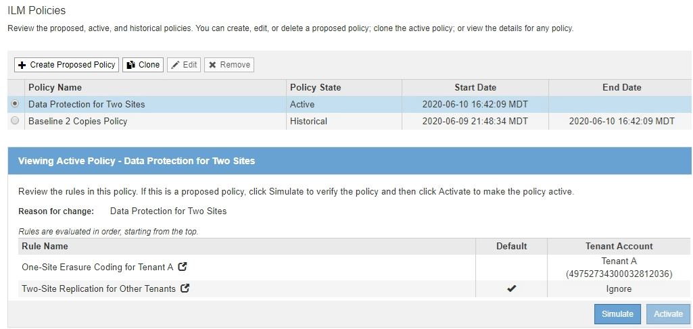

= Beispiel 6: Ändern einer ILM-Richtlinie
:allow-uri-read: 
:icons: font
:imagesdir: ../media/

[role="lead"]
Möglicherweise müssen Sie eine neue ILM-Richtlinie erstellen und aktivieren, wenn sich Ihre Datensicherungsanforderungen ändern oder Sie neue Standorte hinzufügen.

Vor dem Ändern einer Richtlinie muss verstanden werden, wie Änderungen an ILM-Platzierungen die Gesamt-Performance eines StorageGRID Systems vorübergehend beeinträchtigen können.

In diesem Beispiel wurde eine neue StorageGRID Site in einer Erweiterung hinzugefügt. Die aktive ILM-Richtlinie muss überarbeitet werden, um Daten am neuen Standort zu speichern.

CAUTION: Die folgenden ILM-Regeln und -Richtlinien sind nur Beispiele. Es gibt viele Möglichkeiten zur Konfiguration von ILM-Regeln. Vor der Aktivierung einer neuen Richtlinie sollte die vorgeschlagene Richtlinie simuliert werden, um zu bestätigen, dass sie wie vorgesehen funktioniert, um Inhalte vor Verlust zu schützen.

== Wie wirkt sich die Änderung einer ILM-Richtlinie auf die Performance aus

Wenn Sie eine neue ILM-Richtlinie aktivieren, wird die Performance Ihres StorageGRID Systems möglicherweise vorübergehend beeinträchtigt, insbesondere dann, wenn aufgrund der Platzierungsanweisungen in der neuen Richtlinie viele vorhandene Objekte an einen neuen Standort verschoben werden müssen.

CAUTION: Bei der Aktivierung einer neuen ILM-Richtlinie verwendet StorageGRID sie zum Management aller Objekte, einschließlich vorhandener Objekte und neu aufgenommener Objekte. Prüfen Sie vor der Aktivierung einer neuen ILM-Richtlinie alle Änderungen an der Platzierung vorhandener replizierter und Erasure Coding-Objekte. Das Ändern des Speicherorts eines vorhandenen Objekts kann zu vorübergehenden Ressourcenproblemen führen, wenn die neuen Platzierungen ausgewertet und implementiert werden.

Folgende Arten von ILM-Richtlinienänderungen, die vorübergehend Auswirkungen auf die StorageGRID Performance haben:

* Anwenden eines anderen Profils zur Einhaltung von Datenkonsistenz (Erasure Coding) auf vorhandene Objekte mit Verfahren zur Fehlerkorrektur.
+

NOTE: StorageGRID hält jedes Erasure Coding-Profil für einzigartig und verwendet bei Verwendung eines neuen Profils keine Erasure Coding-Fragmente.

* Ändern des für vorhandene Objekte erforderlichen Kopientyps; z. B. Konvertieren eines großen Anteils replizierter Objekte in Objekte mit Erasure-Coding-Verfahren.
* Kopien vorhandener Objekte werden an einen völlig anderen Speicherort verschoben, z. B. um eine große Anzahl von Objekten in einen oder aus einem Cloud-Storage-Pool oder an einen Remote-Standort zu verschieben.

.Verwandte Informationen
xref:creating-ilm-policy.adoc[ILM-Richtlinie erstellen]

== Aktive ILM-Richtlinie z. B. 6: Datensicherung an zwei Standorten

In diesem Beispiel wurde die aktive ILM-Richtlinie ursprünglich für ein StorageGRID System mit zwei Standorten konzipiert und verwendet zwei ILM-Regeln.

In dieser ILM-Richtlinie werden Objekte, die von Mandanten A gehören, durch Erasure Coding von 2+1 an einem Standort geschützt, während Objekte, die zu allen anderen Mandanten gehören, durch die Replizierung mit zwei Kopien über zwei Standorte hinweg geschützt sind.

NOTE: Die erste Regel in diesem Beispiel verwendet einen erweiterten Filter, um sicherzustellen, dass das Erasure Coding nicht für kleine Objekte verwendet wird. Alle Objekte von Mandanten A, die kleiner als 1 MB sind, werden durch die zweite Regel geschützt, die Replikation verwendet.

=== Regel 1: Erasure Coding für einen Standort für Mandant A

[cols="1a,2a"]
|===
| Regeldefinition | Beispielwert 

 a| 
Regelname
 a| 
Erasure Coding für einen Standort für Mandant A

 a| 
Mandantenkonto
 a| 
Mandant A

 a| 
Storage-Pool
 a| 
Datacenter 1

 a| 
Platzierung Von Inhalten
 a| 
2+1 Erasure Coding in Datacenter 1 – von Tag 0 bis für immer

|===

=== Regel 2: Replizierung zwischen zwei Standorten für andere Mandanten

[cols="1a,2a"]
|===
| Regeldefinition | Beispielwert 

 a| 
Regelname
 a| 
Replizierung an zwei Standorten für andere Mandanten

 a| 
Mandantenkonto
 a| 
Ignorieren

 a| 
Storage-Pools
 a| 
Datacenter 1 und Datacenter 2

 a| 
Platzierung Von Inhalten
 a| 
Zwei replizierte Kopien von Tag 0 bis für immer: Eine Kopie im Datacenter 1 und eine Kopie im Datacenter 2.

|===

== Vorgeschlagene ILM-Richtlinie z. B. 6: Datensicherung an drei Standorten

In diesem Beispiel wird die ILM-Richtlinie für ein StorageGRID System mit drei Standorten aktualisiert.

Nach Durchführung einer Erweiterung zum Hinzufügen des neuen Standorts erstellte der Grid-Administrator zwei neue Speicherpools: Einen Speicherpool für Data Center 3 und einen Speicherpool mit allen drei Standorten (nicht identisch mit dem Standardspeicherpool für alle Storage-Nodes). Anschließend erstellte der Administrator zwei neue ILM-Regeln und eine neue vorgeschlagene ILM-Richtlinie, die auf den Schutz von Daten an allen drei Standorten ausgelegt ist.

image::../media/policy_6_proposed_policy.png[Beispiel für die vorgeschlagene ILM-Richtlinie 6]

Bei Aktivierung dieser neuen ILM-Richtlinie werden Objekte, die von Mandant A gehören, an drei Standorten durch 2+1 Erasure Coding geschützt, während Objekte, die zu anderen Mandanten gehören (und kleinere Objekte von Mandanten A), durch Replizierung mit 3 Kopien über drei Standorte hinweg gesichert werden.

=== Regel 1: Erasure Coding für drei Standorte für Mandant A

[cols="1a,2a"]
|===
| Regeldefinition | Beispielwert 

 a| 
Regelname
 a| 
Three-Site Erasure Coding für Mandant A

 a| 
Mandantenkonto
 a| 
Mandant A

 a| 
Storage-Pool
 a| 
Alle 3 Datacenter (einschließlich Datacenter 1, Datacenter 2 und Datacenter 3)

 a| 
Platzierung Von Inhalten
 a| 
2+1 Erasure Coding in allen 3 Datacentern von Tag 0 bis für immer

|===

=== Regel 2: Replizierung an drei Standorten für andere Mandanten

[cols="1a,2a"]
|===
| Regeldefinition | Beispielwert 

 a| 
Regelname
 a| 
Replikation von drei Standorten für andere Mandanten

 a| 
Mandantenkonto
 a| 
Ignorieren

 a| 
Storage-Pools
 a| 
Datacenter 1, Datacenter 2 und Datacenter 3

 a| 
Platzierung Von Inhalten
 a| 
Drei replizierte Kopien von Tag 0 bis für immer: Eine Kopie im Datacenter 1, eine Kopie im Datacenter 2 und eine Kopie im Datacenter 3.

|===

== Aktivierung der vorgeschlagenen ILM-Richtlinie beispielsweise 6

Wenn Sie eine neue vorgeschlagene ILM-Richtlinie aktivieren, können vorhandene Objekte an neue Orte verschoben oder neue Objektkopien für vorhandene Objekte erstellt werden, basierend auf den Anweisungen zur Platzierung in neuen oder aktualisierten Regeln.

CAUTION: Fehler in einer ILM-Richtlinie können zu nicht wiederherstellbaren Datenverlusten führen. Prüfen und simulieren Sie die Richtlinie sorgfältig, bevor Sie sie aktivieren, um sicherzustellen, dass sie wie vorgesehen funktioniert.

CAUTION: Bei der Aktivierung einer neuen ILM-Richtlinie verwendet StorageGRID sie zum Management aller Objekte, einschließlich vorhandener Objekte und neu aufgenommener Objekte. Prüfen Sie vor der Aktivierung einer neuen ILM-Richtlinie alle Änderungen an der Platzierung vorhandener replizierter und Erasure Coding-Objekte. Das Ändern des Speicherorts eines vorhandenen Objekts kann zu vorübergehenden Ressourcenproblemen führen, wenn die neuen Platzierungen ausgewertet und implementiert werden.

=== Was passiert, wenn sich die Anweisungen zur Einhaltung von Datenkonsistenz ändern

In der derzeit aktiven ILM-Richtlinie für dieses Beispiel werden Objekte, die von Mandant A gehören, durch Erasure Coding von 2+1 in Datacenter 1 geschützt. In der neuen vorgeschlagenen ILM-Richtlinie werden Objekte, die von Mandant A gehören, durch Erasure Coding (2+1) in Datacentern 1, 2 und 3 geschützt.

Wenn die neue ILM-Richtlinie aktiviert ist, werden die folgenden ILM-Vorgänge durchgeführt:

* Neue von Mandanten A aufgenommene Objekte werden in zwei Datenfragmente aufgeteilt und ein Paritätsfragment wird hinzugefügt. Anschließend wird jedes der drei Fragmente in einem anderen Rechenzentrum gespeichert.
* Die vorhandenen Objekte, die von Mandant A gehören, werden bei der laufenden ILM-Überprüfung neu bewertet. Da die ILM-Speicheranweisungen ein neues Erasure Coding-Profil verwenden, werden vollständig neue Fragmente mit Erasure-Coding-Verfahren erstellt und auf die drei Datacenter verteilt.
+

NOTE: Die vorhandenen 2+1-Fragmente im Datacenter 1 werden nicht wiederverwendet. StorageGRID hält jedes Erasure Coding-Profil für einzigartig und verwendet bei Verwendung eines neuen Profils keine Erasure Coding-Fragmente.

=== Was geschieht, wenn sich Replikationsanweisungen ändern

In der derzeit aktiven ILM-Richtlinie für dieses Beispiel werden Objekte, die andere Mandanten gehören, durch zwei replizierte Kopien in Storage-Pools in Datacentern 1 und 2 geschützt. In der neuen ILM-Richtlinie werden Objekte, die zu anderen Mandanten gehören, durch drei replizierte Kopien in Storage-Pools in Datacentern 1, 2 und 3 geschützt.

Wenn die neue ILM-Richtlinie aktiviert ist, werden die folgenden ILM-Vorgänge durchgeführt:

* Wenn ein Mandant außer Mandanten A ein neues Objekt in den Mittelpunkt stellt, erstellt StorageGRID drei Kopien und speichert eine Kopie in jedem Datacenter.
* Vorhandene Objekte, die zu diesen anderen Mandanten gehören, werden bei der laufenden ILM-Überprüfung neu bewertet. Da die vorhandenen Objektkopien von Datacenter 1 und Datacenter 2 die Replizierungsanforderungen der neuen ILM-Regel weiterhin erfüllen, muss StorageGRID nur eine neue Kopie des Objekts für Datacenter 3 erstellen.

=== Auswirkungen der Aktivierung dieser Richtlinie auf die Performance

Wenn die vorgeschlagene ILM-Richtlinie in diesem Beispiel aktiviert ist, wird die Gesamtleistung dieses StorageGRID Systems vorübergehend beeinträchtigt. Höher als die normalen Grid-Ressourcen sind erforderlich, um neue, mit Erasure Coding codierte Fragmente für vorhandene Objekte von Mandanten A und neue replizierte Kopien im Datacenter 3 für vorhandene Objekte anderer Mandanten zu erstellen.

Aufgrund der Änderung der ILM-Richtlinie können Lese- und Schreibanfragen von Clients vorübergehend höhere Latenzen aufweisen als die normalen Latenzen. Die Latenzen kehren wieder auf die normalen Werte zurück, nachdem die Anweisungen zur Platzierung im gesamten Grid vollständig implementiert wurden.

Um Ressourcenprobleme bei der Aktivierung einer neuen ILM-Richtlinie zu vermeiden, können Sie den erweiterten Filter für die Aufnahmezeit in jeder Regel verwenden, die den Speicherort einer großen Anzahl vorhandener Objekte ändern könnte. Legen Sie die Aufnahmezeit auf größer oder gleich der ungefähren Zeit fest, zu der die neue Richtlinie in Kraft tritt, um sicherzustellen, dass vorhandene Objekte nicht unnötig verschoben werden.

NOTE: Wenden Sie sich an den technischen Support, wenn Sie die Verarbeitungsgeschwindigkeit von Objekten nach einer ILM-Richtlinienänderung verlangsamen oder erhöhen müssen.
