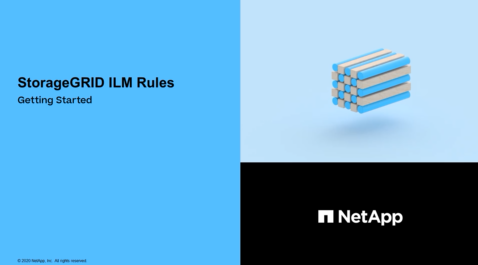

= Objekte mit ILM managen: Übersicht
:allow-uri-read: 
:icons: font
:imagesdir: ../media/

[role="lead"]
Sie managen die Objekte in einem StorageGRID-System durch die Konfiguration von Regeln und Richtlinien für das Information Lifecycle Management (ILM). Die ILM-Regeln und Richtlinien erläutern StorageGRID, wie Kopien von Objektdaten erstellt und verteilt werden und wie diese Kopien im Laufe der Zeit gemanagt werden.

== Informationen zu diesen Anweisungen

Für die Entwicklung und Implementierung von ILM-Regeln und der ILM-Richtlinie ist eine sorgfältige Planung erforderlich. Betriebliche Anforderungen, die Topologie des StorageGRID Systems, die Anforderungen an die Objektsicherung und die verfügbaren Storage-Typen sind unbedingt bekannt. Anschließend müssen Sie festlegen, wie unterschiedliche Objekttypen kopiert, verteilt und gespeichert werden sollen.

Mithilfe dieser Anweisungen können Sie:

* Informieren Sie sich über StorageGRID ILM und darüber, wie ILM während der gesamten Nutzungsdauer eines Objekts funktioniert und welche ILM-Richtlinien und Regeln es gibt.
* Erfahren Sie, wie Sie Storage-Pools, Erasure Coding-Profile und ILM-Regeln konfigurieren.
* Erfahren Sie, wie Sie eine ILM-Richtlinie erstellen und aktivieren, die Objektdaten über einen oder mehrere Standorte hinweg sichert.
* Erfahren Sie, wie Sie Objekte mit S3 Object Lock managen. So können Sie sicherstellen, dass Objekte in bestimmten S3-Buckets nicht für eine bestimmte Zeitspanne gelöscht oder überschrieben werden.

== Weitere Informationen .

Sehen Sie sich die folgenden Videos an, um mehr zu erfahren:

* https://netapp.hosted.panopto.com/Panopto/Pages/Viewer.aspx?id=beffbe9b-e95e-4a90-9560-acc5013c93d8["Video: StorageGRID ILM-Regeln: Erste Schritte"^]
+
[link=https://netapp.hosted.panopto.com/Panopto/Pages/Viewer.aspx?id=beffbe9b-e95e-4a90-9560-acc5013c93d8]

* https://netapp.hosted.panopto.com/Panopto/Pages/Viewer.aspx?id=c929e94e-353a-4375-b112-acc5013c81c7["Video: StorageGRID ILM-Richtlinien"^]
+
[link=https://netapp.hosted.panopto.com/Panopto/Pages/Viewer.aspx?id=c929e94e-353a-4375-b112-acc5013c81c7]
image::../media/video-screenshot-ilm-policies.png[Video: StorageGRID ILM-Richtlinien]

