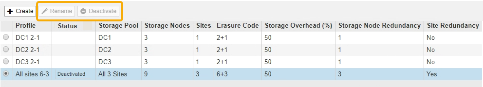
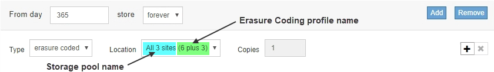

= Benennen Sie ein Erasure Coding-Profil um
:allow-uri-read: 
:icons: font
:imagesdir: ../media/

[role="lead"]
Vielleicht möchten Sie ein Erasure Coding-Profil umbenennen, um es offensichtlicher zu machen, was das Profil tut.

.Was Sie und#8217;ll benötigen
* Sie sind mit einem bei Grid Manager angemeldet xref:../admin/web-browser-requirements.adoc[Unterstützter Webbrowser].
* Sie haben spezifische Zugriffsberechtigungen.

.Schritte
. Wählen Sie *ILM* *Erasure Coding* aus.
+
Die Seite Erasure Coding Profiles wird angezeigt. Die Schaltflächen *Umbenennen* und *Deaktivieren* sind beide deaktiviert.

+

. Wählen Sie das Profil aus, das Sie umbenennen möchten.
+
Die Schaltflächen *Umbenennen* und *Deaktivieren* werden aktiviert.

. Wählen Sie *Umbenennen*.
+
Das Dialogfeld EC-Profil umbenennen wird angezeigt.

+
image::../media/ec_profile_rename.png[Verfahren Zur Codierung Von Löschungsprofils Umbenennen]

. Geben Sie einen eindeutigen Namen für das Erasure Coding-Profil ein.
+
Der Name des Erasure Coding-Profils wird an den Namen des Speicherpools in der Platzierungsanweisung für eine ILM-Regel angehängt.

+

+

NOTE: Profilnamen müssen eindeutig sein. Ein Validierungsfehler tritt auf, wenn Sie den Namen eines vorhandenen Profils verwenden, auch wenn dieses Profil deaktiviert wurde.

. Wählen Sie *Speichern*.

