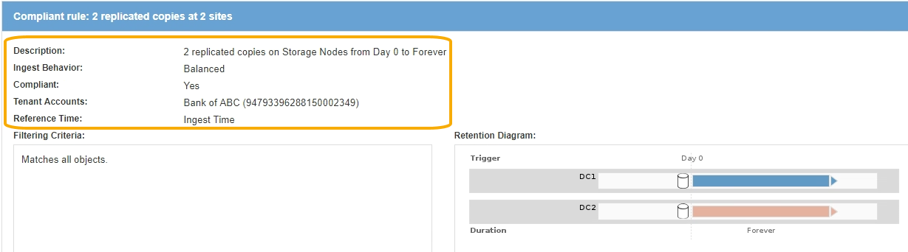

= Anforderungen für die S3-Objektsperre
:allow-uri-read: 
:icons: font
:imagesdir: ../media/

[role="lead"]
Sie müssen die Anforderungen für die Aktivierung der globalen S3-Objektsperre, die Anforderungen für die Erstellung konformer ILM-Regeln und ILM-Richtlinien sowie die Einschränkungen prüfen, die StorageGRID für Buckets und Objekte, die S3 Objektsperre verwenden, festlegen.

== Anforderungen für die Verwendung der globalen S3-Objektsperre

* Sie müssen die globale S3-Objektsperreneinstellung mithilfe des Grid-Managers oder der Grid-Management-API aktivieren, bevor ein S3-Mandant einen Bucket erstellen kann, dessen S3-Objektsperre aktiviert ist.
* Wenn Sie die globale S3-Objektsperre aktivieren, können alle S3-Mandantenkonten Buckets erstellen, wobei S3-Objektsperre aktiviert ist.
* Nachdem Sie die globale S3-Objektsperre aktiviert haben, können Sie die Einstellung nicht deaktivieren.
* Die globale S3-Objektsperre kann nur aktiviert werden, wenn die Standardregel in der aktiven ILM-Richtlinie _konform_ ist (d.h. die Standardregel muss die Anforderungen von Buckets erfüllen, deren S3-Objektsperre aktiviert ist).
* Wenn die globale S3 Object Lock-Einstellung aktiviert ist, können Sie keine neue vorgeschlagene ILM-Richtlinie erstellen oder eine vorhandene vorgeschlagene ILM-Richtlinie aktivieren, wenn die Standardregel in der Richtlinie nicht konform ist. Nachdem die globale S3 Object Lock-Einstellung aktiviert wurde, geben die Seiten ILM-Regeln und ILM-Richtlinien an, welche ILM-Regeln konform sind.
+
Im folgenden Beispiel führt die Seite ILM-Regeln drei Regeln auf, die mit Buckets kompatibel sind, bei denen S3 Object Lock aktiviert ist.

+
image::../media/compliance_fields_on_ilm_rules_page.png[Compliance-Felder auf der Seite ILM-Regeln]

== Anforderungen für konforme ILM-Regeln

Wenn Sie die globale S3-Objektsperre aktivieren möchten, müssen Sie sicherstellen, dass die Standardregel in Ihrer aktiven ILM-Richtlinie konform ist. Eine konforme Regel erfüllt die Anforderungen beider Buckets durch aktivierte S3-Objektsperre und alle vorhandenen Buckets, für die Compliance aktiviert ist:

* Die IT muss mindestens zwei replizierte Objektkopien oder eine Kopie mit Verfahren zur Fehlerkorrektur erstellen.
* Diese Kopien müssen auf Storage-Nodes während der gesamten Dauer jeder Zeile in der Plazierung vorhanden sein.
* Objektkopien können nicht in einem Cloud-Storage-Pool gespeichert werden.
* Objektkopien können nicht auf Archiv-Knoten gespeichert werden.
* Mindestens eine Zeile der Platzierungsanweisungen muss am Tag 0 beginnen und als Referenzzeit *Aufnahmezeit* verwenden.
* Mindestens eine Zeile der Platzierungsanweisungen muss „`Forever`“ sein.

Diese Regel erfüllt beispielsweise die Anforderungen von Buckets, wenn die S3-Objektsperre aktiviert ist. Es werden zwei replizierte Objektkopien von der Aufnahmezeit (Tag 0) bis „`` für immer“ gespeichert. Die Objekte werden auf Storage-Nodes in zwei Datacentern gespeichert.

== Anforderungen für aktive und vorgeschlagene ILM-Richtlinien

Wenn die globale S3 Object Lock-Einstellung aktiviert ist, können aktive und vorgeschlagene ILM-Richtlinien sowohl konforme als auch nicht konforme Regeln umfassen.

* Die Standardregel in der aktiven oder einer vorgeschlagenen ILM-Richtlinie muss konform sein.
* Nicht-konforme Regeln gelten nur für Objekte in Buckets, die die S3-Objektsperre nicht aktiviert haben oder die die ältere Compliance-Funktion nicht aktiviert haben.
* Konforme Regeln können auf Objekte in jedem Bucket angewendet werden; S3-Objektsperre oder vorhandene Compliance muss für den Bucket nicht aktiviert werden.

Eine ILM-konforme Richtlinie kann folgende drei Regeln umfassen:

. Eine konforme Regel, die Erasure-codierte Kopien der Objekte in einem bestimmten Bucket erstellt und bei aktivierter S3-Objektsperre aktiviert ist. Die EC-Kopien werden von Tag 0 bis für immer auf Storage-Nodes gespeichert.
. Eine nicht konforme Regel, die zwei replizierte Objektkopien auf Storage-Nodes für ein Jahr erstellt und dann eine Objektkopie zu Archivierungs-Nodes verschiebt und die Kopie für immer speichert. Diese Regel gilt nur für Buckets, für die die S3-Objektsperre oder ältere Compliance nicht aktiviert ist, da nur eine Objektkopie für immer gespeichert wird und Archiv-Nodes verwendet werden.
. Eine konforme Standardregel, die zwei replizierte Objektkopien auf Storage-Nodes von Tag 0 bis für immer erstellt. Diese Regel gilt für alle Objekte in jedem Bucket, die nicht durch die ersten beiden Regeln herausgefiltert wurden.

== Anforderungen für Buckets, bei denen die S3-Objektsperre aktiviert ist

* Wenn die globale S3-Objektsperre für das StorageGRID System aktiviert ist, können Sie die Buckets mit aktivierter S3-Objektsperre über den Mandantenmanager, die Mandantenmanagement-API oder die S3-REST-API erstellen.
+
In diesem Beispiel aus dem Tenant Manager wird ein Bucket angezeigt, in dem S3 Object Lock aktiviert ist.

+
image::../media/compliant_bucket.png[Beispiel Für Compliance Bucket]

* Wenn Sie die S3-Objektsperre verwenden möchten, müssen Sie beim Erstellen des Buckets die S3-Objektsperre aktivieren. Sie können die S3-Objektsperre für einen vorhandenen Bucket nicht aktivieren.
* Bucket-Versionierung ist mit S3 Object Lock erforderlich. Wenn die S3-Objektsperre für einen Bucket aktiviert ist, ermöglicht StorageGRID automatisch die Versionierung für diesen Bucket.
* Nachdem Sie einen Bucket mit aktivierter S3-Objektsperre erstellt haben, können Sie die S3-Objektsperre oder die Versionierung für diesen Bucket nicht deaktivieren.
* Optional können Sie die Standardaufbewahrung für einen Bucket konfigurieren. Wenn eine Objektversion hochgeladen wird, wird die standardmäßige Aufbewahrung auf die Objektversion angewendet. Sie können den Bucket-Standard überschreiben, indem Sie einen Aufbewahrungsmodus angeben und in der Anforderung zum Hochladen einer Objektversion bis dato aufbewahren.
* Bucket-Lifecycle-Konfiguration wird für S3-Objekt-Lifecycle-Buckets unterstützt.
* Die CloudMirror-Replizierung wird für Buckets nicht unterstützt, wenn S3-Objektsperre aktiviert ist.

== Anforderungen für Objekte in Buckets, bei denen die S3-Objektsperre aktiviert ist

* Zum Schutz einer Objektversion muss die S3-Client-Applikation entweder die Bucket-Standardaufbewahrung konfigurieren oder Aufbewahrungseinstellungen in jeder Upload-Anfrage angeben.
* Sie können das Aufbewahrungsdatum für eine Objektversion erhöhen, diesen Wert jedoch nie reduzieren.
* Wenn Sie über eine ausstehende rechtliche oder behördliche Untersuchung informiert werden, können Sie relevante Informationen erhalten, indem Sie eine gesetzliche Aufbewahrungspflichten auf eine Objektversion setzen. Wenn eine Objektversion unter einer gesetzlichen Aufbewahrungspflichten liegt, kann das Objekt nicht aus StorageGRID gelöscht werden, auch wenn es seine Aufbewahrungsfrist bis zum letzten Tag erreicht hat. Sobald die gesetzliche Aufbewahrungspflichten aufgehoben sind, kann die Objektversion gelöscht werden, wenn das Aufbewahrungsdatum erreicht ist.
* Für die S3-Objektsperre ist die Verwendung versionierter Buckets erforderlich. Aufbewahrungseinstellungen gelten für einzelne Objektversionen. Eine Objektversion kann sowohl eine Aufbewahrungsfrist als auch eine gesetzliche Haltungseinstellung haben, eine jedoch nicht die andere oder keine. Wenn Sie eine Aufbewahrungsfrist oder eine gesetzliche Aufbewahrungseinstellung für ein Objekt angeben, wird nur die in der Anforderung angegebene Version geschützt. Sie können neue Versionen des Objekts erstellen, während die vorherige Version des Objekts gesperrt bleibt.

== Lebenszyklus von Objekten in Buckets, wobei S3 Objektsperre aktiviert ist

Jedes Objekt, das in einem Bucket mit aktivierter S3-Objektsperre gespeichert wird, durchläuft drei Phasen:

. *Objektaufnahme*
+
** Beim Hinzufügen einer Objektversion zu einem Bucket mit aktivierter S3-Objektsperre kann die S3-Client-Applikation die Standard-Bucket-Aufbewahrungseinstellungen verwenden oder optional Aufbewahrungseinstellungen für das Objekt angeben (bis dato, Legal-Hold oder beides beibehalten). StorageGRID generiert dann Metadaten für dieses Objekt, einschließlich einer eindeutigen Objekt-ID (UUID) sowie Datum und Uhrzeit der Aufnahme.
** Nach der Aufnahme einer Objektversion mit Aufbewahrungseinstellungen können seine Daten und benutzerdefinierten S3-Metadaten nicht mehr geändert werden.
** StorageGRID speichert die Objektmetadaten unabhängig von den Objektdaten. Es behält drei Kopien aller Objektmetadaten an jedem Standort.

. *Aufbewahrung von Objekten*
+
** StorageGRID speichert mehrere Kopien des Objekts. Die genaue Anzahl und Art der Kopien und der Speicherorte werden durch die konformen Regeln in der aktiven ILM-Richtlinie festgelegt.

. *Löschen von Objekten*
+
** Ein Objekt kann gelöscht werden, wenn sein Aufbewahrungsdatum erreicht ist.
** Ein Objekt, das sich unter einer gesetzlichen Aufbewahrungspflichten befindet, kann nicht gelöscht werden.

.Verwandte Informationen
* xref:../tenant/index.adoc[Verwenden Sie ein Mandantenkonto]
* xref:../s3/index.adoc[S3 verwenden]
* xref:managing-objects-with-s3-object-lock.adoc#comparing-s3-object-lock-to-legacy-compliance[Vergleich der S3-Objektsperre mit älterer Compliance]
* xref:example-7-compliant-ilm-policy-for-s3-object-lock.adoc[Beispiel 7: Konforme ILM-Richtlinie für S3 Object Lock]
* xref:../audit/index.adoc[Prüfung von Audit-Protokollen]
* xref:../s3/operations-on-buckets.adoc#using-s3-object-lock-default-bucket-retention[S3 Object Lock Standard-Bucket-Aufbewahrung].

