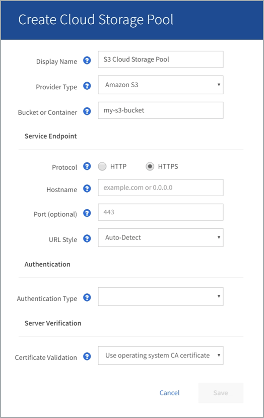
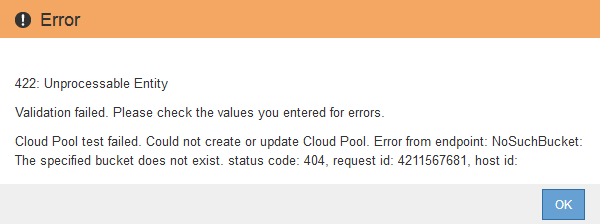

= S3: Angeben von Authentifizierungsdetails für einen Cloud Storage-Pool
:allow-uri-read: 
:icons: font
:imagesdir: ../media/

[role="lead"]
Wenn Sie einen Cloud Storage Pool für S3 erstellen, müssen Sie den Authentifizierungstyp für den Cloud Storage Pool-Endpunkt auswählen. Sie können Anonymous angeben oder eine Zugriffsschlüssel-ID und einen geheimen Zugriffsschlüssel eingeben.

.Was Sie und#8217;ll benötigen
* Sie haben die Basisinformationen für den Cloud-Speicherpool eingegeben und als Provider-Typ *Amazon S3* angegeben.
+

* Wenn Sie die Authentifizierung für Zugriffsschlüssel verwenden, kennen Sie die Zugriffsschlüssel-ID und den geheimen Zugriffsschlüssel für den externen S3-Bucket.

.Schritte
. Geben Sie im Abschnitt * Service Endpoint* folgende Informationen an:
+
.. Wählen Sie das Protokoll aus, das bei der Verbindung mit dem Cloud-Storage-Pool verwendet werden soll.
+
Das Standardprotokoll ist HTTPS.

.. Geben Sie den Serverhostnamen oder die IP-Adresse des Cloud-Speicherpools ein.
+
Beispiel:

+
`s3-_aws-region_.amazonaws.com`

+

NOTE: Geben Sie den Bucket-Namen nicht in dieses Feld ein. Sie fügen den Bucket-Namen in das Feld *Bucket oder Container* ein.

.. Geben Sie optional den Port an, der bei der Verbindung mit dem Cloud Storage Pool verwendet werden soll.
+
Lassen Sie dieses Feld leer, um den Standardport Port 443 für HTTPS oder Port 80 für HTTP zu verwenden.

.. Wählen Sie den URL-Stil für den Cloud Storage Pool Bucket aus:
+
[cols="1a,2a"]
|===
| Option | Beschreibung 

 a| 
Virtual Hosted-Style
 a| 
Verwenden Sie eine virtuelle gehostete URL, um auf den Bucket zuzugreifen. Virtuelle URLs im gehosteten Stil enthalten beispielsweise den Bucket-Namen als Teil des Domain-Namens `+https://bucket-name.s3.company.com/key-name+`.

 a| 
Pfadstil
 a| 
Verwenden Sie eine URL im Pfadstil, um auf den Bucket zuzugreifen. URLs im Pfadstil enthalten beispielsweise den Bucket-Namen am Ende `+https://s3.company.com/bucket-name/key-name+`.

*Hinweis:* die URL im Pfadstil wird veraltet.

 a| 
Automatische Erkennung
 a| 
Versuchen Sie, basierend auf den bereitgestellten Informationen automatisch zu erkennen, welchen URL-Stil verwendet werden soll. Wenn Sie beispielsweise eine IP-Adresse angeben, verwendet StorageGRID eine URL im Pfadstil. Wählen Sie diese Option nur aus, wenn Sie nicht wissen, welcher Stil verwendet werden soll.

|===

. Wählen Sie im Abschnitt *Authentifizierung* den Authentifizierungstyp aus, der für den Cloud-Storage-Pool-Endpunkt erforderlich ist.
+
[cols="1a,2a"]
|===
| Option | Beschreibung 

 a| 
Zugriffsschlüssel
 a| 
Für den Zugriff auf den Cloud Storage Pool-Bucket sind eine Zugriffsschlüssel-ID und ein geheimer Zugriffsschlüssel erforderlich.

 a| 
Anonym
 a| 
Jeder hat Zugriff auf den Cloud-Storage-Pool-Bucket. Eine Zugriffsschlüssel-ID und ein geheimer Zugriffsschlüssel sind nicht erforderlich.

 a| 
KAPPE (C2S-Zugangsportal)
 a| 
Wird nur für C2S S3 verwendet. Gehen Sie zu xref:c2s-s3-authentication-details-for-cloud-storage-pool.adoc[C2S S3: Angeben von Authentifizierungsdetails für einen Cloud-Storage-Pool].

|===
. Wenn Sie den Zugriffsschlüssel ausgewählt haben, geben Sie die folgenden Informationen ein:
+
[cols="1a,2a"]
|===
| Option | Beschreibung 

 a| 
Zugriffsschlüssel-ID
 a| 
Zugriffsschlüssel-ID für das Konto, das den externen Bucket besitzt

 a| 
Geheimer Zugriffsschlüssel
 a| 
Der zugehörige Schlüssel für den geheimen Zugriff.

|===
. Wählen Sie im Abschnitt Server Verification die Methode aus, mit der das Zertifikat für TLS-Verbindungen zum Cloud Storage Pool validiert werden soll:
+
[cols="1a,2a"]
|===
| Option | Beschreibung 

 a| 
Verwenden Sie das CA-Zertifikat für das Betriebssystem
 a| 
Verwenden Sie die auf dem Betriebssystem installierten Standard-Grid-CA-Zertifikate, um Verbindungen zu sichern.

 a| 
Benutzerdefiniertes CA-Zertifikat verwenden
 a| 
Verwenden Sie ein benutzerdefiniertes CA-Zertifikat. Wählen Sie *Select New* aus, und laden Sie das PEM-codierte CA-Zertifikat hoch.

 a| 
Verifizieren Sie das Zertifikat nicht
 a| 
Das für die TLS-Verbindung verwendete Zertifikat wird nicht verifiziert.

|===
. Wählen Sie *Speichern*.

Beim Speichern eines Cloud-Speicherpools führt StorageGRID Folgendes aus:

* Überprüft, ob der Bucket und der Service-Endpunkt vorhanden sind und ob sie mit den von Ihnen angegebenen Zugangsdaten erreicht werden können.
* Schreibt eine Markierungsdatei in den Bucket, um den Bucket als Cloud-Storage-Pool zu identifizieren. Entfernen Sie niemals diese Datei, die benannt ist `x-ntap-sgws-cloud-pool-uuid`.

Wenn die Validierung des Cloud-Storage-Pools fehlschlägt, erhalten Sie eine Fehlermeldung, die erklärt, warum die Validierung fehlgeschlagen ist. Möglicherweise wird ein Fehler gemeldet, wenn ein Zertifikatfehler vorliegt oder der angegebene Bucket nicht bereits vorhanden ist.

Siehe Anweisungen für xref:troubleshooting-cloud-storage-pools.adoc[Fehlerbehebung bei Cloud Storage Pools], Beheben Sie das Problem, und versuchen Sie dann erneut, den Cloud-Speicher-Pool zu speichern.
