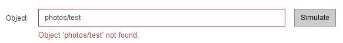

= Simulation einer ILM-Richtlinie
:allow-uri-read: 
:icons: font
:imagesdir: ../media/

[role="lead"]
Sie sollten eine vorgeschlagene Richtlinie für Testobjekte simulieren, bevor Sie die Richtlinie aktivieren und auf Ihre Produktionsdaten anwenden. Das Simulationsfenster bietet eine eigenständige Umgebung, die zum Testen von Richtlinien sicher ist, bevor sie aktiviert und auf Daten in der Produktionsumgebung angewendet werden.

.Was Sie benötigen
* Sie sind mit einem bei Grid Manager angemeldet xref:../admin/web-browser-requirements.adoc[Unterstützter Webbrowser].
* Sie haben spezifische Zugriffsberechtigungen.
* Sie kennen den S3-Bucket/Objektschlüssel oder den Swift-Container/Objektnamen für jedes zu testende Objekt und haben diese Objekte bereits aufgenommen.

.Über diese Aufgabe
Sie müssen sorgfältig die Objekte auswählen, die die vorgeschlagene Richtlinie testen soll. Um eine Richtlinie gründlich zu simulieren, sollten Sie mindestens ein Objekt für jeden Filter in jeder Regel testen.

Wenn eine Richtlinie beispielsweise eine Regel enthält, mit der Objekte in Bucket A und eine andere Regel übereinstimmen, um Objekte in Bucket B zu entsprechen, müssen Sie mindestens ein Objekt aus Bucket A und ein Objekt aus Bucket B auswählen, um die Richtlinie gründlich zu testen. Sie müssen außerdem mindestens ein Objekt aus einem anderen Bucket auswählen, um die Standardregel zu testen.

Bei der Simulation einer Richtlinie gelten folgende Überlegungen:

* Nachdem Sie Änderungen an einer Richtlinie vorgenommen haben, speichern Sie die vorgeschlagene Richtlinie. Dann simulieren Sie das Verhalten der gespeicherten vorgeschlagenen Richtlinie.
* Wenn Sie eine Richtlinie simulieren, filtern die ILM-Regeln in der Richtlinie die Testobjekte ab, sodass Sie sehen können, welche Regel auf jedes Objekt angewendet wurde. Es werden jedoch keine Objektkopien erstellt und keine Objekte abgelegt. Wenn Sie eine Simulation ausführen, ändern Sie Ihre Daten, Regeln oder Richtlinien in keiner Weise.
* Auf der Seite Simulation werden die von Ihnen getesteten Objekte gespeichert, bis Sie die Seite ILM-Richtlinien schließen, wegnavigieren oder aktualisieren.
* Simulation gibt den Namen der übereinstimmenden Regel zurück. Um festzustellen, welcher Speicherpool oder welches Erasure-Coding-Profil wirksam ist, können Sie das Aufbewahrungsdiagramm anzeigen, indem Sie den Regelnamen oder das Symbol mehr Details auswählen image:../media/icon_nms_more_details.gif["Weitere Details"].
* Wenn die S3-Versionierung aktiviert ist, wird die Richtlinie nur mit der aktuellen Objektversion simuliert.

.Schritte
. Wählen Sie die Regeln aus und ordnen Sie sie an, und speichern Sie die vorgeschlagene Richtlinie.
+
Die Richtlinie in diesem Beispiel hat drei Regeln:

+
[cols="1a,1a,1a,1a"]
|===
| Regelname | Filtern | Kopentyp | Aufbewahrung 

 a| 
X-men
 a| 
** Mandant A
** Benutzer-Metadaten (Serie=x-men)

 a| 
2 Kopien in zwei Rechenzentren
 a| 
2 Jahre

 a| 
PNGs
 a| 
Die Schlüssel enden mit .png
 a| 
2 Kopien in zwei Rechenzentren
 a| 
5 Jahre

 a| 
Zwei Kopien Zwei Datacenter
 a| 
_Keine_
 a| 
2 Kopien in zwei Rechenzentren
 a| 
Für Immer

|===
+
image::../media/ilm_policies_viewing_proposed.png[ILM-Richtlinien anzeigen vorgeschlagen]

. Verwenden eines S3- oder Swift-Clients oder des xref:../tenant/use-s3-console.adoc[Experimentelle S3 Konsole], Die im Tenant Manager für jeden Mandanten verfügbar ist, geben Sie die Objekte ein, die zum Testen jeder Regel erforderlich sind.
. Wählen Sie *Simulieren*.
+
Das Dialogfeld Simulation ILM-Richtlinie wird angezeigt.

. Geben Sie im Feld *Object* den S3-Bucket/Object-Key oder den Swift-Container/Object-Name für ein Testobjekt ein und wählen Sie *Simulate* aus.
+
[NOTE]
====
Wenn Sie ein Objekt angeben, das nicht aufgenommen wurde, wird eine Meldung angezeigt.

====
. Bestätigen Sie unter *Simulationsergebnisse*, dass jedes Objekt mit der richtigen Regel übereinstimmt.
+
In dem Beispiel wird der verwendet `Havok.png` Und `Warpath.jpg` Objekte wurden durch die X-Men-Regel korrekt abgeglichen. Der `Fullsteam.png` Objekt, das nicht enthält `series=x-men` Benutzermetadaten, wurde nicht mit der X-Men-Regel abgeglichen, wurde aber von der PNGs-Regel korrekt abgeglichen. Die Standardregel wurde nicht verwendet, da alle drei Objekte mit anderen Regeln abgeglichen wurden.

+
image::../media/ilm_policy_simulation_results.gif[Simulationsergebnisse]

== Beispiel 1: Überprüfung der Regeln bei der Simulation einer vorgeschlagenen ILM-Richtlinie

Dieses Beispiel zeigt, wie Regeln bei der Simulation einer vorgeschlagenen Richtlinie überprüft werden.

In diesem Beispiel wird die *Beispiel ILM-Richtlinie* für die aufgenommene Objekte in zwei Buckets simuliert. Die Richtlinie umfasst drei Regeln:

* Die erste Regel, *zwei Kopien, zwei Jahre für Eimer-A*, gilt nur für Objekte in Eimer-a.
* Die zweite Regel, *EC-Objekte 1 MB*, gilt für alle Buckets, aber für Filter auf Objekten größer als 1 MB.
* Die dritte Regel, *zwei Kopien, zwei Rechenzentren*, ist die Standardregel. Er enthält keine Filter und verwendet keine nicht aktuelle Referenzzeit.

image::../media/saved_policy_for_simulation.png[Gespeicherte Richtlinie für Simulation]

.Schritte
. Nachdem Sie die Regeln hinzugefügt und die Richtlinie gespeichert haben, wählen Sie *Simulieren*.
+
Das Dialogfeld ILM-Richtlinie simulieren wird angezeigt.

. Geben Sie im Feld *Object* den S3-Bucket/Object-Key oder den Swift-Container/Object-Name für ein Testobjekt ein und wählen Sie *Simulate* aus.
+
Die Simulationsergebnisse werden angezeigt und zeigen an, welche Regel in der Richtlinie zu jedem getesteten Objekt passt.

+
image::../media/simulate_policy_screen.png[Bildschirm Richtlinie Simulieren]

. Vergewissern Sie sich, dass jedes Objekt mit der richtigen Regel übereinstimmt.
+
In diesem Beispiel:

+
.. `bucket-a/bucket-a object.pdf` Die erste Regel, die nach Objekten in filtert, wurde richtig zugeordnet `bucket-a`.
.. `bucket-b/test object greater than 1 MB.pdf` Ist in `bucket-b`, So dass es nicht mit der ersten Regel. Stattdessen wurde sie durch die zweite Regel korrekt abgeglichen, die nach Objekten mit einer Größe von mehr als 1 MB filtert.
.. `bucket-b/test object less than 1 MB.pdf` Stimmt nicht mit den Filtern in den ersten beiden Regeln überein, so wird sie durch die Standardregel platziert, die keine Filter enthält.

== Beispiel 2: Neuanordnung von Regeln bei der Simulation einer vorgeschlagenen ILM-Richtlinie

Dieses Beispiel zeigt, wie Sie Regeln neu anordnen können, um die Ergebnisse bei der Simulation einer Richtlinie zu ändern.

In diesem Beispiel wird die *Demo*-Richtlinie simuliert. Diese Richtlinie, die zum Auffinden von Objekten mit Metadaten für Benutzer der Serie=x-men bestimmt ist, enthält drei Regeln:

* Die erste Regel, *PNGs*, filtert nach Schlüsselnamen, die enden `.png`.
* Die zweite Regel, *X-Men*, gilt nur für Objekte für Mieter A und Filter für `series=x-men` Benutzer-Metadaten:
* Die letzte Regel, *zwei Kopien zwei Rechenzentren*, ist die Standardregel, die alle Objekte, die nicht mit den ersten beiden Regeln übereinstimmen, übereinstimmt.

image::../media/simulate_reorder_rules_pngs_rule.png[Beispiel 2: Neuanordnung von Regeln bei der Simulation einer vorgeschlagenen ILM-Richtlinie]

.Schritte
. Nachdem Sie die Regeln hinzugefügt und die Richtlinie gespeichert haben, wählen Sie *Simulieren*.
. Geben Sie im Feld *Object* den S3-Bucket/Object-Key oder den Swift-Container/Object-Name für ein Testobjekt ein und wählen Sie *Simulate* aus.
+
Die Simulationsergebnisse werden angezeigt, wobei das angezeigt wird `Havok.png` Das Objekt wurde durch die *PNGs*-Regel abgeglichen.

+
image::../media/simulate_reorder_rules_pngs_result.gif[Beispiel 2: Neuanordnung von Regeln bei der Simulation einer vorgeschlagenen ILM-Richtlinie]

+
Allerdings die Regel, dass die `Havok.png` Das Objekt war für den Test die *X-Men*-Regel gedacht.

. Um das Problem zu lösen, ordnen Sie die Regeln neu an.
+
.. Wählen Sie *Fertig*, um die Seite ILM-Richtlinie simulieren zu schließen.
.. Wählen Sie *Bearbeiten*, um die Richtlinie zu bearbeiten.
.. Ziehen Sie die *X-Men*-Regel an den Anfang der Liste.
+
image::../media/simulate_reorder_rules_correct_rule.png[Simulieren - Regeln Neu Ordnen - Korrekte Regel]

.. Wählen Sie *Speichern*.

. Wählen Sie *Simulieren*.
+
Die zuvor getesteten Objekte werden anhand der aktualisierten Richtlinie neu bewertet und die neuen Simulationsergebnisse angezeigt. Im Beispiel wird in der Spalte Regel zugeordnet das angezeigt `Havok.png` Das Objekt entspricht jetzt wie erwartet der X-Men-Metadatenregel. Die Spalte Vorheriger Abgleich zeigt an, dass die PNGs-Regel mit dem Objekt in der vorherigen Simulation übereinstimmt.

+
image::../media/simulate_reorder_rules_correct_result.gif[Beispiel 2: Neuanordnung von Regeln bei der Simulation einer vorgeschlagenen ILM-Richtlinie]

+

NOTE: Wenn Sie auf der Seite Richtlinien konfigurieren bleiben, können Sie eine Richtlinie nach Änderungen erneut simulieren, ohne die Namen der Testobjekte erneut eingeben zu müssen.

== Beispiel 3: Korrigieren Sie eine Regel bei der Simulation einer vorgeschlagenen ILM-Richtlinie

Dieses Beispiel zeigt, wie eine Richtlinie simuliert, eine Regel in der Richtlinie korrigiert und die Simulation fortgesetzt wird.

In diesem Beispiel wird die *Demo*-Richtlinie simuliert. Diese Richtlinie dient zum Suchen von Objekten, die über solche verfügen `series=x-men` Benutzer-Metadaten: Bei der Simulation dieser Richtlinie gegen die traten jedoch unerwartete Ergebnisse auf `Beast.jpg` Objekt: Anstatt die X-Men-Metadatenregel zu entsprechen, kopiert das Objekt die Standardregel. Zwei Rechenzentren werden kopiert.

image::../media/simulate_results_for_object_wrong_metadata.png[Beispiel 3: Korrektur einer Regel bei der Simulation einer vorgeschlagenen ILM-Richtlinie]

Wenn ein Testobjekt nicht mit der erwarteten Regel in der Richtlinie übereinstimmt, müssen Sie jede Regel in der Richtlinie überprüfen und eventuelle Fehler korrigieren.

.Schritte
. Zeigen Sie für jede Regel in der Richtlinie die Regeleinstellungen an, indem Sie den Regelnamen oder das Symbol Weitere Details auswählen image:../media/icon_nms_more_details.gif["Weitere Details"] In jedem Dialogfeld, in dem die Regel angezeigt wird.
. Prüfen Sie das Mandantenkonto der Regel, die Referenzzeit und die Filterkriterien.
+
In diesem Beispiel enthält die Metadaten für die X-Men-Regel einen Fehler. Der Metadatenwert wurde als „`x-men1`“ anstelle von „`x-men.`“ eingegeben.

+
image::../media/simulate_rules_select_rule_popup_with_wrong_metadata.png[Beispiel 3: Korrektur einer Regel bei der Simulation einer vorgeschlagenen ILM-Richtlinie]

. Um den Fehler zu beheben, korrigieren Sie die Regel wie folgt:
+
** Wenn die Regel Teil der vorgeschlagenen Richtlinie ist, können Sie entweder die Regel klonen oder die Regel aus der Richtlinie entfernen und sie dann bearbeiten.
** Wenn die Regel Teil der aktiven Richtlinie ist, müssen Sie die Regel klonen. Sie können eine Regel nicht bearbeiten oder aus der aktiven Richtlinie entfernen.
+
[cols="1a,3a"]
|===
| Option | Beschreibung 

 a| 
Die Regel klonen
 a| 
... Wählen Sie *ILM* *Regeln*.
... Wählen Sie die falsche Regel aus, und wählen Sie *Clone*.
... Ändern Sie die falschen Informationen, und wählen Sie *Speichern*.
... Wählen Sie *ILM* *Richtlinien* aus.
... Wählen Sie die vorgeschlagene Richtlinie aus, und wählen Sie *Bearbeiten*.
... Wählen Sie *Regeln Auswählen*.
... Aktivieren Sie das Kontrollkästchen für die neue Regel, deaktivieren Sie das Kontrollkästchen für die ursprüngliche Regel, und wählen Sie *Anwenden*.
... Wählen Sie *Speichern*.

 a| 
Bearbeiten Sie die Regel
 a| 
... Wählen Sie die vorgeschlagene Richtlinie aus, und wählen Sie *Bearbeiten*.
... Klicken Sie auf das Löschsymbol image:../media/icon_nms_delete_new.gif["Symbol Löschen"] Um die falsche Regel zu entfernen, und wählen Sie *Speichern*.
... Wählen Sie *ILM* *Regeln*.
... Wählen Sie die falsche Regel aus, und wählen Sie *Bearbeiten*.
... Ändern Sie die falschen Informationen, und wählen Sie *Speichern*.
... Wählen Sie *ILM* *Richtlinien* aus.
... Wählen Sie die vorgeschlagene Richtlinie aus, und wählen Sie *Bearbeiten*.
... Wählen Sie die korrigierte Regel aus, wählen Sie *Anwenden* und wählen Sie *Speichern*.

|===

. Führen Sie die Simulation erneut aus.
+

NOTE: Da Sie zur Bearbeitung der Regel nicht mehr auf der Seite ILM-Richtlinien navigiert haben, werden die zuvor für die Simulation eingegebenen Objekte nicht mehr angezeigt. Sie müssen die Namen der Objekte erneut eingeben.

+
In diesem Beispiel entspricht die korrigierte X-Men-Regel nun dem `Beast.jpg` Objekt auf Grundlage des `series=x-men` Benutzer-Metadaten, wie erwartet.

+
image::../media/simulate_results_for_object_corrected_metadata.gif[Beispiel 3: Korrektur einer Regel bei der Simulation einer vorgeschlagenen ILM-Richtlinie]

