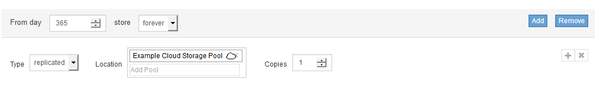
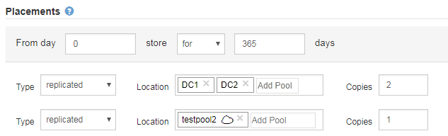

= Schritt 2 von 3: Definieren von Platzierungen
:allow-uri-read: 
:icons: font
:imagesdir: ../media/

[role="lead"]
Schritt 2 (Platzierungen definieren) des Assistenten zur Erstellung von ILM-Regeln können Sie die Anweisungen zur Platzierung festlegen, um festzulegen, wie lange Objekte gespeichert werden, wie viel Kopien (repliziert oder Erasure Coding), den Storage-Standort und die Anzahl der Kopien erstellt werden.

Eine ILM-Regel kann eine oder mehrere Anweisungen zur Platzierung enthalten. Jede Einstufungsanweisung gilt für einen einzelnen Zeitraum. Wenn Sie mehrere Befehle verwenden, müssen die Zeiträume zusammenhängend sein, und mindestens eine Anweisung muss am Tag 0 beginnen. Die Anweisungen können entweder für immer fortgesetzt werden oder bis Sie keine Objektkopien mehr benötigen.

Jede Anweisung für die Platzierung kann mehrere Zeilen haben, wenn Sie verschiedene Arten von Kopien erstellen oder verschiedene Standorte während dieses Zeitraums verwenden möchten.

Diese Beispiel-ILM-Regel erstellt zwei replizierte Kopien für das erste Jahr. Jede Kopie wird in einem Speicherpool an einem anderen Standort gespeichert. Nach einem Jahr wird eine 2+1-Kopie mit Erasure-Coding-Verfahren an nur einem Standort erstellt und gespeichert.

image::../media/ilm_create_ilm_rule_wizard_2.png[Assistent für die Erstellung von ILM-Regeln Seite 2]

.Schritte
. Wählen Sie für *Referenzzeit* den Zeittyp aus, der bei der Berechnung der Startzeit für eine Platzierungsanweisung verwendet werden soll.
+
[cols="1a,2a"]
|===
| Option | Beschreibung 

 a| 
Aufnahmezeit
 a| 
Die Zeit, zu der das Objekt aufgenommen wurde.

 a| 
Zeitpunkt Des Letzten Zugriffs
 a| 
Die Zeit, zu der das Objekt zuletzt abgerufen (gelesen oder angezeigt) wurde.

*Hinweis:* um diese Option zu nutzen, müssen Updates zur letzten Zugriffszeit für den S3-Bucket oder Swift-Container aktiviert sein. Siehe xref:using-last-access-time-in-ilm-rules.adoc[Verwenden Sie die Zeit für den letzten Zugriff in ILM-Regeln].

 a| 
Nicht Aktuelle Zeit
 a| 
Die Zeit, in der eine Objektversion nicht mehr aktuell wurde, weil eine neue Version aufgenommen und als aktuelle Version ersetzt wurde.

*Hinweis:* die nicht aktuelle Zeit gilt nur für S3-Objekte in Versionierungsfähigen Buckets.

Mit dieser Option können Sie die Auswirkungen versionierter Objekte auf den Speicher reduzieren, indem Sie nach nicht aktuellen Objektversionen filtern. Siehe xref:example-4-ilm-rules-and-policy-for-s3-versioned-objects.adoc[Beispiel 4: ILM-Regeln und -Richtlinie für versionierte Objekte mit S3].

 a| 
Benutzerdefinierte Erstellungszeit
 a| 
Eine in benutzerdefinierten Metadaten angegebene Zeit.

|===
+

NOTE: Wenn Sie eine konforme Regel erstellen möchten, müssen Sie *Aufnahmezeit* auswählen.

. Wählen Sie im Abschnitt *Platzierungen* eine Startzeit und eine Dauer für den ersten Zeitraum aus.
+
Sie können beispielsweise festlegen, wo Objekte für das erste Jahr gespeichert werden sollen („`day 0 für 365 Tage`“). Mindestens eine Anweisung muss am Tag 0 beginnen.

. So erstellen Sie replizierte Kopien:
+
.. Wählen Sie aus der Dropdown-Liste *Typ* die Option *repliziert* aus.
.. Wählen Sie im Feld *Standort* für jeden Speicherpool, den Sie hinzufügen möchten, *Pool hinzufügen* aus.
+
*Wenn Sie nur einen Speicherpool* angeben, beachten Sie, dass StorageGRID nur eine replizierte Kopie eines Objekts auf einem beliebigen Speicherknoten speichern kann. Wenn Ihr Grid drei Storage-Nodes enthält und Sie 4 als Anzahl der Kopien auswählen, werden nur drei Kopien erstellt: Eine Kopie für jeden Storage-Node.

+

NOTE: Die Warnung *ILM-Platzierung unerreichbar* wird ausgelöst, um anzuzeigen, dass die ILM-Regel nicht vollständig angewendet werden konnte.

+
*Wenn Sie mehr als einen Speicherpool* angeben, beachten Sie folgende Regeln:

+
*** Die Anzahl der Kopien darf nicht größer sein als die Anzahl der Speicherpools.
*** Wenn die Anzahl der Kopien der Anzahl der Storage-Pools entspricht, wird in jedem Storage-Pool eine Kopie des Objekts gespeichert.
*** Wenn die Anzahl der Kopien kleiner als die Anzahl der Storage-Pools ist, verteilt das System die Kopien, damit die Festplattennutzung zwischen den Pools ausgeglichen bleibt. Gleichzeitig wird sichergestellt, dass an keinem Standort mehr als eine Kopie eines Objekts gespeichert wird.
*** Wenn sich die Speicherpools überschneiden (die gleichen Storage-Nodes enthalten), werden möglicherweise alle Kopien des Objekts an nur einem Standort gespeichert. Geben Sie aus diesem Grund nicht den Standardpool Alle Speicherknoten und einen anderen Speicherpool an.
+
image::../media/ilm_rule_with_multiple_storage_pools.png[Anweisungen zur Platzierung mehrerer Storage Pools]

.. Wählen Sie die Anzahl der Kopien aus, die Sie erstellen möchten.
+
Wenn Sie die Anzahl der Kopien in 1 ändern, wird eine Warnung angezeigt. Eine ILM-Regel, die immer nur eine replizierte Kopie erstellt, gefährdet Daten permanent. Siehe xref:why-you-should-not-use-single-copy-replication.adoc[Warum sollten Sie keine Replizierung mit nur einer Kopie verwenden].

+
image::../media/ilm_create_ilm_rule_warning_for_1_copy.png[ILM-Regel Seite 2 Warnung für 1 Kopie erstellen]

+
Um diese Risiken zu vermeiden, führen Sie einen oder mehrere der folgenden Schritte aus:

+
*** Erhöhen Sie die Anzahl der Kopien für den Zeitraum.
*** Klicken Sie auf das Pluszeichen-Symbol image:../media/icon_plus_sign_black_on_white.gif["Plus Schild schwarz auf weiß"] Um während des Zeitraums zusätzliche Kopien zu erstellen. Wählen Sie dann einen anderen Speicherpool oder einen Cloud-Speicherpool aus.
*** Wählen Sie *Erasure Coded* für Typ, statt *repliziert*. Sie können diese Warnung ohne Bedenken ignorieren, wenn diese Regel bereits mehrere Kopien für alle Zeiträume erstellt.

.. Wenn Sie nur einen Speicherpool angegeben haben, ignorieren Sie das Feld *temporärer Standort*.
+

NOTE: Temporäre Speicherorte sind veraltet und werden in einer zukünftigen Version entfernt. Siehe xref:using-storage-pool-as-temporary-location-deprecated.adoc[Verwenden eines Speicherpools als temporärer Speicherort (veraltet)].

. Wenn Sie eine Kopie mit Verfahren zur Einhaltung von Datenkonsistenz (Erasure Coding) erstellen möchten:
+
.. Wählen Sie aus der Dropdown-Liste *Typ* die Option *Löschvorgang codiert* aus.
+
Die Anzahl der Kopien ändert sich in 1. Es wird eine Warnung angezeigt, wenn die Regel keinen erweiterten Filter besitzt, um Objekte zu ignorieren, die 200 KB oder kleiner sind.

+
image::../media/ilm_rule_warning_for_ec_size.png[ILM-Regel Warnung für EC-Größe]

+

IMPORTANT: Das Verfahren zur Einhaltung von Datenkonsistenz eignet sich am besten für Objekte mit einer Größe von mehr als 1 MB. Verwenden Sie kein Erasure Coding für Objekte mit einer Größe von mehr als 200 KB, um den Overhead zu vermeiden, der bei dem Management sehr kleiner, mit Erasure Coding codierter Fragmente verbunden ist.

.. Wenn die Warnung für die Objektgröße angezeigt wurde, wählen Sie *Zurück* aus, um zu Schritt 1 zurückzukehren. Wählen Sie dann *Advanced Filtering* aus, und setzen Sie den Filter Objektgröße (MB) auf einen Wert größer als 0.2.
.. Wählen Sie den Speicherort aus.
+
Der Speicherort für eine Kopie mit Erasure-Coding-Verfahren umfasst den Namen des Speicherpools, gefolgt vom Namen des Erasure Coding-Profils.

+
image::../media/storage_pool_and_erasure_coding_profile.png[Storage-Pool und EC-Profilname]

. Optional können Sie verschiedene Zeiträume hinzufügen oder zusätzliche Kopien an verschiedenen Standorten erstellen:
+
** Wählen Sie das Plus-Symbol, um zusätzliche Kopien an einem anderen Ort während des gleichen Zeitraums zu erstellen.
** Wählen Sie *Hinzufügen* aus, um den Anweisungen zur Platzierung einen anderen Zeitraum hinzuzufügen.
+

NOTE: Objekte werden am Ende des Endzeitzeitraums automatisch gelöscht, es sei denn, der Endzeitraum endet mit *forever*.

. Wenn Sie Objekte in einem Cloud-Speicherpool speichern möchten:
+
.. Wählen Sie aus der Dropdown-Liste *Typ* die Option *repliziert* aus.
.. Wählen Sie im Feld *Ort* die Option *Pool hinzufügen* aus. Wählen Sie dann einen Cloud-Speicherpool aus.
+

+
Beachten Sie bei der Verwendung von Cloud-Storage-Pools folgende Regeln:

+
*** Sie können nicht mehr als einen Cloud-Storage-Pool in einer einzelnen Speicheranweisung auswählen. Auf ähnliche Weise können Sie keinen Cloud-Storage-Pool und einen Storage-Pool in derselben Speicheranweisung auswählen.
+
image::../media/ilm_cloud_storage_pool_error.gif[ILM-Regel Cloud-Storage-Pool-Fehler]

*** Sie können nur eine Kopie eines Objekts in einem beliebigen Cloud Storage Pool speichern. Wenn Sie *Copies* auf 2 oder mehr setzen, wird eine Fehlermeldung angezeigt.
+
image::../media/ilm_cloud_storage_pool_error_one_copy.gif[ILM-Regel: Cloud-Storage-Pool-Fehler, wenn mehr als eine Kopie]

*** Sie können nicht mehr als eine Objektkopie in einem Cloud-Speicherpool gleichzeitig speichern. Eine Fehlermeldung wird angezeigt, wenn mehrere Platzierungen, die einen Cloud-Speicher-Pool verwenden, sich überschneidende Daten aufweisen oder wenn mehrere Zeilen derselben Platzierung einen Cloud-Storage-Pool verwenden.
+
image::../media/ilm_rule_cloud_storage_pool_error_overlapping_dates.png[ILM-Regel Cloud-Storage-Pool: Sich überschneidende Daten]

*** Ein Objekt kann in einem Cloud-Storage-Pool gleichzeitig gespeichert werden, als replizierte oder als Erasure Coding-Kopie in StorageGRID. Wie in diesem Beispiel gezeigt wird, müssen Sie für den Zeitraum jedoch mehr als eine Zeile in die Platzierungsanweisung aufnehmen, damit Sie die Anzahl und die Art der Kopien für jeden Standort angeben können.
+

. Wählen Sie *Aktualisieren*, um das Aufbewahrungsdiagramm zu aktualisieren und die Anweisungen zur Platzierung zu bestätigen.
+
Jede Zeile im Diagramm zeigt an, wo und wann Objektkopien platziert werden. Der Kopiertyp wird durch eines der folgenden Symbole dargestellt:

+
[cols="1a,2a"]
|===

 a| 
image:../media/icon_nms_replicated.gif["Symbol für replizierte Kopien"]
 a| 
Replizierte Kopie

 a| 
image:../media/icon_nms_erasure_coded.gif["Symbol zum Löschen codierter Kopie"]
 a| 
Kopie mit Erasure Coding – eine Kopie

 a| 
image:../media/icon_cloud_storage_pool.gif["Symbol: Cloud-Storage-Pool"]
 a| 
Cloud-Storage-Pool-Kopie

|===
+
In diesem Beispiel werden zwei replizierte Kopien für ein Jahr in zwei Speicherpools (DC1 und DC2) gespeichert. Anschließend wird eine Kopie mit Erasure Coding für weitere 10 Jahre gespeichert. Dabei wird ein 6+3 Erasure Coding-Schema an drei Standorten verwendet. Nach 11 Jahren werden die Objekte aus StorageGRID gelöscht.

+
image::../media/ilm_rule_retention_diagram.png[Diagramm zur Aufbewahrung von ILM-Regeln]

. Wählen Sie *Weiter*.
+
Schritt 3 (Ingest Behavior definieren) wird angezeigt.

.Verwandte Informationen
* xref:what-ilm-rule-is.adoc[Was ist eine ILM-Regel]
* xref:managing-objects-with-s3-object-lock.adoc[Objekte managen mit S3 Object Lock]
* xref:step-3-of-3-define-ingest-behavior.adoc[Schritt 3 von 3: Definieren des Aufnahmeverhaltens]

