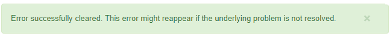

= Fehlerbehebung Bei Cloud Storage Pools
:allow-uri-read: 
:icons: font
:imagesdir: ../media/

[role="lead"]
Wenn beim Erstellen, Bearbeiten oder Löschen eines Cloud-Speicherpools Fehler auftreten, führen Sie diese Schritte zur Fehlerbehebung durch.

== Ermitteln Sie, ob ein Fehler aufgetreten ist

StorageGRID führt einmal pro Minute eine einfache Zustandsprüfung für jeden Cloud Storage Pool durch, um sicherzustellen, dass auf den Cloud Storage Pool zugegriffen werden kann und dass er ordnungsgemäß funktioniert. Wenn die Zustandsprüfung ein Problem feststellt, wird in der Spalte „Letzter Fehler“ der Tabelle „Cloud Storage Pools“ auf der Seite „Speicherpools“ eine Meldung angezeigt.

In der Tabelle ist der aktuellste Fehler aufgeführt, der bei den einzelnen Cloud-Storage-Pools erkannt wurde. Der Fehler ist vor langer Zeit aufgetreten.

image::../media/cloud_storage_pools_error.png[Fehler Bei Cloud-Storage-Pools]

Zusätzlich wird eine Meldung mit * Cloud Storage Pool Verbindungsfehler* ausgelöst, wenn die Systemprüfung feststellt, dass innerhalb der letzten 5 Minuten ein oder mehrere neue Cloud Storage Pool-Fehler aufgetreten sind. Wenn Sie eine E-Mail-Benachrichtigung für diese Warnmeldung erhalten, gehen Sie auf die Seite Storage Pool (wählen Sie *ILM* *Storage Pools*), überprüfen Sie die Fehlermeldungen in der Spalte Letzter Fehler, und lesen Sie die nachfolgenden Hinweise zur Fehlerbehebung.

== Überprüfen Sie, ob ein Fehler behoben wurde

Nach der Behebung von Problemen können Sie feststellen, ob der Fehler behoben ist. Wählen Sie auf der Seite Cloud Storage Pool die Optionsschaltfläche für den Endpunkt aus, und wählen Sie *Fehler löschen*. Eine Bestätigungsmeldung gibt an, dass StorageGRID den Fehler für den Cloud-Speicherpool gelöscht hat.

Wenn das zugrunde liegende Problem behoben wurde, wird die Fehlermeldung nicht mehr angezeigt. Wenn jedoch das zugrunde liegende Problem nicht behoben wurde (oder ein anderer Fehler auftritt), wird die Fehlermeldung innerhalb weniger Minuten in der Spalte Letzter Fehler angezeigt.

== Fehler: Dieser Cloud-Speicherpool enthält unerwartete Inhalte

Dieser Fehler wird möglicherweise auftreten, wenn Sie versuchen, einen Cloud-Speicherpool zu erstellen, zu bearbeiten oder zu löschen. Dieser Fehler tritt auf, wenn der Bucket oder Container den enthält `x-ntap-sgws-cloud-pool-uuid` Markierungsdatei, aber diese Datei verfügt nicht über die erwartete UUID.

In der Regel wird dieser Fehler nur angezeigt, wenn Sie einen neuen Cloud Storage-Pool erstellen, und eine andere Instanz von StorageGRID verwendet bereits den gleichen Cloud Storage-Pool.

Versuchen Sie mit diesen Schritten das Problem zu beheben:

* Vergewissern Sie sich, dass niemand in Ihrem Unternehmen diesen Cloud-Speicherpool verwendet.
* Löschen Sie die `x-ntap-sgws-cloud-pool-uuid` Datei und versuchen Sie erneut, den Cloud-Speicherpool zu konfigurieren.

== Fehler: Cloud-Speicherpool konnte nicht erstellt oder aktualisiert werden. Fehler vom Endpunkt

Dieser Fehler wird möglicherweise auftreten, wenn Sie versuchen, einen Cloud-Speicherpool zu erstellen oder zu bearbeiten. Dieser Fehler zeigt an, dass eine Art von Verbindungs- oder Konfigurationsproblem darin besteht, dass StorageGRID das Schreiben in den Cloud Storage Pool verhindert.

Überprüfen Sie die Fehlermeldung vom Endpunkt, um das Problem zu beheben.

* Wenn die Fehlermeldung enthält `Get _url_: EOF`, Überprüfen Sie, ob der Service-Endpunkt für den Cloud Storage Pool das HTTP-Protokoll für einen Container oder Bucket verwendet, der HTTPS erfordert.
* Wenn die Fehlermeldung enthält `Get _url_: net/http: request canceled while waiting for connection`, Überprüfen Sie, ob die Netzwerkkonfiguration Storage-Knoten Zugriff auf den Service-Endpunkt erlaubt, der für den Cloud Storage Pool verwendet wird.
* Versuchen Sie bei allen anderen Fehlermeldungen am Endpunkt eine oder mehrere der folgenden Optionen:
+
** Erstellen Sie einen externen Container oder Bucket mit demselben Namen, den Sie für den Cloud-Storage-Pool eingegeben haben, und versuchen Sie, den neuen Cloud-Storage-Pool erneut zu speichern.
** Korrigieren Sie den für den Cloud Storage Pool angegebenen Container- oder Bucket-Namen und versuchen Sie, den neuen Cloud Storage-Pool erneut zu speichern.

== Fehler: Fehler beim Parsen des CA-Zertifikats

Dieser Fehler wird möglicherweise auftreten, wenn Sie versuchen, einen Cloud-Speicherpool zu erstellen oder zu bearbeiten. Der Fehler tritt auf, wenn StorageGRID das bei der Konfiguration des Cloud-Speicherpools eingegebene Zertifikat nicht analysieren konnte.

Überprüfen Sie zum Beheben des Problems das von Ihnen bereitgestellte CA-Zertifikat auf Probleme.

== Fehler: Ein Cloud-Speicherpool mit dieser ID wurde nicht gefunden

Dieser Fehler wird möglicherweise auftreten, wenn Sie versuchen, einen Cloud-Speicherpool zu bearbeiten oder zu löschen. Dieser Fehler tritt auf, wenn der Endpunkt eine 404-Antwort zurückgibt. Dies kann eine der folgenden Optionen bedeuten:

* Die für den Cloud-Storage-Pool verwendeten Anmeldedaten besitzen keine Leseberechtigung für den Bucket.
* Der für den Cloud-Storage-Pool verwendete Bucket enthält nicht den `x-ntap-sgws-cloud-pool-uuid` Markierungsdatei.

Versuchen Sie mindestens einen der folgenden Schritte, um das Problem zu beheben:

* Stellen Sie sicher, dass der dem konfigurierten Zugriffsschlüssel zugeordnete Benutzer über die erforderlichen Berechtigungen verfügt.
* Bearbeiten Sie den Cloud Storage Pool mit Zugangsdaten, die über die entsprechenden Berechtigungen verfügen.
* Wenn die Berechtigungen korrekt sind, wenden Sie sich an den Support.

== Fehler: Der Inhalt des Cloud-Speicherpools konnte nicht überprüft werden. Fehler vom Endpunkt

Dieser Fehler wird möglicherweise auftreten, wenn Sie versuchen, einen Cloud-Speicherpool zu löschen. Dieser Fehler zeigt an, dass eine Art von Verbindungs- oder Konfigurationsproblem darin besteht, dass StorageGRID den Inhalt des Cloud Storage Pool Buckets liest.

Überprüfen Sie die Fehlermeldung vom Endpunkt, um das Problem zu beheben.

== Fehler: Objekte wurden bereits in diesen Bucket platziert

Dieser Fehler wird möglicherweise auftreten, wenn Sie versuchen, einen Cloud-Speicherpool zu löschen. Ein Cloud-Storage-Pool kann nicht gelöscht werden, wenn er Daten enthält, die durch ILM verschoben wurden, Daten, die sich vor dem Konfigurieren des Cloud-Storage-Pools im Bucket befand, oder Daten, die nach der Erstellung des Cloud-Storage-Pools von einer anderen Quelle in den Bucket verschoben wurden.

Versuchen Sie mindestens einen der folgenden Schritte, um das Problem zu beheben:

* Folgen Sie den Anweisungen, um Objekte in „`Lifecycle eines Cloud-Storage-Pool-Objekts zurück in StorageGRID zu verschieben.`“
* Wenn Sie sicher sind, dass die verbleibenden Objekte nicht durch ILM im Cloud-Storage-Pool platziert wurden, löschen Sie die Objekte manuell aus dem Bucket.
+

NOTE: Löschen Sie nie Objekte manuell aus einem Cloud-Storage-Pool, der eventuell durch ILM gespeichert wurde. Wenn Sie später versuchen, auf ein manuell gelöschtes Objekt aus StorageGRID zuzugreifen, wird das gelöschte Objekt nicht gefunden.

== Fehler: Beim Versuch, den Cloud-Speicherpool zu erreichen, ist ein externer Fehler aufgetreten

Dieser Fehler kann auftreten, wenn Sie zwischen Storage-Nodes einen nicht transparenten Storage Proxy und den externen S3-Endpunkt konfiguriert haben, der für den Cloud Storage-Pool verwendet wird. Dieser Fehler tritt auf, wenn der externe Proxyserver den Endpunkt des Cloud-Storage-Pools nicht erreichen kann. Beispielsweise kann der DNS-Server den Hostnamen möglicherweise nicht lösen, oder es könnte ein externes Netzwerkproblem geben.

Versuchen Sie mindestens einen der folgenden Schritte, um das Problem zu beheben:

* Überprüfen Sie die Einstellungen für den Cloud Storage Pool (*ILM* *Storage Pools*).
* Überprüfen Sie die Netzwerkkonfiguration des Storage Proxy-Servers.

.Verwandte Informationen
xref:lifecycle-of-cloud-storage-pool-object.adoc[Lebenszyklus eines Cloud-Storage-Pool-Objekts]
