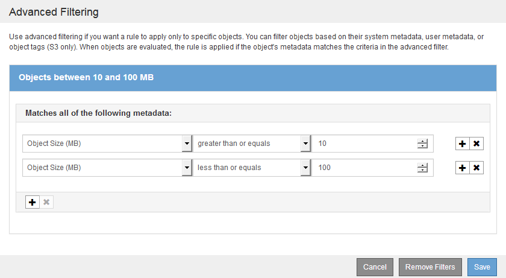

= Verwenden Sie erweiterte Filter in ILM-Regeln
:allow-uri-read: 
:icons: font
:imagesdir: ../media/

[role="lead"]
Mit der erweiterten Filterung können Sie ILM-Regeln erstellen, die sich nur auf bestimmte Objekte anwenden lassen, basierend auf ihren Metadaten. Wenn Sie die erweiterte Filterung für eine Regel einrichten, wählen Sie den Metadatentyp aus, der übereinstimmen soll, wählen Sie einen Operator aus und geben einen Metadatenwert an. Wenn Objekte ausgewertet werden, wird die ILM-Regel nur auf Objekte angewendet, die Metadaten enthalten, die dem erweiterten Filter entsprechen.

Die Tabelle zeigt die Metadatentypen, die Sie in den erweiterten Filtern angeben können, die Operatoren, die Sie für jeden Metadatentyp verwenden können, und die erwarteten Metadaten.

[cols="1a,1a,2a"]
|===
| Metadatentyp | Unterstützte Operatoren | Metadatenwert 

 a| 
Aufnahmezeit (Mikrosekunden)
 a| 
* Gleich
* Ist nicht gleich
* Kleiner als
* Weniger als oder gleich
* Größer als
* Größer als oder gleich

 a| 
Uhrzeit und Datum, an dem das Objekt aufgenommen wurde.

*Hinweis:* um Ressourcenprobleme bei der Aktivierung einer neuen ILM-Richtlinie zu vermeiden, können Sie den erweiterten Filter für die Aufnahmezeit in jeder Regel verwenden, die den Speicherort einer großen Anzahl vorhandener Objekte ändern könnte. Legen Sie die Aufnahmezeit auf größer oder gleich der ungefähren Zeit fest, zu der die neue Richtlinie in Kraft tritt, um sicherzustellen, dass vorhandene Objekte nicht unnötig verschoben werden.

 a| 
Taste
 a| 
* Gleich
* Ist nicht gleich
* Enthält
* Enthält nicht
* Beginnt mit
* Startet nicht mit
* Endet mit
* Endet nicht mit

 a| 
Der gesamte Objektschlüssel oder Teil eines eindeutigen S3- oder Swift-Objektschlüssels.

Beispielsweise können Sie Objekte, die mit enden, aufeinander abstimmen `.txt` Oder beginnen Sie mit `test-object/`.

 a| 
Zeitpunkt des letzten Zugriffs (Mikrosekunden)
 a| 
* Gleich
* Ist nicht gleich
* Kleiner als
* Weniger als oder gleich
* Größer als
* Größer als oder gleich
* Vorhanden
* Nicht vorhanden

 a| 
Uhrzeit und Datum, an dem das Objekt zuletzt abgerufen wurde (gelesen oder angezeigt).

*Hinweis:* Wenn Sie die letzte Zugriffszeit als erweiterten Filter verwenden möchten, müssen Updates der letzten Zugriffszeit für den S3-Bucket oder Swift-Container aktiviert sein.

xref:using-last-access-time-in-ilm-rules.adoc[Verwenden Sie die Zeit für den letzten Zugriff in ILM-Regeln]

 a| 
Speicherortbeschränkung (nur S3)
 a| 
* Gleich
* Ist nicht gleich

 a| 
Die Region, in der ein S3-Bucket erstellt wurde. Verwenden Sie *ILM* *Regionen*, um die angezeigten Regionen zu definieren.

*Hinweis:* Ein Wert von US-East-1 entspricht Objekten in Eimern, die in der Region US-East-1 erstellt wurden, sowie Objekten in Buckets, die keine Region angegeben haben.

xref:configuring-regions-optional-and-s3-only.adoc[Regionen konfigurieren (nur optional und S3)]

 a| 
Objektgröße (MB)
 a| 
* Gleich
* Nicht gleich
* Kleiner als
* Weniger als oder gleich
* Größer als
* Größer als oder gleich

 a| 
Die Größe des Objekts in MB.

Das Verfahren zur Einhaltung von Datenkonsistenz eignet sich am besten für Objekte mit einer Größe von mehr als 1 MB. Verwenden Sie kein Erasure Coding für Objekte mit einer Größe von mehr als 200 KB, um den Overhead zu vermeiden, der bei dem Management sehr kleiner, mit Erasure Coding codierter Fragmente verbunden ist.

*Hinweis:* um nach Objektgrößen kleiner als 1 MB zu filtern, geben Sie einen Dezimalwert ein. Der Browsertyp und die Ländereinstellungen steuern, ob Sie einen Punkt oder ein Komma als Dezimaltrennzeichen verwenden müssen.

 a| 
Benutzermetadaten
 a| 
* Enthält
* Endet mit
* Gleich
* Vorhanden
* Enthält nicht
* Endet nicht mit
* Ist nicht gleich
* Nicht vorhanden
* Startet nicht mit
* Beginnt mit

 a| 
Schlüssel-Wert-Paar, wobei *User Metadata Name* der Schlüssel ist und *User Metadata Value* der Wert ist.

Zum Beispiel nach Objekten mit Benutzer-Metadaten von filtern `color=blue`, Spezifizieren `color` Für *User Metadata Name*, `equals` Für den Bediener, und `blue` Für *User Metadata Value*.

*Hinweis:* Benutzer-Metadaten Namen sind nicht Groß-/Kleinschreibung; Benutzer-Metadaten-Werte sind Groß-/Kleinschreibung.

 a| 
Objekt-Tag (nur S3)
 a| 
* Enthält
* Endet mit
* Gleich
* Vorhanden
* Enthält nicht
* Endet nicht mit
* Ist nicht gleich
* Nicht vorhanden
* Startet nicht mit
* Beginnt mit

 a| 
Schlüssel-Wert-Paar, wobei *Objekt-Tag-Name* der Schlüssel und *Objekt-Tag-Wert* der Wert ist.

Zum Beispiel, um nach Objekten zu filtern, die ein Objekt-Tag von haben `Image=True`, Spezifizieren `Image` Für *Objekt-Tag-Name*, `equals` Für den Bediener, und `True` Für *Objekt-Tag-Wert*.

*Hinweis:* Objekt-Tag-Namen und Objekt-Tag-Werte sind Groß- und Kleinschreibung. Sie müssen diese Elemente genau so eingeben, wie sie für das Objekt definiert wurden.

|===

== Angeben mehrerer Metadatentypen und -Werte

Wenn Sie die erweiterte Filterung definieren, können Sie mehrere Metadatentypen und mehrere Metadatenwerte angeben. Wenn Sie beispielsweise eine Regel für Objekte zwischen 10 MB und 100 MB Größe festlegen möchten, wählen Sie den Metadatentyp *Objektgröße* aus und geben zwei Metadaten an.

* Der erste Metadatenwert gibt Objekte an, die größer oder gleich 10 MB sind.
* Der zweite Metadatenwert gibt Objekte an, die kleiner als oder gleich 100 MB sind.

Durch die Verwendung mehrerer Einträge können Sie genau steuern, welche Objekte abgeglichen werden. Im folgenden Beispiel gilt die Regel für Objekte, die einen Brand A oder eine Marke B als Wert der Camera_type-Benutzermetadaten haben. Die Regel gilt jedoch nur für Objekte der Marke B, die kleiner als 10 MB sind.

image::../media/advanced_filtering_multiple_rows.gif[Beispiel für die erweiterte Filterung von Benutzermetadaten]
