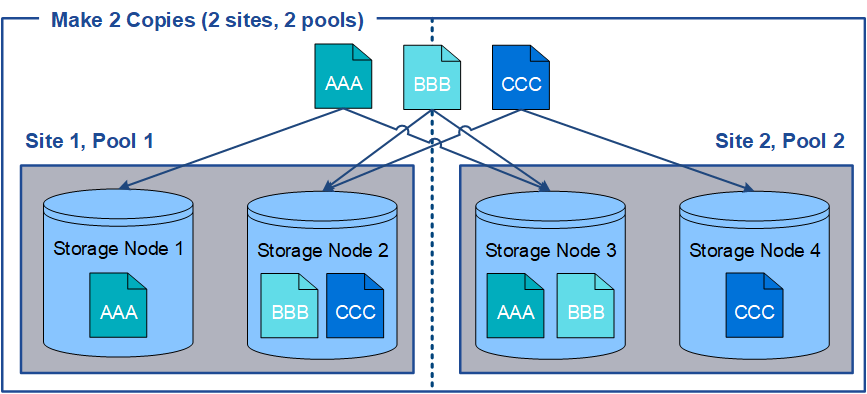

= Verwendung mehrerer Storage Pools zur standortübergreifenden Replizierung
:allow-uri-read: 
:icons: font
:imagesdir: ../media/

[role="lead"]
Wenn Ihre StorageGRID-Implementierung mehr als einen Standort umfasst, können Sie den Site-Loss-Schutz durch die Erstellung eines Storage-Pools für jeden Standort aktivieren und in den Anweisungen zur Platzierung der Regeln beide Storage Pools angeben. Wenn Sie beispielsweise eine ILM-Regel konfigurieren, um zwei replizierte Kopien zu erstellen und Storage-Pools an zwei Standorten festzulegen, wird an jedem Standort eine Kopie jedes Objekts erstellt. Wenn Sie eine Regel für die Erstellung von zwei Kopien konfigurieren und drei Speicherpools festlegen, werden die Kopien verteilt, um die Festplattennutzung in den Speicherpools auszugleichen, während gleichzeitig sichergestellt wird, dass die beiden Kopien an unterschiedlichen Standorten gespeichert werden.

Das folgende Beispiel zeigt, was passieren kann, wenn eine ILM-Regel replizierte Objektkopien in einen einzelnen Storage-Pool mit Storage Nodes von zwei Standorten platziert. Da das System alle verfügbaren Nodes im Storage-Pool zum Speichern der replizierten Kopien verwendet, kann es alle Kopien von einigen Objekten innerhalb eines der Standorte platzieren. In diesem Beispiel speicherte das System zwei Kopien von Objekt AAA auf Storage Nodes an Standort 1 und zwei Kopien von Objekt CCC auf Storage Nodes an Standort 2. Nur Objekt BBB ist geschützt, wenn eine der Standorte ausfällt oder nicht mehr zugänglich ist.

image::../media/ilm_replication_make_2_copies_1_pool_2_sites.png[Erstellen Sie an zwei Standorten die Regel für 2 Kopien, jedoch nur einen Speicherpool]

Im Gegensatz dazu zeigt dieses Beispiel, wie Objekte gespeichert werden, wenn Sie mehrere Speicherpools verwenden. Im Beispiel gibt die ILM-Regel an, dass zwei replizierte Kopien jedes Objekts erstellt und die Kopien auf zwei Storage-Pools verteilt werden. Jeder Speicherpool enthält alle Storage-Nodes an einem Standort. Da an jedem Standort eine Kopie jedes Objekts gespeichert wird, werden Objektdaten gegen Standortausfall oder Nichtverfügbarkeit geschützt.

Beachten Sie bei der Verwendung mehrerer Speicherpools die folgenden Regeln:

* Wenn Sie n Kopien erstellen, müssen Sie n oder mehr Speicherpools hinzufügen. Wenn eine Regel beispielsweise für die Erstellung von drei Kopien konfiguriert ist, müssen Sie drei oder mehr Speicherpools angeben.
* Wenn die Anzahl der Kopien der Anzahl der Storage-Pools entspricht, wird in jedem Storage-Pool eine Kopie des Objekts gespeichert.
* Wenn die Anzahl der Kopien kleiner als die Anzahl der Storage-Pools ist, verteilt das System die Kopien, um die Festplattennutzung auf den ausgeglichenen Pools zu halten, und um sicherzustellen, dass mindestens zwei Kopien nicht im selben Storage-Pool gespeichert werden.
* Wenn sich die Speicherpools überschneiden (die gleichen Storage-Nodes enthalten), werden möglicherweise alle Kopien des Objekts an nur einem Standort gespeichert. Sie müssen sicherstellen, dass die ausgewählten Speicherpools nicht die gleichen Speicherknoten enthalten.

