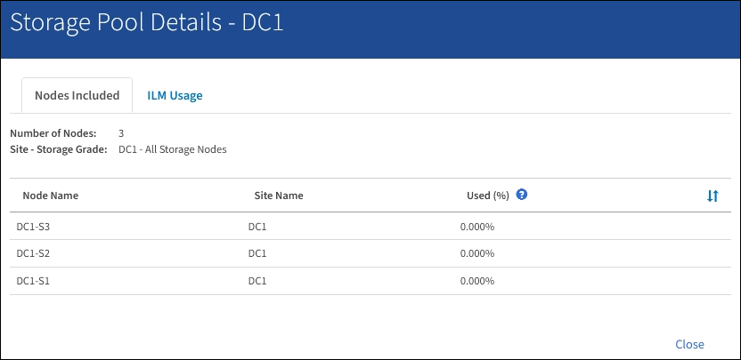

= Zeigen Sie Details zum Speicherpool an
:allow-uri-read: 
:icons: font
:imagesdir: ../media/

[role="lead"]
Sie können die Details eines Speicherpools anzeigen, um zu bestimmen, wo der Speicherpool verwendet wird, und um zu sehen, welche Nodes und Speicherklassen enthalten sind.

.Was Sie und#8217;ll benötigen
* Sie sind mit einem bei Grid Manager angemeldet xref:../admin/web-browser-requirements.adoc[Unterstützter Webbrowser].
* Sie haben spezifische Zugriffsberechtigungen.

.Schritte
. Wählen Sie *ILM* *Storage Pools* aus.
+
Die Seite Speicherpools wird angezeigt. Auf dieser Seite werden alle definierten Speicherpools aufgelistet.

+
image::../media/storage_pools_page_with_pools.png[Speicherpools Seite Mit Pools.png]

+
Die Tabelle enthält die folgenden Informationen zu den einzelnen Storage-Pools, einschließlich Storage-Nodes:

+
** *Name*: Der eindeutige Anzeigename des Speicherpools.
** *Verwendeter Platz*: Die Menge an Speicherplatz, die derzeit zum Speichern von Objekten im Speicherpool verwendet wird.
** *Freier Raum*: Der Speicherplatz, der zur Speicherung von Objekten im Speicherpool verfügbar bleibt.
** *Gesamtkapazität*: Die Größe des Speicherpools, die der gesamten nutzbaren Menge an Objektdaten für alle Knoten im Speicherpool entspricht.
** *ILM-Nutzung*: Wie der Speicherpool derzeit genutzt wird. Ein Storage-Pool kann ungenutzt sein oder auch in einem oder mehreren ILM-Regeln, Erasure Coding-Profilen oder beidem verwendet werden.
+

NOTE: Ein Speicherpool kann nicht entfernt werden, wenn er verwendet wird.

. Um Details zu einem bestimmten Speicherpool anzuzeigen, wählen Sie das entsprechende Optionsfeld aus, und wählen Sie *Details anzeigen*.
+
Der Storage Pool Details Modal wird angezeigt.

. Auf der Registerkarte *enthaltene Knoten* erfahren Sie mehr über die Speicherknoten oder Archivknoten, die im Speicherpool enthalten sind.
+

+
Die Tabelle enthält die folgenden Informationen für jeden Node:

+
** Node-Name
** Standortname
** Genutzt (%): Für Storage-Nodes, der Prozentsatz des insgesamt nutzbaren Speicherplatzes für Objektdaten, der verwendet wurde. Dieser Wert enthält keine Objektmetadaten.
+

NOTE: Der gleiche verwendete (%) Wert wird auch im Diagramm Speicher verwendet - Objektdaten für jeden Speicherknoten angezeigt (wählen Sie *NODES* *_Storage Node_* *Storage*).

. Wählen Sie die Registerkarte *ILM-Nutzung* aus, um festzustellen, ob der Speicherpool derzeit in ILM-Regeln oder Erasure Coding-Profilen verwendet wird.
+
In diesem Beispiel wird der DC1-Speicherpool in drei ILM-Regeln verwendet: Zwei Regeln, die sich in der aktiven ILM-Richtlinie befinden, und eine Regel, die nicht in der aktiven Richtlinie ist.

+
image::../media/storage_pools_details_ilm.png[Storage Pools Details ILM]

+

NOTE: Sie können einen Speicherpool nicht entfernen, wenn er in einer ILM-Regel verwendet wird.

+
In diesem Beispiel wird der Speicherpool „Alle 3 Standorte“ in einem Erasure Coding-Profil verwendet. Dieses Erasure Coding-Profil wird wiederum von einer ILM-Regel in der aktiven ILM-Richtlinie verwendet.

+
image::../media/storage_pools_details_ilm_ec.png[Storage Pools Details ILM EC]

+

NOTE: Ein Speicherpool kann nicht entfernt werden, wenn er in einem Erasure Coding-Profil verwendet wird.

. Klicken Sie optional auf die Seite *ILM-Regeln*, um mehr über die Regeln zu erfahren und diese zu verwalten, die den Speicherpool verwenden.
+
Anweisungen zum Arbeiten mit ILM-Regeln finden Sie in der Anleitung.

. Wenn Sie die Details des Speicherpools anzeigen, wählen Sie *Schließen*.

xref:working-with-ilm-rules-and-ilm-policies.adoc[Arbeiten Sie mit ILM-Regeln und ILM-Richtlinien]
