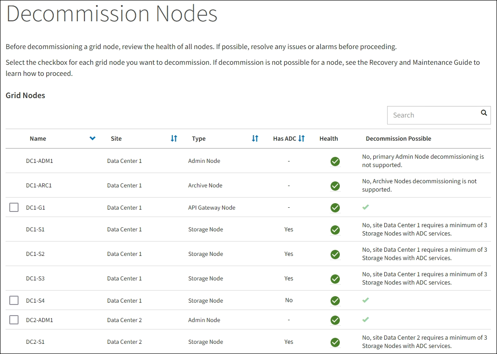

= Öffnen Sie die Seite Decommission Nodes
:allow-uri-read: 
:icons: font
:imagesdir: ../media/

[role="lead"]
Wenn Sie im Grid Manager auf die Seite Decommission Nodes zugreifen, sehen Sie auf einen Blick, welche Knoten deaktiviert werden können.

.Was Sie benötigen
* Sie müssen mit einem beim Grid Manager angemeldet sein xref:../admin/web-browser-requirements.adoc[Unterstützter Webbrowser].
* Sie müssen über die Berechtigung Wartung oder Stammzugriff verfügen.

.Schritte
. Wählen Sie *WARTUNG* *Aufgaben* *Dekommission*.
. Wählen Sie *Decommission Nodes*.
+
Die Seite Decommission Nodes wird angezeigt. Auf dieser Seite können Sie:

+
** Legen Sie fest, welche Grid-Nodes derzeit deaktiviert werden können.
** Den Systemzustand aller Grid-Nodes anzeigen
** Sortieren Sie die Liste in aufsteigender oder absteigender Reihenfolge nach *Name*, *Standort*, *Typ* oder *hat ADC*.
** Geben Sie Suchbegriffe ein, um bestimmte Nodes schnell zu finden. Beispielsweise werden auf dieser Seite die Grid-Nodes in zwei Datacentern angezeigt. Die Spalte Decommission Mögliche gibt an, dass Sie den Gateway-Node, einen der fünf Storage-Nodes und den nicht primären Admin-Node außer Betrieb nehmen können.

+

. Überprüfen Sie die Spalte *Decommission möglich* für jeden Knoten, den Sie stilllegen möchten.
+
Wenn ein Grid-Node deaktiviert werden kann, enthält diese Spalte ein grünes Häkchen, und in der Spalte links ist das Kontrollkästchen enthalten. Wenn ein Node nicht außer Betrieb genommen werden kann, wird in dieser Spalte das Problem beschrieben. Wenn ein Node nicht mehr außer einem Grund außer Betrieb genommen werden kann, wird der kritischste Grund angezeigt.

+
[cols="1a,2a,3a"]
|===
| Möglichen Grund einer Deaktivierung | Beschreibung | Schritte zur Lösung 

 a| 
Nein, die Ausmusterung von Node-Typen wird nicht unterstützt.
 a| 
Sie können den primären Admin-Node oder einen Archiv-Node nicht stilllegen.
 a| 
Keine.

 a| 
Nein, mindestens ein Grid-Node ist getrennt.

*Hinweis:* Diese Meldung wird nur für verbundene Grid-Knoten angezeigt.
 a| 
Sie können einen verbundenen Grid-Node nicht stilllegen, wenn ein Grid-Node getrennt ist.

Die Spalte *Health* enthält eines der folgenden Symbole für getrennte Grid-Knoten:

** image:../media/icon_alarm_gray_administratively_down.png["Graues Fragensymbol"] (Grau): Administrativ nach unten
** image:../media/icon_alarm_blue_unknown.png["Blaues Fragezeichen-Symbol"] (Blau): Unbekannt

 a| 
Wechseln Sie zum <<decommission_procedure_choices,Schritt, in dem die Optionen für das Stilllegen aufgeführt sind>>.

 a| 
Nein, ein oder mehrere erforderliche Nodes sind derzeit getrennt und müssen wiederhergestellt werden.

*Hinweis:* Diese Meldung wird nur für getrennte Gitterknoten angezeigt.
 a| 
Ein nicht getrennter Grid-Node kann nicht stillgelegt werden, wenn auch ein oder mehrere erforderliche Nodes getrennt sind (z. B. ein Storage-Node, der für das ADC-Quorum erforderlich ist).
 a| 
.. Überprüfen Sie die möglichen Meldungen zur Dekommission für alle nicht verbundenen Knoten.
.. Legen Sie fest, welche Nodes nicht außer Betrieb genommen werden können, da sie erforderlich sind.
+
*** Wenn der Status eines erforderlichen Knotens „Administrativ ausgefallen“ ist, stellen Sie den Knoten wieder in den Online-Modus.
*** Wenn der Systemzustand eines erforderlichen Node Unbekannt ist, führen Sie einen Wiederherstellungsvorgang für den Node durch, um den erforderlichen Node wiederherzustellen.

 a| 
Nein, Mitglied der HA-Gruppe(n): _X_. Bevor Sie diesen Node außer Betrieb nehmen können, müssen Sie ihn aus allen HA-Gruppen entfernen.
 a| 
Sie können einen Admin-Node oder einen Gateway-Node nicht außer Betrieb nehmen, wenn eine Node-Schnittstelle einer HA-Gruppe (High Availability, Hochverfügbarkeit) angehört.
 a| 
Bearbeiten Sie die HA-Gruppe, um die Schnittstelle des Node zu entfernen, oder entfernen Sie die gesamte HA-Gruppe. Lesen Sie die Anweisungen zum Verwalten von StorageGRID.

 a| 
Nein, Standort _x_ erfordert mindestens _n_ Storage Nodes mit ADC-Services.
 a| 
*Nur Speicherknoten.* ein Speicherknoten kann nicht stillgelegt werden, wenn nicht genügend Knoten am Standort verbleiben würden, um ADC-Quorum-Anforderungen zu unterstützen.
 a| 
Eine Erweiterung durchführen. Fügen Sie dem Standort einen neuen Speicherknoten hinzu, und geben Sie an, dass ein ADC-Dienst vorhanden sein soll. Siehe Informationen über das ADC-Quorum.

 a| 
Nein, mindestens ein Erasure Coding-Profil benötigt mindestens _n_ Storage-Nodes. Wenn das Profil in einer ILM-Regel nicht verwendet wird, können Sie es deaktivieren.
 a| 
*Nur Speicherknoten.* Sie können einen Speicherknoten nicht stilllegen, es sei denn, es würden genügend Knoten für die vorhandenen Erasure Coding Profile übrig bleiben.

Wenn beispielsweise ein Erasure Coding-Profil für das Erasure Coding-Verfahren von 4+2 vorhanden ist, müssen mindestens 6 Storage-Nodes verbleiben.
 a| 
Führen Sie für jedes betroffene Erasure Coding-Profil einen der folgenden Schritte aus, je nachdem, wie das Profil verwendet wird:

** *In der aktiven ILM-Richtlinie verwendet*: Eine Erweiterung durchführen. Fügen Sie genügend neue Storage-Nodes hinzu, um das Erasure Coding-Verfahren fortzusetzen. Weitere Informationen finden Sie in den Anweisungen zum erweitern von StorageGRID.
** *Wird in einer ILM-Regel verwendet, aber nicht in der aktiven ILM-Richtlinie*: Bearbeiten oder löschen Sie die Regel und deaktivieren Sie dann das Erasure Coding-Profil.
** *Nicht in einer ILM-Regel verwendet*: Deaktivieren Sie das Erasure Coding-Profil.

*Hinweis:* eine Fehlermeldung erscheint, wenn Sie versuchen, ein Erasure Coding-Profil zu deaktivieren und Objektdaten weiterhin mit dem Profil verknüpft sind. Sie müssen möglicherweise mehrere Wochen warten, bevor Sie den Deaktivierungsprozess erneut versuchen.

Erfahren Sie mehr über die Deaktivierung eines Erasure Coding-Profils in den Anweisungen zum Verwalten von Objekten mit Information Lifecycle Management.

|===
. [[Decommission_Procedure_Chooces]]Falls für den Knoten ein Stilllegen möglich ist, bestimmen Sie, welche Prozedur Sie durchführen müssen:

[cols="1a,1a"]
|===
| Wenn Ihr Grid Folgendes enthält: | Gehe zu... 

 a| 
Alle getrennten Grid-Nodes
 a| 
xref:decommissioning-disconnected-grid-nodes.adoc[Die getrennten Grid-Nodes werden deaktiviert]

 a| 
Nur verbundene Grid-Nodes
 a| 
xref:decommissioning-connected-grid-nodes.adoc[Verbundene Grid-Nodes ausmustern]

|===
.Verwandte Informationen
xref:checking-data-repair-jobs.adoc[Prüfen Sie die Reparatur von Daten]

xref:understanding-adc-service-quorum.adoc[Das ADC-Quorum verstehen]

xref:../ilm/index.adoc[Objektmanagement mit ILM]

xref:../expand/index.adoc[Erweitern Sie Ihr Raster]

xref:../admin/index.adoc[StorageGRID verwalten]
