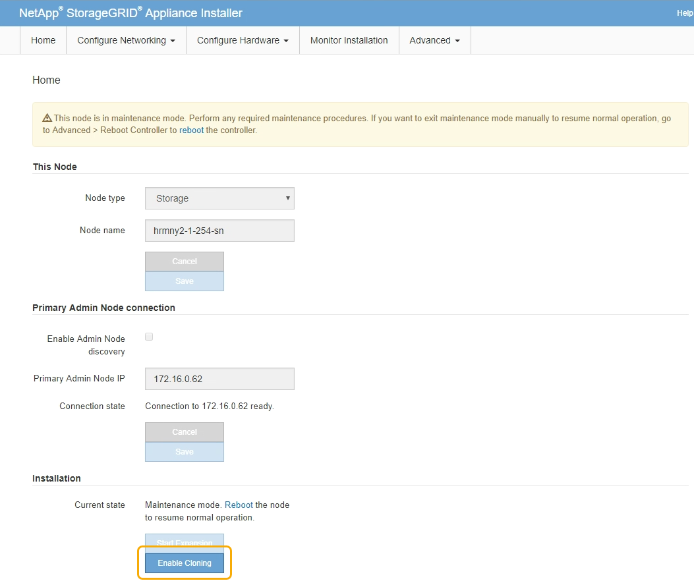

= Klon-Appliance-Node
:allow-uri-read: 
:icons: font
:imagesdir: ../media/

[role="lead"]
Der Klonprozess kann mehrere Tage dauern, bis die Daten zwischen dem Quell-Node (Appliance, die ersetzt wird) und der Ziel-Appliance übertragen werden.

.Was Sie benötigen
* Sie haben das kompatible Zielgerät in einem Schrank oder Rack installiert, alle Kabel angeschlossen und mit Strom versorgt.
* Sie haben überprüft, ob die Installationsversion für die StorageGRID Appliance auf der Ersatzanwendung mit der Softwareversion des StorageGRID-Systems übereinstimmt. Dabei müssen Sie ggf. die StorageGRID Appliance Installer-Firmware aktualisieren.
* Sie haben die Ziel-Appliance konfiguriert, einschließlich der Konfiguration von StorageGRID-Verbindungen, SANtricity System Manager (nur Storage Appliances) und der BMC-Schnittstelle.
+
** Verwenden Sie beim Konfigurieren von StorageGRID-Verbindungen die temporären IP-Adressen.
** Verwenden Sie bei der Konfiguration von Netzwerkverbindungen die abschließende Link-Konfiguration.

NOTE: Lassen Sie das Installationsprogramm der StorageGRID Appliance nach Abschluss der Erstkonfiguration der Ziel-Appliance offen. Nach dem Start des Node-Klonprozesses kehren Sie zur Installationsseite der Zielanwendung zurück.

* Optional ist die Node-Verschlüsselung für die Ziel-Appliance aktiviert.
* Sie haben optional den RAID-Modus für die Ziel-Appliance eingestellt (nur Storage Appliances).
* xref:considerations-and-requirements-for-appliance-node-cloning.adoc[Überlegungen und Anforderungen zum Klonen von Appliance-Nodes]
+
xref:../sg100-1000/index.adoc[SG100- und SG1000-Services-Appliances]

+
xref:../sg5600/index.adoc[SG5600 Storage Appliances]

+
xref:../sg5700/index.adoc[SG5700 Storage-Appliances]

+
xref:../sg6000/index.adoc[SG6000 Storage-Appliances]

Sie sollten jeweils nur einen Appliance-Node klonen, um die Netzwerk-Performance und Datenverfügbarkeit von StorageGRID zu erhalten.

.Schritte
. xref:placing-appliance-into-maintenance-mode.adoc[Platzieren Sie den Quellknoten, den Sie klonen, in den Wartungsmodus].
. Wählen Sie im StorageGRID-Appliance-Installationsprogramm auf dem Quellknoten im Abschnitt Installation der Startseite die Option *Klonen aktivieren* aus.
+

+
Der Abschnitt primäre Admin-Node-Verbindung wird durch den Abschnitt „Verbindung zum Ziel-Node klonen“ ersetzt.

+
image::../media/clone_peer_node_connection_section.png[Abschnitt „Verbindung des Ziel-Node klonen“]

. Geben Sie für *Zielknoten-IP* die temporäre IP-Adresse ein, die dem Zielknoten zugewiesen ist, das Netzwerk für den Datenverkehr der Klondatenübertragung verwenden soll, und wählen Sie dann *Speichern* aus.
+
Normalerweise geben Sie die IP-Adresse für das Grid-Netzwerk ein. Wenn Sie jedoch ein anderes Netzwerk für den Datenverkehr von Klondaten verwenden müssen, geben Sie die IP-Adresse des Zielknoten in diesem Netzwerk ein.

+

NOTE: Die Verwendung des 1-GbE-Admin-Netzwerks für die Übertragung von Klondaten führt zu langsamerem Klonen.

+
Nachdem die Zielanwendung konfiguriert und validiert wurde, ist im Abschnitt Installation *Klonen starten* auf dem Quellknoten aktiviert.

+
image::../media/start_cloning.png[Beginnen Sie mit dem Klonen]

+
Wenn Probleme bestehen, die das Klonen verhindern, ist *Klonen starten* nicht aktiviert und Probleme, die Sie lösen müssen, werden als *Verbindungsstatus* aufgeführt. Diese Probleme sind auf der Startseite des StorageGRID-Appliance-Installationsprogramms sowohl des Quell-Knotens als auch der Ziel-Appliance aufgeführt. Es wird immer nur ein Problem angezeigt, und der Status wird automatisch aktualisiert, wenn sich die Bedingungen ändern. Lösen Sie alle Klonprobleme, um *Klonen starten* zu aktivieren.

+
Wenn *Klonen starten* aktiviert ist, zeigt der *Aktueller Status* das zum Klonen des Datenverkehrs ausgewählte StorageGRID-Netzwerk sowie Informationen über die Verwendung dieser Netzwerkverbindung an.

+
xref:considerations-and-requirements-for-appliance-node-cloning.adoc[Überlegungen und Anforderungen zum Klonen von Appliance-Nodes]

. Wählen Sie *Klonen starten* auf dem Quellknoten aus.
. Überwachen Sie den Klonfortschritt mit dem Installationsprogramm von StorageGRID Appliance auf dem Quell- oder Zielknoten.
+
Das Installationsprogramm der StorageGRID Appliance auf den Quell- und den Ziel-Nodes weist denselben Status auf.

+
image::../media/cloning_progress.png[Klonvorgang läuft]

+
Die Seite Klonen überwachen bietet detaillierte Fortschritte für jede Phase des Klonprozesses:

+
** *Aufbau einer Klon-Peering-Beziehung* zeigt den Fortschritt der Klonerstellung und -Konfiguration.
** *Ein weiterer Knoten von diesem Knoten klonen* zeigt den Fortschritt der Datenübertragung an. (Dieser Teil des Klonprozesses kann mehrere Tage dauern.)
** *Geklonter Knoten aktivieren und diesen offline lassen* zeigt den Fortschritt der Übertragung der Steuerung auf den Zielknoten und der Platzierung des Quellknoten in einen Pre-install Zustand, nachdem die Datenübertragung abgeschlossen ist.

. Wenn Sie den Klonprozess beenden und den Quellknoten vor dem Abschluss des Klonens in den Dienst zurücksenden müssen, wechseln Sie auf dem Quellknoten zur Startseite des StorageGRID Appliance Installer und wählen Sie *Erweitert* *Controller neu starten* aus und wählen dann *Neustart in StorageGRID* aus.
+
Wenn der Klonprozess beendet wird:

+
** Der Quell-Node beendet den Wartungsmodus und verbindet sich neu zu StorageGRID.
** Der Ziel-Node bleibt im Installationszustand. Um das Klonen des Quellknoten neu zu starten, starten Sie den Klonprozess erneut von Schritt 1.

Wenn das Klonen erfolgreich abgeschlossen wurde:

* Die Quell- und Ziel-Knoten tauschen IP-Adressen aus:
+
** Der Zielknoten verwendet nun die IP-Adressen, die ursprünglich dem Quellknoten für Grid-, Admin- und Client-Netzwerke zugewiesen wurden.
** Der Quellknoten verwendet jetzt die temporäre IP-Adresse, die dem Zielknoten ursprünglich zugewiesen wurde.

* Der Ziel-Node beendet den Wartungsmodus und tritt dem StorageGRID bei und ersetzt den Quell-Node.
* Die Quell-Appliance befindet sich in einem vorinstallierten Zustand, so als ob Sie es hätten xref:preparing-appliance-for-reinstallation-platform-replacement-only.adoc[Es für die Neuinstallation vorbereitet].

NOTE: Wenn das Gerät nicht wieder in das Raster integriert wird, wechseln Sie zur Startseite des StorageGRID-Appliance-Installationsprogramms für den Quellknoten, wählen Sie *Erweitert* *Controller neu starten* und wählen Sie dann *Neustart im Wartungsmodus* aus. Nachdem der Quell-Node im Wartungsmodus neu gebootet wurde, wiederholen Sie den Vorgang des Node-Klonens.

Benutzerdaten auf der Quell-Appliance bleiben als Wiederherstellungsoption, wenn bei dem Ziel-Node ein unerwartetes Problem auftritt. Nachdem der Ziel-Node der StorageGRID erneut beigetreten ist, sind die Benutzerdaten auf der Quell-Appliance veraltet und werden nicht mehr benötigt. Bitten Sie den StorageGRID-Support bei Bedarf, die Quell-Appliance zu löschen, damit diese Daten zerstört werden können.

Ihre Vorteile:

* Verwenden Sie die Quell-Appliance als Ziel für weitere Klonvorgänge: Es ist keine zusätzliche Konfiguration erforderlich. Dieser Appliance wurde bereits die temporäre IP-Adresse zugewiesen, die ursprünglich für das erste Klonziel angegeben wurde.
* Installieren und richten Sie die Quell-Appliance als neuen Appliance-Node ein.
* Entsorgen Sie die Quell-Appliance, wenn sie nicht mehr mit StorageGRID verwendet wird.

