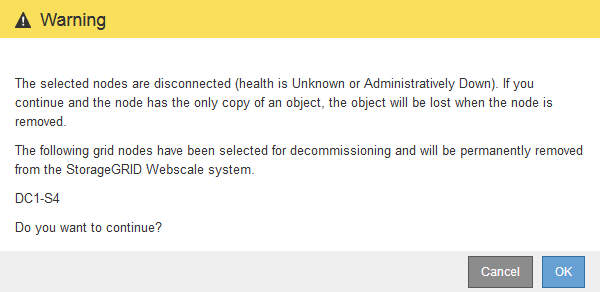

= Die getrennten Grid-Nodes werden deaktiviert
:allow-uri-read: 
:icons: font
:imagesdir: ../media/

[role="lead"]
Möglicherweise müssen Sie einen Knoten außer Betrieb setzen, der derzeit nicht mit dem Grid verbunden ist (einen Node, dessen Status unbekannt oder administrativ ausgefallen ist).

.Was Sie benötigen
* Sie verstehen die Anforderungen und xref:considerations-for-decommissioning-grid-nodes.adoc[Überlegungen für die Deaktivierung von Grid-Nodes].
* Sie haben alle erforderlichen Elemente erhalten.
* Sie haben sichergestellt, dass keine Datenreparaturjobs aktiv sind. Siehe xref:checking-data-repair-jobs.adoc[Prüfen Sie die Reparatur von Daten].
* Sie haben bestätigt, dass die Wiederherstellung von Storage-Nodes an keiner Stelle im Grid ausgeführt wird. In diesem Fall müssen Sie warten, bis alle Cassandra-Rebuilds im Rahmen der Recovery abgeschlossen sind. Anschließend können Sie mit der Stilllegung fortfahren.
* Sie haben sichergestellt, dass andere Wartungsvorgänge während der Deaktivierung des Nodes nicht ausgeführt werden, es sei denn, der Vorgang zur Deaktivierung des Nodes wurde angehalten.
* Die Spalte *Decommission möglich* für den Knoten oder Knoten, die Sie außer Betrieb nehmen möchten, enthält ein grünes Häkchen.
* Sie müssen über eine Passphrase für die Bereitstellung verfügen.

.Über diese Aufgabe
Sie können nicht verbundene Knoten identifizieren, indem Sie in der Spalte *Health* nach Unbekannt (blau) oder Administrativ Down (grau)-Symbolen suchen. Im Beispiel ist der Speicherknoten DC1-S4 getrennt; alle anderen Knoten sind verbunden.

image::../media/decommission_nodes_page_one_disconnected.png[Legen Sie die Seite Knoten außer Betrieb, wobei ein Knoten nicht verbunden ist]

Beachten Sie vor dem Stilllegen getrennter Nodes Folgendes:

* Dieses Verfahren dient in erster Linie zum Entfernen eines einzelnen nicht verbundenen Knotens. Wenn Ihr Grid mehrere getrennte Knoten enthält, muss die Software gleichzeitig ausmustern, wodurch das Potenzial für unerwartete Ergebnisse erhöht wird.
+

IMPORTANT: Gehen Sie sehr vorsichtig vor, wenn Sie mehrere getrennte Grid-Nodes gleichzeitig außer Betrieb nehmen. Dies gilt insbesondere dann, wenn Sie mehrere getrennte Storage-Nodes auswählen.

* Wenn ein nicht getrennter Knoten nicht entfernt werden kann (z. B. ein Speicherknoten, der für das ADC-Quorum benötigt wird), kann kein anderer nicht getrennter Knoten entfernt werden.

Beachten Sie vor dem Stilllegen eines nicht verbundenen *Storage Node* Folgendes

* Sie sollten niemals einen getrennten Storage-Knoten außer Betrieb nehmen, wenn Sie sicher sind, dass er nicht online oder wiederhergestellt werden kann.
+

IMPORTANT: Wenn Sie glauben, dass Objektdaten weiterhin über den Node wiederhergestellt werden können, führen Sie dieses Verfahren nicht aus. Wenden Sie sich stattdessen an den technischen Support, um zu ermitteln, ob das Recovery von Nodes möglich ist.

* Wenn Sie mehrere getrennte Storage-Nodes außer Betrieb nehmen, kann es zu Datenverlusten kommen. Das System ist möglicherweise nicht in der Lage, Daten zu rekonstruieren, wenn nicht genügend Objektkopien, Fragmente mit Erasure-Coding-Verfahren oder Objekt-Metadaten verfügbar sind.
+

IMPORTANT: Wenn mehr als ein getrennter Speicherknoten vorhanden ist, den Sie nicht wiederherstellen können, wenden Sie sich an den technischen Support, um die beste Vorgehensweise zu ermitteln.

* Wenn Sie einen getrennten Storage-Node außer Betrieb nehmen, startet StorageGRID am Ende des Stilllegungsvorgangs die Reparatur der Daten. Diese Jobs versuchen, die Objektdaten und Metadaten, die auf dem getrennten Node gespeichert waren, zu rekonstruieren.
* Wenn Sie einen getrennten Storage-Node ausmustern, wird der Vorgang der Ausmusterung relativ schnell abgeschlossen. Die Ausführung der Reparatur von Daten kann jedoch Tage oder Wochen dauern und wird nicht durch den Außerbetriebnahme überwacht. Sie müssen diese Jobs manuell überwachen und nach Bedarf neu starten. Siehe xref:checking-data-repair-jobs.adoc[Prüfen Sie die Reparatur von Daten].
* Wenn Sie einen getrennten Storage-Node stilllegen, der die einzige Kopie eines Objekts enthält, geht das Objekt verloren. Die Datenrekonstruktionsaufgaben können Objekte nur rekonstruieren und wiederherstellen, wenn mindestens eine replizierte Kopie oder genug Fragmente mit Löschungscode auf aktuell verbundenen Storage-Nodes vorhanden sind.

Beachten Sie vor dem Stilllegen eines nicht verbundenen *Admin-Node* oder *Gateway-Node* Folgendes:

* Wenn Sie einen getrennten Admin-Node stilllegen, verlieren Sie die Audit-Protokolle von diesem Node. Diese Protokolle sollten jedoch auch im primären Admin-Node vorhanden sein.
* Sie können einen Gateway-Node sicher außer Betrieb setzen, während er getrennt ist.

.Schritte
. Versuchen Sie, getrennte Grid-Nodes wieder online zu bringen oder sie wiederherzustellen.
+
Anweisungen hierzu finden Sie in den Wiederherstellungsverfahren.

. Wenn Sie einen getrennten Grid-Node nicht wiederherstellen können und ihn während der Trennung außer Betrieb setzen möchten, aktivieren Sie das Kontrollkästchen für diesen Node.
+

NOTE: Wenn Ihr Grid mehrere getrennte Knoten enthält, muss die Software gleichzeitig ausmustern, wodurch das Potenzial für unerwartete Ergebnisse erhöht wird.

+

IMPORTANT: Gehen Sie sehr vorsichtig vor, wenn Sie mehrere getrennte Grid-Nodes gleichzeitig außer Betrieb nehmen möchten, insbesondere wenn Sie mehrere getrennte Storage-Nodes auswählen. Wenn mehr als ein getrennter Speicherknoten vorhanden ist, den Sie nicht wiederherstellen können, wenden Sie sich an den technischen Support, um die beste Vorgehensweise zu ermitteln.

. Geben Sie die Provisionierungs-Passphrase ein.
+
Die Schaltfläche *Start Decommission* ist aktiviert.

. Klicken Sie Auf *Start Decommission*.
+
Es wird eine Warnung angezeigt, die angibt, dass Sie einen nicht verbundenen Knoten ausgewählt haben und dass Objektdaten verloren gehen, wenn der Knoten die einzige Kopie eines Objekts hat.

+

. Überprüfen Sie die Liste der Knoten, und klicken Sie auf *OK*.
+
Der Vorgang zur Deaktivierung wird gestartet und für jeden Node wird der Fortschritt angezeigt. Während des Verfahrens wird ein neues Wiederherstellungspaket mit der Änderung der Grid-Konfiguration generiert.

+
image::../media/decommission_nodes_procedure_in_progress_disconnected.png[Screenshot der Ausmusterung von Nodes wird ausgeführt]

. Sobald das neue Wiederherstellungspaket verfügbar ist, klicken Sie auf den Link oder wählen Sie *WARTUNG* *System* *Wiederherstellungspaket*, um die Seite des Wiederherstellungspakets aufzurufen. Laden Sie anschließend die herunter `.zip` Datei:
+
Siehe Anweisungen für xref:downloading-recovery-package.adoc[Herunterladen des Wiederherstellungspakets].

+

NOTE: Laden Sie das Wiederherstellungspaket so schnell wie möglich herunter, um sicherzustellen, dass Sie Ihr Grid wiederherstellen können, wenn während des Stillfalls etwas schief geht.

+

IMPORTANT: Die Recovery Package-Datei muss gesichert sein, weil sie Verschlüsselungsschlüssel und Passwörter enthält, die zum Abrufen von Daten vom StorageGRID-System verwendet werden können.

. Überwachen Sie die Seite Dekommission regelmäßig, um sicherzustellen, dass alle ausgewählten Knoten erfolgreich außer Betrieb gesetzt werden.
+
Storage-Nodes können Tage oder Wochen ausmustern. Wenn alle Aufgaben abgeschlossen sind, wird die Liste der Knotenauswahl mit einer Erfolgsmeldung erneut angezeigt. Wenn Sie einen getrennten Speicherknoten außer Betrieb genommen haben, zeigt eine Informationsmeldung an, dass die Reparaturaufträge gestartet wurden.

+
image::../media/decommission_nodes_data_repair.png[Screenshot zeigt, dass Reparaturaufträge gestartet wurden]

. Nachdem die Nodes im Rahmen der Stilllegung automatisch heruntergefahren wurden, entfernen Sie alle verbleibenden Virtual Machines oder anderen Ressourcen, die dem ausgemusterten Node zugeordnet sind.
+

IMPORTANT: Führen Sie diesen Schritt erst aus, wenn die Nodes automatisch heruntergefahren wurden.

. Wenn Sie einen Storage Node außer Betrieb nehmen, überwachen Sie den Status der Reparatur-Jobs mit *replizierten Daten* und *Erasure-codierten (EC) Daten*, die während des Stilllegungsprozesses automatisch gestartet werden.

[role="tabbed-block"]
====
.Replizierte Daten
--
* So stellen Sie fest, ob Reparaturen abgeschlossen sind:
+
.. Wählen Sie *NODES* *_Storage Node wird repariert_* *ILM* aus.
.. Prüfen Sie die Attribute im Abschnitt Bewertung. Wenn die Reparaturen abgeschlossen sind, weist das Attribut *wartet - Alle* 0 Objekte an.

* So überwachen Sie die Reparatur genauer:
+
.. Wählen Sie *SUPPORT* > *Tools* > *Grid-Topologie* aus.
.. Wählen Sie *_Grid_* *_Speicherknoten, der repariert wird_* *LDR* *Datenspeicher* aus.
.. Verwenden Sie eine Kombination der folgenden Attribute, um festzustellen, ob replizierte Reparaturen abgeschlossen sind.
+

NOTE: Cassandra ist möglicherweise Inkonsistenzen vorhanden und fehlgeschlagene Reparaturen werden nicht nachverfolgt.

+
*** *Reparted (XRPA)*: Verwenden Sie dieses Attribut, um den Fortschritt der replizierten Reparaturen zu verfolgen. Dieses Attribut erhöht sich jedes Mal, wenn ein Storage-Node versucht, ein risikoreicheres Objekt zu reparieren. Wenn dieses Attribut für einen Zeitraum nicht länger als die aktuelle Scan-Periode (vorgesehen durch das Attribut *Scan Period -- Estimated*) steigt, bedeutet dies, dass ILM-Scans keine hoch riskant Objekte gefunden haben, die auf allen Knoten repariert werden müssen.
+

NOTE: Objekte mit hohem Risiko sind Objekte, die Gefahr laufen, völlig verloren zu sein. Dies umfasst keine Objekte, die ihre ILM-Konfiguration nicht erfüllen.

*** *Scan Period -- Estimated (XSCM)*: Verwenden Sie dieses Attribut, um zu schätzen, wann eine Richtlinienänderung auf zuvor aufgenommene Objekte angewendet wird. Wenn sich das Attribut *Repears versuchte* über einen Zeitraum nicht länger als der aktuelle Scanzeitraum erhöht, ist es wahrscheinlich, dass replizierte Reparaturen durchgeführt werden. Beachten Sie, dass sich der Scanzeitraum ändern kann. Das Attribut *Scan Period -- Estimated (XSCM)* gilt für das gesamte Raster und ist die maximale Anzahl aller Knoten Scan Perioden. Sie können den Attributverlauf des Attributs *Scanperiode -- Estimated* für das Raster abfragen, um einen geeigneten Zeitrahmen zu ermitteln.

* Wenn Sie optional einen geschätzten Fertigstellungsgrad für die replizierte Reparatur erhalten möchten, fügen Sie den hinzu `show-replicated-repair-status` Option zum Befehl Repair-Data.
+
`repair-data show-replicated-repair-status`

+

IMPORTANT: Der `show-replicated-repair-status` Die Option ist für die technische Vorschau in StorageGRID 11.6 verfügbar. Diese Funktion ist in der Entwicklung, und der zurückgegebene Wert kann falsch oder verzögert sein. Um festzustellen, ob eine Reparatur abgeschlossen ist, verwenden Sie *Anstehend – Alle*, *Reparaturen versucht (XRPA)* und *Scanzeitraum -- Estimated (XSCM)* wie in beschrieben xref:..//maintain/restoring-object-data-to-storage-volume-where-system-drive-is-intact.adoc[Überwachen Sie Reparaturen].

--
.EC-Daten (Erasure Coding)
--
So überwachen Sie die Reparatur von Daten mit Verfahren zur Einhaltung von Datenkonsistenz und versuchen Sie es erneut, eventuell fehlgeschlagene Anfragen zu senden:

. Status von Datenreparaturen mit Löschungscode ermitteln:
+
** Wählen Sie *SUPPORT* *Tools* *Kennzahlen* aus, um die voraussichtliche Zeit bis zur Fertigstellung und den Prozentsatz für den Abschluss des aktuellen Jobs anzuzeigen. Wählen Sie dann im Abschnitt Grafana die Option *EC Übersicht* aus. Sehen Sie sich die Dashboards *Grid EC Job Estimated Time to Completion* und *Grid EC Job prozentual Completed* an.
** Verwenden Sie diesen Befehl, um den Status eines bestimmten anzuzeigen `repair-data` Betriebliche Gründe:
+
`repair-data show-ec-repair-status --repair-id repair ID`

** Verwenden Sie diesen Befehl, um alle Reparaturen aufzulisten:
+
`repair-data show-ec-repair-status`

+
Die Ausgabe enthält Informationen, einschließlich `repair ID`, Für alle zuvor und derzeit laufenden Reparaturen.

. Wenn in der Ausgabe angezeigt wird, dass der Reparaturvorgang fehlgeschlagen ist, verwenden Sie den `--repair-id` Option, um die Reparatur erneut zu versuchen.
+
Mit diesem Befehl wird eine fehlerhafte Node-Reparatur mithilfe der Reparatur-ID 6949309319275667690 erneut versucht:

+
`repair-data start-ec-node-repair --repair-id 6949309319275667690`

+
Mit diesem Befehl wird eine fehlerhafte Volume-Reparatur mithilfe der Reparatur-ID 6949309319275667690 wiederholt:

+
`repair-data start-ec-volume-repair --repair-id 6949309319275667690`

--
====
.Nachdem Sie fertig sind
Sobald die getrennten Nodes außer Betrieb genommen und alle Reparatur-Jobs abgeschlossen sind, können Sie alle verbundenen Grid-Nodes je nach Bedarf ausmustern.

Führen Sie anschließend die folgenden Schritte aus, nachdem Sie den Vorgang zur Deaktivierung abgeschlossen haben:

* Stellen Sie sicher, dass die Laufwerke des ausgemusterten Grid-Node sauber gelöscht werden. Verwenden Sie ein handelsübliches Datenwischwerkzeug oder einen Dienst, um die Daten dauerhaft und sicher von den Laufwerken zu entfernen.
* Wenn Sie einen Appliance-Node deaktiviert haben und die Daten auf der Appliance mithilfe der Node-Verschlüsselung geschützt wurden, löschen Sie die Konfiguration des Verschlüsselungsmanagement-Servers (Clear KMS) mithilfe des StorageGRID Appliance Installer. Wenn Sie die Appliance einem anderen Grid hinzufügen möchten, müssen Sie die KMS-Konfiguration löschen.
+
** xref:../sg100-1000/index.adoc[SG100- und SG1000-Services-Appliances]
** xref:../sg5600/index.adoc[SG5600 Storage Appliances]
** xref:../sg5700/index.adoc[SG5700 Storage-Appliances]
** xref:../sg6000/index.adoc[SG6000 Storage-Appliances]

.Verwandte Informationen
xref:grid-node-recovery-procedures.adoc[Verfahren zur Recovery von Grid-Nodes]
