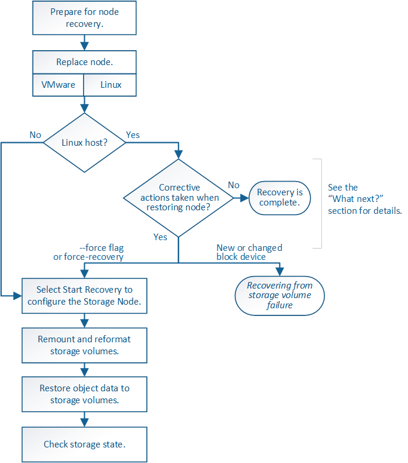

= Wiederherstellung nach einem Laufwerksausfall
:allow-uri-read: 
:icons: font
:imagesdir: ../media/

[role="lead"]
Wenn das Systemlaufwerk auf einem softwarebasierten Speicherknoten ausgefallen ist, steht der Speicherknoten dem StorageGRID-System nicht zur Verfügung. Sie müssen einen bestimmten Satz von Aufgaben zur Wiederherstellung nach einem Systemausfall ausführen.

Gehen Sie folgendermaßen vor, um nach einem Systemlaufwerksausfall auf einem softwarebasierten Speicherknoten wiederherzustellen. Dieses Verfahren umfasst die folgenden Schritte, wenn auch Storage-Volumes ausgefallen sind oder nicht neu eingebunden werden können.

NOTE: Dieses Verfahren gilt nur für softwarebasierte Speicherknoten. Sie müssen ein anderes Verfahren befolgen, um einen Appliance-Speicherknoten wiederherzustellen.

xref:recovering-storagegrid-appliance-storage-node.adoc[Appliance Storage Node wiederherstellen]

