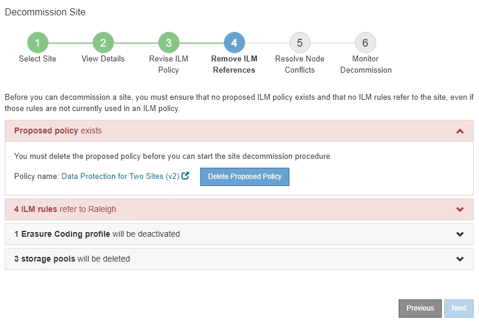
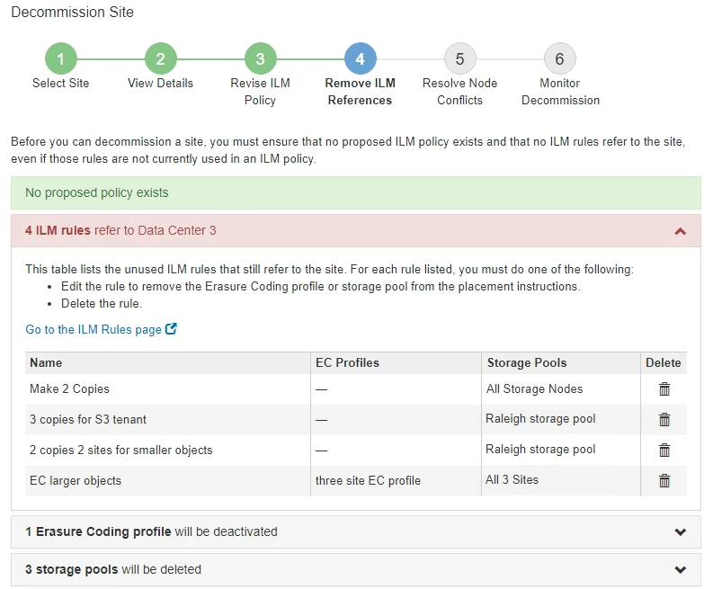

= Schritt 4: Entfernen Sie ILM-Referenzen
:allow-uri-read: 
:icons: font
:imagesdir: ../media/

[role="lead"]
Ab Schritt 4 (Entfernen von ILM-Referenzen) des Decommission Site Wizard können Sie die vorgeschlagene Richtlinie entfernen, wenn diese vorhanden ist, und alle nicht verwendeten ILM-Regeln löschen oder bearbeiten, die sich noch auf die Site beziehen.

In den folgenden Fällen können Sie den Ablauf zur Deaktivierung der Website nicht starten:

* Es gibt eine vorgeschlagene ILM-Richtlinie. Wenn Sie über eine vorgeschlagene Richtlinie verfügen, müssen Sie diese löschen.
* Jede ILM-Regel bezieht sich auf den Standort, selbst wenn diese Regel in keiner ILM-Richtlinie verwendet wird. Sie müssen alle Regeln, die sich auf die Website beziehen, löschen oder bearbeiten.

.Schritte
. Wenn eine vorgeschlagene Richtlinie aufgeführt ist, entfernen Sie sie.
+

+
.. Wählen Sie *Vorgeschlagene Richtlinie Löschen*.
.. Wählen Sie im Bestätigungsdialogfeld * OK* aus.

. Stellen Sie fest, ob sich ungenutzte ILM-Regeln auf den Standort beziehen.
+

+
ILM-Regeln, die aufgeführt sind, beziehen sich immer noch auf die Site, werden aber in keinen Richtlinien verwendet. Im Beispiel:

+
** Die Stock *make 2 Kopien* Regel verwendet den Systemstandard *Alle Speicherknoten* Speicherpool, der die Seite Alle Sites verwendet.
** Die ungenutzte *3 Kopien für S3-Mandanten*-Regel bezieht sich auf den *Raleigh*-Speicherpool.
** Die ungenutzte *2 Copy 2-Seiten für kleinere Objekte*-Regel bezieht sich auf den *Raleigh*-Speicherpool.
** Die ungenutzten *EC-Regeln für größere Objekte* verwenden die Raleigh-Site im Profil *Alle 3 Sites* Erasure Coding.
** Wenn keine ILM-Regeln aufgeführt sind, wählen Sie *Weiter* aus, um zu *Schritt 5 (Node-Konflikte auflösen)* zu wechseln.
+
xref:step-5-resolve-node-conflicts.adoc[Schritt 5: Auflösen von Knotenkonflikten (und Start der Stilllegung)]

+

NOTE: Wenn StorageGRID den Standort dekomprimiert, werden automatisch alle nicht verwendeten Erasure Coding-Profile deaktiviert, die auf den Standort verweisen. Außerdem werden alle nicht verwendeten Speicherpools, die sich auf den Standort beziehen, automatisch gelöscht. Der standardmäßige Speicherpool Alle Speicherknoten wird entfernt, da er den Standort Alle Standorte verwendet.

** Wenn eine oder mehrere ILM-Regeln aufgeführt sind, fahren Sie mit dem nächsten Schritt fort.

. Bearbeiten oder Löschen jeder nicht verwendeten Regel:
+
** Um eine Regel zu bearbeiten, gehen Sie auf der Seite ILM-Regeln und aktualisieren Sie alle Platzierungen, die ein Erasure Coding-Profil oder einen Speicherpool verwenden, der sich auf den Standort bezieht. Kehren Sie dann zu *Schritt 4 (ILM-Referenzen entfernen)* zurück.
+

NOTE: Weitere Informationen finden Sie in den Anweisungen zum Verwalten von Objekten mit Information Lifecycle Management.

** Um eine Regel zu löschen, wählen Sie das Papierkorb-Symbol aus image:../media/icon_trash_can.png["Symbol Papierkorb Kann"] Und wählen Sie *OK*.
+

IMPORTANT: Sie müssen die Regel für Lagerbestand *Erstellen von 2 Kopien* löschen, bevor Sie eine Website stilllegen können.

. Vergewissern Sie sich, dass keine vorgeschlagene ILM-Richtlinie vorhanden ist, keine ungenutzten ILM-Regeln auf die Site verweisen und die Schaltfläche *Weiter* ist aktiviert.
+
image::../media/decommission_site_step_4_no_policy_or_rules.png[Decommission Site Schritt 4 Keine Richtlinien oder Regeln]

. Wählen Sie *Weiter*.
+

NOTE: Alle verbleibenden Speicherpools und Erasure Coding-Profile, die sich auf den Standort beziehen, werden ungültig, wenn der Standort entfernt wird. Wenn StorageGRID den Standort dekomprimiert, werden automatisch alle nicht verwendeten Erasure Coding-Profile deaktiviert, die auf den Standort verweisen. Außerdem werden alle nicht verwendeten Speicherpools, die sich auf den Standort beziehen, automatisch gelöscht. Der standardmäßige Speicherpool Alle Speicherknoten wird entfernt, da er den Standort Alle Standorte verwendet.

+
Schritt 5 (Auflösen von Knotenkonflikten) wird angezeigt.

