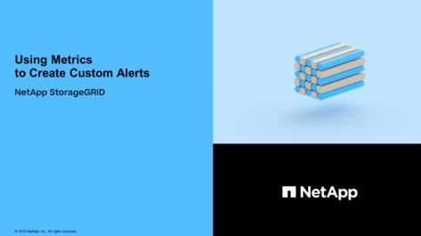

= Benachrichtigungen verwalten: Übersicht
:allow-uri-read: 
:icons: font
:imagesdir: ../media/

[role="lead"]
Mithilfe von Meldungen können Sie verschiedene Ereignisse und Bedingungen innerhalb des StorageGRID Systems überwachen. Sie können Benachrichtigungen verwalten, indem Sie benutzerdefinierte Warnmeldungen erstellen, Standardwarnungen bearbeiten oder deaktivieren, E-Mail-Benachrichtigungen für Warnungen einrichten und Benachrichtigungen deaktivieren.

== Allgemeines zu StorageGRID-Meldungen

Das Warnsystem bietet eine benutzerfreundliche Oberfläche zum Erkennen, Bewerten und Beheben von Problemen, die während des StorageGRID-Betriebs auftreten können.

* Das Warnsystem konzentriert sich auf umsetzbare Probleme im System. Bei Ereignissen, die eine sofortige Aktion erfordern, werden Warnmeldungen ausgelöst und nicht bei Ereignissen, die sicher ignoriert werden können.
* Die Seite „Aktuelle Meldungen“ bietet eine benutzerfreundliche Oberfläche zum Anzeigen aktueller Probleme. Sie können die Liste nach einzelnen Warnungen und Alarmgruppen sortieren. Beispielsweise können Sie alle Meldungen nach Node/Standort sortieren, um zu sehen, welche Meldungen sich auf einen bestimmten Node auswirken. Oder Sie möchten die Meldungen in einer Gruppe nach der Zeit sortieren, die ausgelöst wird, um die letzte Instanz einer bestimmten Warnmeldung zu finden.
* Die Seite „gelöste Warnmeldungen“ enthält ähnliche Informationen wie auf der Seite „Aktuelle Meldungen“. Sie können jedoch einen Verlauf der behobenen Warnmeldungen suchen und anzeigen, einschließlich des Auslöseverlaufs und der Behebung des Alarms.
* Mehrere Warnmeldungen desselben Typs werden in einer E-Mail gruppiert, um die Anzahl der Benachrichtigungen zu reduzieren. Darüber hinaus werden auf der Seite „Meldungen“ mehrere Warnmeldungen desselben Typs als Gruppe angezeigt. Sie können Warnungsgruppen erweitern oder ausblenden, um die einzelnen Warnmeldungen ein- oder auszublenden. Wenn z. B. mehrere Knoten die Meldung *nicht in der Lage, mit Knoten* zu kommunizieren ungefähr zur gleichen Zeit melden, wird nur eine E-Mail gesendet und die Warnung wird als Gruppe auf der Seite Warnungen angezeigt.
* Warnmeldungen verwenden intuitive Namen und Beschreibungen, um das Problem schnell zu verstehen. Meldungsbenachrichtigungen umfassen Details zum betroffenen Node und Standort, den Schweregrad der Warnmeldung, den Zeitpunkt, zu dem die Meldungsregel ausgelöst wurde, und den aktuellen Wert der Metriken in Bezug auf die Meldung.
* Warnmeldungen per E-Mail und die auf den Seiten „Aktuelle Warnmeldungen und gelöste Warnmeldungen“ angezeigten Warnmeldungen enthalten empfohlene Aktionen zur Behebung von Warnmeldungen. Dazu gehören häufig direkte Links zum StorageGRID Dokumentationszentrum, damit detailliertere Fehlerbehebungsmaßnahmen leichter gefunden und zugänglich sind.
* Wenn Sie die Benachrichtigungen für eine Warnung vorübergehend auf einem oder mehreren Schweregraden unterdrücken müssen, können Sie ganz einfach eine bestimmte Alarmregel für eine bestimmte Dauer und für das gesamte Grid, eine einzelne Site oder einen einzelnen Node stummschalten. Sie können auch während einer geplanten Wartung, z. B. einer Software-Aktualisierung, alle Alarmregeln stummschalten.
* Sie können die standardmäßigen Alarmregeln nach Bedarf bearbeiten. Sie können eine Meldungsregel vollständig deaktivieren oder deren Triggerbedingungen und -Dauer ändern.
* Sie können benutzerdefinierte Alarmregeln erstellen, um auf die für Ihre Situation relevanten spezifischen Bedingungen abzielen und eigene Empfehlungen auszuarbeiten. Um die Bedingungen für eine benutzerdefinierte Warnung zu definieren, erstellen Sie Ausdrücke mithilfe der Prometheus-Metriken, die im Abschnitt Kennzahlen der Grid Management API verfügbar sind.

== Weitere Informationen .

Sehen Sie sich die folgenden Videos an, um mehr zu erfahren:

* https://["Video: Übersicht über Warnungen"^]
+
[link=https://netapp.hosted.panopto.com/Panopto/Pages/Viewer.aspx?id=2680a74f-070c-41c2-bcd3-acc5013c9cdd]
image::../media/video-screenshot-alert-overview.png[Video: Übersicht über Warnungen]

* https://["Video: Verwenden von Metriken, um benutzerdefinierte Warnmeldungen zu erstellen"^]
+
 alt=„Video: Verwenden von Metriken zum Erstellen benutzerdefinierter Warnmeldungen“]

