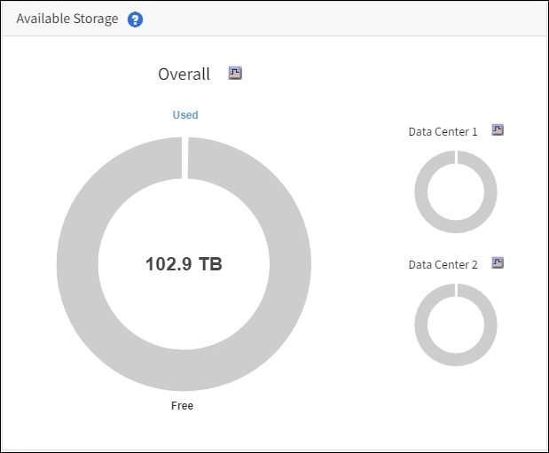

= Monitoring der Storage-Kapazität
:allow-uri-read: 
:icons: font
:imagesdir: ../media/

[role="lead"]
Überwachen Sie den insgesamt verfügbaren nutzbaren Speicherplatz, um sicherzustellen, dass dem StorageGRID System der Speicherplatz für Objekte oder Objekt-Metadaten nicht knapp wird.

StorageGRID speichert Objektdaten und Objektmetadaten separat und behält eine bestimmte Menge an Speicherplatz für eine verteilte Cassandra-Datenbank mit Objekt-Metadaten bei. Überwachen Sie den Gesamtspeicherplatz für Objekte und Objekt-Metadaten sowie Trends für den Speicherplatz, der für jeden verbraucht wird. So können Sie das Hinzufügen von Nodes vorausschauender planen und Serviceausfälle vermeiden.

Das können Sie xref:viewing-storage-tab.adoc[Informationen zur Storage-Kapazität anzeigen] Für das gesamte Grid, für jeden Standort und für jeden Storage-Node im StorageGRID-System.

== Überwachung der Speicherkapazität für das gesamte Grid

Die Storage-Gesamtkapazität für das Grid muss überwacht werden, um zu gewährleisten, dass ausreichend freier Speicherplatz für Objekt- und Objekt-Metadaten verbleibt. Wenn Sie verstehen, wie sich die Storage-Kapazität im Laufe der Zeit verändert, können Sie Storage-Nodes oder Storage-Volumes planen, bevor die nutzbare Storage-Kapazität des Grid verbraucht wird.

Sie sind mit einem bei Grid Manager angemeldet xref:../admin/web-browser-requirements.adoc[Unterstützter Webbrowser].

Über das Dashboard im Grid Manager können Sie schnell ermitteln, wie viel Storage für das gesamte Grid und für jedes Datacenter zur Verfügung steht. Die Seite Knoten enthält detailliertere Werte für Objektdaten und Objektmetadaten.

.Schritte
. Beurteilen Sie, wie viel Storage für das gesamte Grid und das jeweilige Datacenter verfügbar ist.
+
.. Wählen Sie *Dashboard*.
.. Notieren Sie sich im Fenster Verfügbare Speicherkapazität die Zusammenfassung der freien und genutzten Speicherkapazität.
+

NOTE: Die Zusammenfassung enthält keine Archivierungsmedien.

+

.. Platzieren Sie den Cursor über die freien bzw. genutzten Kapazitätsbereiche des Diagramms, um genau zu sehen, wie viel Speicherplatz frei oder verwendet wird.
+
image::../media/storage_capacity_used.gif[Diagramm „Freie oder genutzte Kapazität“ auf dem Dashboard]

.. Sehen Sie sich das Diagramm für die einzelnen Datacenter an, um Grids für mehrere Standorte zu verwenden.
.. Klicken Sie auf das Diagrammsymbol image:../media/icon_chart_new_for_11_5.png["Diagrammsymbol"] Für das Gesamtdiagramm oder für ein einzelnes Datacenter, um ein Diagramm anzuzeigen, in dem die Kapazitätsauslastung im Laufe der Zeit dargestellt wird.
+
Eine Grafik zeigt den prozentualen Anteil an der genutzten Storage-Kapazität (%) gegenüber Die Uhrzeit wird angezeigt.

. Ermitteln Sie, wie viel Storage genutzt wurde und wie viel Storage für Objekt- und Objekt-Metadaten verfügbar ist.
+
.. Wählen Sie *KNOTEN*.
.. Wählen Sie *_Grid_* *Storage* aus.
+
image::../media/nodes_deployment_storage_tab.png[Registerkarte Nodes Deployment Storage]

.. Bewegen Sie den Cursor über die Diagramme *verwendeter Speicher - Objektdaten* und *verwendeter Speicher - Objektmetadaten*, um zu sehen, wie viel Objekt-Storage und Objekt-Metadaten für das gesamte Grid zur Verfügung stehen und wie viel über die Zeit genutzt wurde.
+

NOTE: Die Gesamtwerte für einen Standort oder das Grid enthalten keine Nodes, die mindestens fünf Minuten lang keine Kennzahlen enthalten, z. B. Offline-Nodes.

. Planung, eine Erweiterung zum Hinzufügen von Storage-Nodes oder Storage-Volumes durchzuführen, bevor die nutzbare Storage-Kapazität des Grid genutzt wird
+
Berücksichtigen Sie bei der Planung des Zeitplans für eine Erweiterung, wie lange die Beschaffung und Installation von zusätzlichem Storage dauern wird.

+

NOTE: Wenn Ihre ILM-Richtlinie Erasure Coding verwendet, wird es möglicherweise besser erweitert, wenn vorhandene Storage-Nodes ungefähr 70 % ausgelastet sind, um die Anzahl der hinzugefügten Nodes zu verringern.

+
Weitere Informationen zur Planung einer Speichererweiterung finden Sie im xref:../expand/index.adoc[Anweisungen zur Erweiterung von StorageGRID].

== Überwachen Sie die Storage-Kapazität für jeden Storage-Node

Überwachen Sie den insgesamt nutzbaren Speicherplatz für jeden Storage-Node, um sicherzustellen, dass der Node über ausreichend Speicherplatz für neue Objektdaten verfügt.

.Was Sie und#8217;ll benötigen
* Sie sind mit einem bei Grid Manager angemeldet xref:../admin/web-browser-requirements.adoc[Unterstützter Webbrowser].

Der nutzbare Speicherplatz ist der Speicherplatz, der zum Speichern von Objekten zur Verfügung steht. Der insgesamt nutzbare Speicherplatz für einen Storage-Node wird berechnet, indem der verfügbare Speicherplatz in allen Objektspeichern innerhalb des Node hinzugefügt wird.

image::../media/calculating_watermarks.gif[Konzeptzeichnung für den insgesamt nutzbaren Speicherplatz]

.Schritte
. Wählen Sie *NODES* *_Storage Node_* *Storage* aus.
+
Die Diagramme und Tabellen für den Node werden angezeigt.

. Halten Sie den Mauszeiger über das Diagramm „verwendete Objekte – Objektdaten“.
+
Die folgenden Werte werden angezeigt:

+
** *Used (%)*: Der Prozentsatz des gesamten nutzbaren Speicherplatzes, der für Objektdaten verwendet wurde.
** *Verwendet*: Die Menge des gesamten nutzbaren Speicherplatzes, der für Objektdaten verwendet wurde.
** *Replizierte Daten*: Eine Schätzung der Menge der replizierten Objektdaten auf diesem Knoten, Standort oder Grid.
** *Erasure-codierte Daten*: Eine Schätzung der Menge der mit der Löschung codierten Objektdaten auf diesem Knoten, Standort oder Grid.
** *Gesamt*: Die Gesamtmenge an nutzbarem Speicherplatz auf diesem Knoten, Standort oder Grid. Der verwendete Wert ist der `storagegrid_storage_utilization_data_bytes` Metrisch.

+
image::../media/nodes_page_storage_used_object_data.png[Knoten Seite Speicher Verwendete Objektdaten]

. Überprüfen Sie die verfügbaren Werte in den Tabellen Volumes und Objektspeichern unter den Diagrammen.
+

NOTE: Klicken Sie auf die Diagrammsymbole, um Diagramme dieser Werte anzuzeigen image:../media/icon_chart_new_for_11_5.png["Diagrammsymbol"] In den Spalten verfügbar.

+
image::../media/nodes_page_storage_tables.png[Im Objekt werden Tabellen gespeichert]

. Überwachen Sie die Werte im Zeitbereich, um die Rate abzuschätzen, mit der der nutzbare Speicherplatz belegt wird.
. Um normale Systemvorgänge aufrechtzuerhalten, fügen Sie Storage-Nodes hinzu, fügen Storage Volumes oder Archivdaten hinzu, bevor der nutzbare Speicherplatz verbraucht wird.
+
Berücksichtigen Sie bei der Planung des Zeitplans für eine Erweiterung, wie lange die Beschaffung und Installation von zusätzlichem Storage dauern wird.

+

NOTE: Wenn Ihre ILM-Richtlinie Erasure Coding verwendet, wird es möglicherweise besser erweitert, wenn vorhandene Storage-Nodes ungefähr 70 % ausgelastet sind, um die Anzahl der hinzugefügten Nodes zu verringern.

+
Weitere Informationen zur Planung einer Speichererweiterung finden Sie im xref:../expand/index.adoc[Anweisungen zur Erweiterung von StorageGRID].

+
Der xref:troubleshooting-storagegrid-system.adoc[*Niederer Objektspeicher*] Die Meldung wird ausgelöst, wenn nicht genügend Speicherplatz zum Speichern von Objektdaten auf einem Storage-Node verbleibt.

== Überwachen der Objekt-Metadaten-Kapazität für jeden Storage Node

Überwachen Sie die Metadatennutzung für jeden Storage-Node, um sicherzustellen, dass ausreichend Speicherplatz für wichtige Datenbankvorgänge verfügbar ist. Sie müssen an jedem Standort neue Storage-Nodes hinzufügen, bevor die Objektmetadaten 100 % des zulässigen Metadaten-Speicherplatzes übersteigen.

.Was Sie und#8217;ll benötigen
* Sie sind mit einem bei Grid Manager angemeldet xref:../admin/web-browser-requirements.adoc[Unterstützter Webbrowser].

StorageGRID behält drei Kopien von Objektmetadaten an jedem Standort vor, um Redundanz zu gewährleisten und Objekt-Metadaten vor Verlust zu schützen. Die drei Kopien werden gleichmäßig über alle Storage-Nodes an jedem Standort verteilt. Dabei wird der für Metadaten reservierte Speicherplatz auf dem Storage Volume 0 jedes Storage-Nodes verwendet.

In einigen Fällen wird die Kapazität der Objektmetadaten des Grid möglicherweise schneller belegt als die Kapazität des Objekt-Storage. Wenn Sie zum Beispiel normalerweise eine große Anzahl von kleinen Objekten aufnehmen, müssen Sie möglicherweise Storage-Nodes hinzufügen, um die Metadaten-Kapazität zu erhöhen, obwohl weiterhin ausreichend Objekt-Storage-Kapazität vorhanden ist.

Zu den Faktoren, die die Metadatennutzung steigern können, gehören die Größe und Menge der Metadaten und -Tags der Benutzer, die Gesamtzahl der Teile in einem mehrteiligen Upload und die Häufigkeit von Änderungen an den ILM-Speicherorten.

.Schritte
. Wählen Sie *NODES* *_Storage Node_* *Storage* aus.
. Halten Sie den Mauszeiger über das Diagramm „verwendete Werte – Objektmetadaten“, um die Werte für eine bestimmte Zeit anzuzeigen.
+
image::../media/storage_used_object_metadata.png[Verwendeter Storage: Objekt-Metadaten]

+
[cols="1a,3a,2a"]
|===
| Wert | Beschreibung | Prometheus metrisch 

 a| 
Nutzung (%)
 a| 
Der Prozentsatz des zulässigen Metadaten-Speicherplatzes, der auf diesem Storage-Node verwendet wurde.
 a| 
`storagegrid_storage_utilization_metadata_bytes/ storagegrid_storage_utilization_metadata_allowed_bytes`

 a| 
Verwendet
 a| 
Die Bytes des zulässigen Metadaten-Speicherplatzes, der auf diesem Speicherknoten verwendet wurde.
 a| 
`storagegrid_storage_utilization_metadata_bytes`

 a| 
Zulässig
 a| 
Der zulässige Speicherplatz für Objektmetadaten auf diesem Storage-Node. Informationen darüber, wie dieser Wert für jeden Storage-Node bestimmt wird, finden Sie im xref:../admin/index.adoc[Anweisungen für die Administration von StorageGRID].
 a| 
`storagegrid_storage_utilization_metadata_allowed_bytes`

 a| 
Ist reserviert
 a| 
Der tatsächliche Speicherplatz, der für Metadaten auf diesem Speicherknoten reserviert ist. Beinhaltet den zulässigen Speicherplatz und den erforderlichen Speicherplatz für wichtige Metadaten-Vorgänge. Informationen dazu, wie dieser Wert für jeden Storage-Node berechnet wird, finden Sie im xref:../admin/index.adoc[Anweisungen für die Administration von StorageGRID].
 a| 
_Metric wird in einer zukünftigen Version hinzugefügt._

|===
+

NOTE: Die Gesamtwerte für einen Standort oder das Grid enthalten keine Nodes, die Kennzahlen für mindestens fünf Minuten nicht gemeldet haben, z. B. Offline-Nodes.

. Wenn der * verwendete (%)*-Wert 70% oder höher ist, erweitern Sie Ihr StorageGRID-System, indem Sie jedem Standort Storage-Knoten hinzufügen.
+

IMPORTANT: Der Alarm * Low Metadaten Storage* wird ausgelöst, wenn der Wert *used (%)* bestimmte Schwellenwerte erreicht. Unerwünschte Ergebnisse können auftreten, wenn Objekt-Metadaten mehr als 100 % des zulässigen Speicherplatzes beanspruchen.

+
Wenn Sie die neuen Nodes hinzufügen, gleicht das System die Objektmetadaten automatisch auf alle Storage-Nodes am Standort aus. Siehe xref:../expand/index.adoc[Anweisungen zum erweitern eines StorageGRID-Systems].

