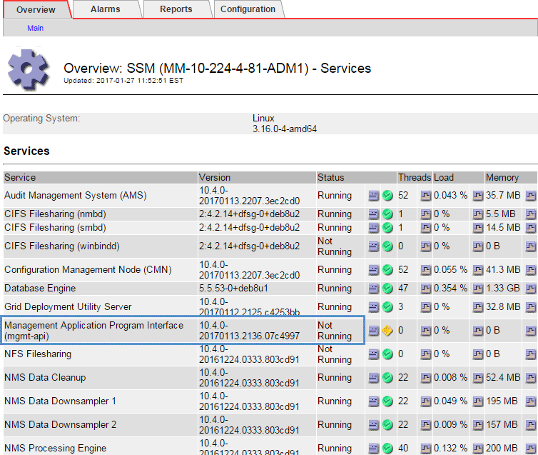

= Fehlerbehebung bei Problemen mit Admin-Node und Benutzeroberfläche
:allow-uri-read: 
:experimental: 
:icons: font
:imagesdir: ../media/

[role="lead"]
Es gibt verschiedene Aufgaben, die Sie durchführen können, um die Ursache von Problemen im Zusammenhang mit Admin-Knoten und der StorageGRID-Benutzeroberfläche zu ermitteln.

== Fehler bei der Anmeldung beheben

Wenn beim Anmelden bei einem StorageGRID-Admin-Node ein Fehler auftritt, weist Ihr System möglicherweise ein Problem mit der Konfiguration des Identitätsverbunds auf, ein Netzwerk- oder Hardwareproblem, ein Problem mit den Admin-Node-Services oder ein Problem mit der Cassandra-Datenbank auf verbundenen Speicherknoten.

.Was Sie benötigen
* Sie müssen die haben `Passwords.txt` Datei:
* Sie müssen über spezifische Zugriffsberechtigungen verfügen.

.Über diese Aufgabe
Verwenden Sie diese Hinweise zur Fehlerbehebung, wenn eine der folgenden Fehlermeldungen angezeigt wird, wenn Sie versuchen, sich bei einem Admin-Knoten anzumelden:

* `Your credentials for this account were invalid. Please try again.`
* `Waiting for services to start...`
* `Internal server error. The server encountered an error and could not complete your request. Please try again. If the problem persists, contact Technical Support.`
* `Unable to communicate with server. Reloading page...`

.Schritte
. Warten Sie 10 Minuten, und melden Sie sich erneut an.
+
Wenn der Fehler nicht automatisch behoben wird, fahren Sie mit dem nächsten Schritt fort.

. Wenn Ihr StorageGRID-System mehr als einen Admin-Knoten hat, melden Sie sich von einem anderen Admin-Knoten beim Grid-Manager an.
+
** Wenn Sie sich anmelden können, können Sie die Optionen *Dashboard*, *NODES*, *Alerts* und *SUPPORT* verwenden, um die Ursache des Fehlers zu ermitteln.
** Wenn Sie nur einen Admin-Node haben oder sich dennoch nicht anmelden können, fahren Sie mit dem nächsten Schritt fort.

. Ermitteln, ob die Hardware des Node offline ist
. Wenn SSO (Single Sign On) für Ihr StorageGRID-System aktiviert ist, lesen Sie in den Anweisungen zur Administration von StorageGRID die Schritte zur Konfiguration der Single Sign-On.
+
Unter Umständen müssen Sie SSO für einen einzelnen Admin-Node vorübergehend deaktivieren und erneut aktivieren, um Probleme zu beheben.

+

NOTE: Wenn SSO aktiviert ist, können Sie sich nicht mit einem eingeschränkten Port anmelden. Sie müssen Port 443 verwenden.

. Ermitteln Sie, ob das verwendete Konto einem föderierten Benutzer angehört.
+
Wenn das verbundene Benutzerkonto nicht funktioniert, melden Sie sich beim Grid Manager als lokaler Benutzer, z. B. als Root, an.

+
** Wenn sich der lokale Benutzer anmelden kann:
+
... Überprüfen Sie alle angezeigten Alarme.
... Wählen Sie *KONFIGURATION* *Zugangskontrolle* *Identitätsverbund*.
... Klicken Sie auf *Verbindung testen*, um die Verbindungseinstellungen für den LDAP-Server zu validieren.
... Wenn der Test fehlschlägt, beheben Sie alle Konfigurationsfehler.

** Wenn sich der lokale Benutzer nicht anmelden kann und Sie sich sicher sind, dass die Anmeldeinformationen korrekt sind, fahren Sie mit dem nächsten Schritt fort.

. Verwenden Sie Secure Shell (SSH), um sich beim Admin-Knoten anzumelden:
+
.. Geben Sie den folgenden Befehl ein: `ssh admin@Admin_Node_IP`
.. Geben Sie das im aufgeführte Passwort ein `Passwords.txt` Datei:
.. Geben Sie den folgenden Befehl ein, um zum Root zu wechseln: `su -`
.. Geben Sie das im aufgeführte Passwort ein `Passwords.txt` Datei:
+
Wenn Sie als root angemeldet sind, ändert sich die Eingabeaufforderung von `$` Bis `#`.

. Status aller auf dem Grid-Node ausgeführten Services anzeigen: `storagegrid-status`
+
Stellen Sie sicher, dass die nms-, mi-, nginx- und Management-API-Services ausgeführt werden.

+
Die Ausgabe wird sofort aktualisiert, wenn sich der Status eines Dienstes ändert.

+
....
$ storagegrid-status
Host Name                      99-211
IP Address                     10.96.99.211
Operating System Kernel        4.19.0         Verified
Operating System Environment   Debian 10.1    Verified
StorageGRID Webscale Release   11.4.0         Verified
Networking                                    Verified
Storage Subsystem                             Verified
Database Engine                5.5.9999+default Running
Network Monitoring             11.4.0         Running
Time Synchronization           1:4.2.8p10+dfsg Running
ams                            11.4.0         Running
cmn                            11.4.0         Running
nms                            11.4.0         Running
ssm                            11.4.0         Running
mi                             11.4.0         Running
dynip                          11.4.0         Running
nginx                          1.10.3         Running
tomcat                         9.0.27         Running
grafana                        6.4.3          Running
mgmt api                       11.4.0         Running
prometheus                     11.4.0         Running
persistence                    11.4.0         Running
ade exporter                   11.4.0         Running
alertmanager                   11.4.0         Running
attrDownPurge                  11.4.0         Running
attrDownSamp1                  11.4.0         Running
attrDownSamp2                  11.4.0         Running
node exporter                  0.17.0+ds      Running
sg snmp agent                  11.4.0         Running
....
. Vergewissern Sie sich, dass der nginx-gw-Dienst ausgeführt wird `# service nginx-gw status`
. [[use_Lumberjack_to_Collect_logs, Start=9]]Lumberjack zum Sammeln von Protokollen verwenden: `# /usr/local/sbin/lumberjack.rb`
+
Wenn die fehlgeschlagene Authentifizierung in der Vergangenheit stattgefunden hat, können Sie die Skriptoptionen --Start und --end Lumberjack verwenden, um den entsprechenden Zeitbereich festzulegen. Verwenden Sie die lumberjack -h für Details zu diesen Optionen.

+
Die Ausgabe an das Terminal gibt an, wo das Protokollarchiv kopiert wurde.

. [[review_logs, Start=10]]folgende Protokolle prüfen:
+
** `/var/local/log/bycast.log`
** `/var/local/log/bycast-err.log`
** `/var/local/log/nms.log`
** `**/*commands.txt`

. Wenn Sie keine Probleme mit dem Admin-Knoten feststellen konnten, geben Sie einen der folgenden Befehle ein, um die IP-Adressen der drei Speicherknoten zu ermitteln, die den ADC-Dienst an Ihrem Standort ausführen. In der Regel handelt es sich dabei um die ersten drei Storage-Nodes, die am Standort installiert wurden.
+
[listing]
----
# cat /etc/hosts
----
+
[listing]
----
# vi /var/local/gpt-data/specs/grid.xml
----
+
Admin-Knoten verwenden den ADC-Dienst während des Authentifizierungsprozesses.

. Melden Sie sich über den Admin-Node bei jedem der ADC-Speicherknoten an. Verwenden Sie dazu die IP-Adressen, die Sie identifiziert haben.
+
.. Geben Sie den folgenden Befehl ein: `ssh admin@grid_node_IP`
.. Geben Sie das im aufgeführte Passwort ein `Passwords.txt` Datei:
.. Geben Sie den folgenden Befehl ein, um zum Root zu wechseln: `su -`
.. Geben Sie das im aufgeführte Passwort ein `Passwords.txt` Datei:
+
Wenn Sie als root angemeldet sind, ändert sich die Eingabeaufforderung von `$` Bis `#`.

. Status aller auf dem Grid-Node ausgeführten Services anzeigen: `storagegrid-status`
+
Stellen Sie sicher, dass die Services idnt, acct, nginx und cassandra ausgeführt werden.

. Wiederholen Sie die Schritte <<use_Lumberjack_to_collect_logs,Verwenden Sie Lumberjack, um Protokolle zu sammeln>> Und <<review_logs,Protokolle prüfen>> So prüfen Sie die Protokolle auf den Speicherknoten.
. Wenn das Problem nicht behoben werden kann, wenden Sie sich an den technischen Support.
+
Stellen Sie die Protokolle bereit, die Sie für den technischen Support gesammelt haben. Siehe auch xref:logs-files-reference.adoc[Referenz für Protokolldateien].

== Fehlerbehebung bei Problemen mit der Benutzeroberfläche

Nach dem Upgrade auf eine neue Version der StorageGRID-Software sind möglicherweise Probleme mit dem Grid Manager oder dem Tenant Manager zu sehen.

=== Web-Oberfläche reagiert nicht wie erwartet

Der Grid-Manager oder der Mandantenmanager reagieren nach einem Upgrade der StorageGRID-Software möglicherweise nicht wie erwartet.

Wenn Probleme mit der Weboberfläche auftreten:

* Stellen Sie sicher, dass Sie ein verwenden xref:../admin/web-browser-requirements.adoc[Unterstützter Webbrowser].
+

NOTE: Die Browser-Unterstützung wurde für StorageGRID 11.5 geändert. Vergewissern Sie sich, dass Sie eine unterstützte Version verwenden.

* Löschen Sie den Cache Ihres Webbrowsers.
+
Beim Löschen des Caches werden veraltete Ressourcen entfernt, die von der vorherigen Version der StorageGRID-Software verwendet werden, und die Benutzeroberfläche kann wieder ordnungsgemäß ausgeführt werden. Anweisungen hierzu finden Sie in der Dokumentation Ihres Webbrowsers.

== Überprüfen Sie den Status eines nicht verfügbaren Admin-Knotens

Wenn das StorageGRID-System mehrere Administratorknoten enthält, können Sie den Status eines nicht verfügbaren Admin-Knotens mit einem anderen Admin-Knoten überprüfen.

.Was Sie benötigen
Sie müssen über spezifische Zugriffsberechtigungen verfügen.

.Schritte
. Melden Sie sich bei einem verfügbaren Admin-Node mit einem bei Grid Manager an xref:../admin/web-browser-requirements.adoc[Unterstützter Webbrowser].
. Wählen Sie *SUPPORT* > *Tools* > *Grid-Topologie* aus.
. Wählen Sie *_Site* *nicht verfügbar Admin Node_* *SSM* *Services* *Übersicht* *Main*.
. Suchen Sie nach Diensten, die den Status nicht aktiv haben und die möglicherweise auch blau angezeigt werden.
+

. Bestimmen Sie, ob Alarme ausgelöst wurden.
. Ergreifen Sie die entsprechenden Maßnahmen, um das Problem zu lösen.

.Verwandte Informationen
xref:../admin/index.adoc[StorageGRID verwalten]
