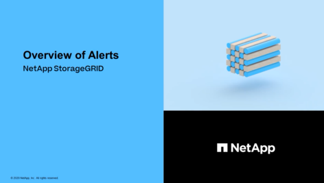
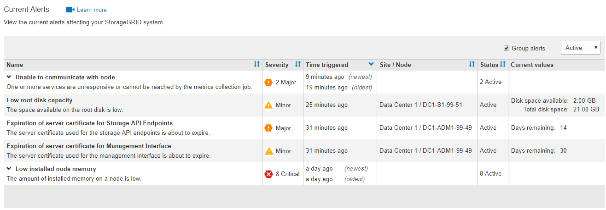
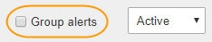

= Anzeigen aktueller Warnmeldungen
:allow-uri-read: 
:icons: font
:imagesdir: ../media/

[role="lead"]
Wenn eine Meldung ausgelöst wird, wird auf dem Dashboard ein Meldungssymbol angezeigt. Auf der Seite Knoten wird auch ein Warnungssymbol für den Knoten angezeigt. Es kann auch eine E-Mail-Benachrichtigung gesendet werden, es sei denn, die Warnung wurde stummgeschaltet.

.Was Sie und#8217;ll benötigen
* Sie müssen mit einem beim Grid Manager angemeldet sein xref:../admin/web-browser-requirements.adoc[Unterstützter Webbrowser].
* Optional haben Sie sich das Video angesehen: https://netapp.hosted.panopto.com/Panopto/Pages/Viewer.aspx?id=2680a74f-070c-41c2-bcd3-acc5013c9cdd["Video: Übersicht über Warnungen"^].
+
[link=https://netapp.hosted.panopto.com/Panopto/Pages/Viewer.aspx?id=2680a74f-070c-41c2-bcd3-acc5013c9cdd]

.Schritte
. Wenn eine oder mehrere Warnmeldungen aktiv sind, führen Sie einen der folgenden Schritte aus:
+
** Klicken Sie im Fenster Systemzustand des Dashboards auf das Warnsymbol oder klicken Sie auf *Aktuelle Meldungen*. (Ein Warnsymbol und der Link *Current Alerts* werden nur angezeigt, wenn mindestens eine Warnung aktuell aktiv ist.)
** Wählen Sie *ALERTS* *Current*.
+
Die Seite Aktuelle Meldungen wird angezeigt. Er listet alle Warnmeldungen auf, die derzeit Ihr StorageGRID System beeinträchtigen.

+

+
Standardmäßig werden Alarme wie folgt angezeigt:

** Die zuletzt ausgelösten Warnmeldungen werden zuerst angezeigt.
** Mehrere Warnmeldungen desselben Typs werden als Gruppe angezeigt.
** Meldungen, die stummgeschaltet wurden, werden nicht angezeigt.
** Wenn für eine bestimmte Warnmeldung auf einem bestimmten Node die Schwellenwerte für mehr als einen Schweregrad erreicht werden, wird nur die schwerste Warnmeldung angezeigt. Wenn also Alarmschwellenwerte für kleinere, größere und kritische Schweregrade erreicht werden, wird nur die kritische Warnung angezeigt.

+
Die Seite „Aktuelle Meldungen“ wird alle zwei Minuten aktualisiert.

. Überprüfen Sie die Informationen in der Tabelle.
+
[cols="1a,3a"]
|===
| Spaltenüberschrift | Beschreibung 

 a| 
Name
 a| 
Der Name der Warnmeldung und deren Beschreibung.

 a| 
Schweregrad
 a| 
Der Schweregrad der Meldung. Wenn mehrere Warnungen gruppiert sind, zeigt die Titelzeile an, wie viele Instanzen dieser Warnung bei jedem Schweregrad auftreten.

** * Kritisch* image:../media/icon_alert_red_critical.png["Symbol Warnung Rot Kritisch"]: Es besteht eine anormale Bedingung, die die normalen Vorgänge eines StorageGRID-Knotens oder -Dienstes gestoppt hat. Sie müssen das zugrunde liegende Problem sofort lösen. Wenn das Problem nicht behoben ist, kann es zu Serviceunterbrechungen und Datenverlusten kommen.
** *Major* : Es besteht eine anormale Bedingung, die entweder die aktuellen Operationen beeinflusst oder sich dem Schwellenwert für eine kritische Warnung nähert. Sie sollten größere Warnmeldungen untersuchen und alle zugrunde liegenden Probleme beheben, um sicherzustellen, dass die anormale Bedingung den normalen Betrieb eines StorageGRID Node oder Service nicht beendet.
** *Klein* image:../media/icon_alert_yellow_minor.png["Symbol Alarm Gelb Minor"]: Das System funktioniert normal, aber es besteht eine anormale Bedingung, die die Fähigkeit des Systems beeinträchtigen könnte, zu arbeiten, wenn es fortgesetzt wird. Sie sollten kleinere Warnmeldungen überwachen und beheben, die sich nicht selbst beheben lassen, um sicherzustellen, dass sie nicht zu einem schwerwiegenderen Problem führen.

 a| 
Auslösezeit
 a| 
Wie lange vor der Warnmeldung ausgelöst wurde. Wenn mehrere Warnungen gruppiert sind, zeigt die Titelzeile Zeiten für die letzte Instanz der Warnmeldung (_neueste_) und die älteste Instanz der Warnmeldung (_älteste_) an.

 a| 
Standort/Knoten
 a| 
Der Name des Standorts und des Nodes, an dem die Meldung ausgeführt wird. Wenn mehrere Warnmeldungen gruppiert sind, werden die Standort- und Node-Namen in der Titelzeile nicht angezeigt.

 a| 
Status
 a| 
Gibt an, ob die Warnung aktiv ist oder stummgeschaltet wurde. Wenn mehrere Warnungen gruppiert sind und *Alle Alarme* in der Dropdown-Liste ausgewählt ist, zeigt die Titelzeile an, wie viele Instanzen dieser Warnung aktiv sind und wie viele Instanzen zum Schweigen gebracht wurden.

 a| 
Aktuelle Werte
 a| 
Der aktuelle Wert der Metrik, der die Meldung ausgelöst hat. Für manche Warnmeldungen werden zusätzliche Werte angezeigt, die Ihnen helfen, die Warnmeldung zu verstehen und zu untersuchen. Die Werte für eine Meldung mit * Objekt-Datenspeicher* enthalten beispielsweise den Prozentsatz des verwendeten Festplattenspeichers, die Gesamtmenge des Speicherplatzes und die Menge des verwendeten Festplattenspeichers.

*Hinweis:* Wenn mehrere Warnungen gruppiert sind, werden die aktuellen Werte in der Titelzeile nicht angezeigt.

|===
. So erweitern und reduzieren Sie Alarmgruppen:
+
** Um die einzelnen Alarme in einer Gruppe anzuzeigen, klicken Sie auf das nach-unten-Symbol image:../media/icon_alert_caret_down.png["Nach unten fahrlässiges Symbol"] In der Überschrift, oder klicken Sie auf den Namen der Gruppe.
** Um die einzelnen Alarme in einer Gruppe auszublenden, klicken Sie auf das nach-oben-Symbol image:../media/icon_alert_caret_up.png["Nach-oben-Symbol"] In der Überschrift, oder klicken Sie auf den Namen der Gruppe.
+
image::../media/alerts_page_expanded_alert_group.png[Alarmseite Erweiterte Alarmgruppe]

. Um einzelne Warnungen anstelle von Meldegruppen anzuzeigen, deaktivieren Sie das Kontrollkästchen *Gruppenwarnungen* oben in der Tabelle.
+

. Zum Sortieren von Warnungen oder Warnungsgruppen klicken Sie auf die nach-oben/unten-Pfeile image:../media/icon_alert_sort_column.png["Sortieren Sie das Symbol für die Pfeile"] In jeder Spaltenüberschrift.
+
** Wenn *Group Alerts* ausgewählt ist, werden sowohl die Warnungsgruppen als auch die einzelnen Alarme innerhalb jeder Gruppe sortiert. Sie können beispielsweise die Warnungen in einer Gruppe nach *Zeit ausgelöst* sortieren, um die aktuellste Instanz eines bestimmten Alarms zu finden.
** Wenn *Group Alerts* nicht ausgewählt ist, wird die gesamte Liste der Warnungen sortiert. Beispielsweise können Sie alle Warnungen nach *Node/Site* sortieren, um alle Warnungen anzuzeigen, die einen bestimmten Knoten betreffen.

. Um die Warnungen nach Status zu filtern, verwenden Sie das Dropdown-Menü oben in der Tabelle.
+
image::../media/alerts_page_active_drop_down.png[Dropdown-Menü „Alarmstatus“]

+
** Wählen Sie * Alle Alarme*, um alle aktuellen Warnungen anzuzeigen (sowohl aktive als auch stummgeschaltet).
** Wählen Sie *aktiv* aus, um nur die aktuellen Alarme anzuzeigen, die aktiv sind.
** Wählen Sie *stummgeschaltet* aus, um nur die aktuellen Meldungen anzuzeigen, die zum Schweigen gebracht wurden. Siehe xref:silencing-alert-notifications.adoc[Benachrichtigung über Stille].

. Um Details zu einer bestimmten Warnmeldung anzuzeigen, wählen Sie die Warnmeldung aus der Tabelle aus.
+
Ein Dialogfeld für die Meldung wird angezeigt. Siehe xref:viewing-specific-alert.adoc[Zeigen Sie eine bestimmte Warnmeldung an].

