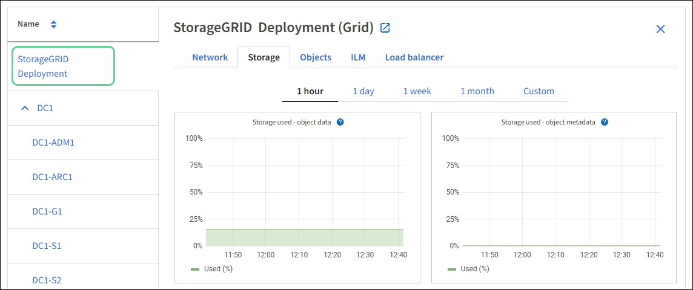

= Zeigen Sie die Seite Knoten an
:allow-uri-read: 
:icons: font
:imagesdir: ../media/

[role="lead"]
Wenn Sie detailliertere Informationen über Ihr StorageGRID-System als das Dashboard erhalten, können Sie auf der Seite Nodes Metriken für das gesamte Grid, jeden Standort im Raster und jeden Node an einem Standort anzeigen.

image::../media/nodes_table.png[Knoten-Menü]

Die Tabelle Knoten enthält alle Standorte und Knoten Ihres StorageGRID Systems. Für jeden Node werden zusammenfassende Informationen angezeigt. Wenn ein Node über eine aktive Warnmeldung verfügt, wird neben dem Node-Namen ein Symbol angezeigt. Wenn der Knoten verbunden ist und keine aktiven Warnmeldungen enthält, wird kein Symbol angezeigt.

== Symbole für Verbindungsstatus

* *Nicht verbunden - Unbekannt* image:../media/icon_alarm_blue_unknown.png["Blaues Fragezeichen-Symbol"]: Der Knoten ist aus einem unbekannten Grund nicht mit dem Raster verbunden. Beispielsweise wurde die Netzwerkverbindung zwischen den Knoten unterbrochen oder der Strom ist ausgefallen. Die Warnung * kann nicht mit Node* kommunizieren. Auch andere Warnmeldungen können aktiv sein. Diese Situation erfordert sofortige Aufmerksamkeit.
+

NOTE: Ein Node wird möglicherweise während des verwalteten Herunterfahrens als „Unbekannt“ angezeigt. In diesen Fällen können Sie den Status Unbekannt ignorieren.

* *Nicht verbunden - Administrativ unten* image:../media/icon_alarm_gray_administratively_down.png["Graues Fragensymbol"]: Der Knoten ist aus einem erwarteten Grund nicht mit dem Netz verbunden. Beispielsweise wurde der Node oder die Services für den Node ordnungsgemäß heruntergefahren, der Node neu gebootet oder die Software wird aktualisiert. Mindestens ein Alarm ist möglicherweise auch aktiv.

Wenn ein Knoten vom Raster getrennt wird, wird möglicherweise eine zugrunde liegende Warnmeldung angezeigt, aber nur das Symbol „`not connected`“ wird angezeigt. Um die aktiven Warnmeldungen für einen Node anzuzeigen, wählen Sie den Node aus.

== Warnungssymbole

Wenn eine aktive Warnmeldung für einen Node vorhanden ist, wird neben dem Node-Namen eines der folgenden Symbole angezeigt:

* * Kritisch* image:../media/icon_alert_red_critical.png["Symbol Warnung Rot Kritisch"]: Es besteht eine anormale Bedingung, die die normalen Vorgänge eines StorageGRID-Knotens oder -Dienstes gestoppt hat. Sie müssen das zugrunde liegende Problem sofort lösen. Wenn das Problem nicht behoben ist, kann es zu Serviceunterbrechungen und Datenverlusten kommen.
* *Major* image:../media/icon_alert_orange_major.png["Icon Alert Orange Major"]: Es besteht eine anormale Bedingung, die entweder die aktuellen Operationen beeinflusst oder sich dem Schwellenwert für eine kritische Warnung nähert. Sie sollten größere Warnmeldungen untersuchen und alle zugrunde liegenden Probleme beheben, um sicherzustellen, dass die anormale Bedingung den normalen Betrieb eines StorageGRID Node oder Service nicht beendet.
* *Klein* image:../media/icon_alert_yellow_minor.png["Symbol Alarm Gelb Minor"]: Das System funktioniert normal, aber es besteht eine anormale Bedingung, die die Fähigkeit des Systems beeinträchtigen könnte, zu arbeiten, wenn es fortgesetzt wird. Sie sollten kleinere Warnmeldungen überwachen und beheben, die sich nicht selbst beheben lassen, um sicherzustellen, dass sie nicht zu einem schwerwiegenderen Problem führen.

== Anzeigen von Details zu einem System, Standort oder Node

Um die verfügbaren Informationen anzuzeigen, wählen Sie den Namen des Rasters, des Standorts oder Nodes wie folgt aus:

* Wählen Sie den Grid-Namen aus, um eine Zusammenfassung der Statistiken für Ihr gesamtes StorageGRID System anzuzeigen.
* Wählen Sie einen bestimmten Datacenter-Standort aus, um eine aggregierte Zusammenfassung der Statistiken für alle Nodes an diesem Standort anzuzeigen.
* Wählen Sie einen bestimmten Node aus, um detaillierte Informationen zu diesem Node anzuzeigen.

