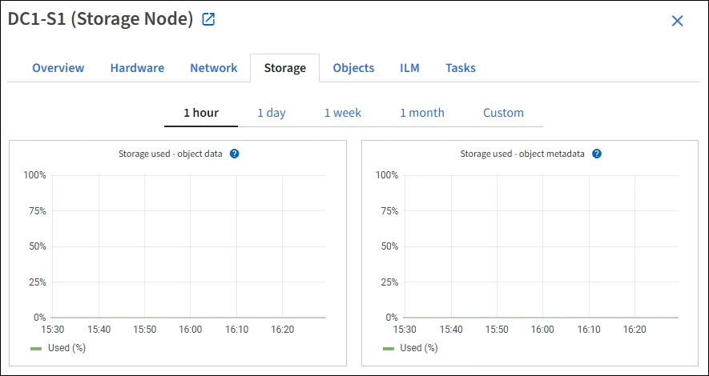

= Öffnen Sie die Registerkarte „Speicher“
:allow-uri-read: 
:icons: font
:imagesdir: ../media/

[role="lead"]
Die Registerkarte „Storage“ fasst Storage-Verfügbarkeit und andere Storage-Metriken zusammen.

Die Registerkarte Storage wird für alle Nodes, jeden Standort und das gesamte Raster angezeigt.

== Verwendete Diagramme im Storage

Für Storage-Nodes, jeden Standort und das gesamte Raster enthält die Registerkarte Storage Diagramme, die zeigen, wie viel Storage von Objektdaten und Objekt-Metadaten im Laufe der Zeit verwendet wurde.

NOTE: Die Gesamtwerte für einen Standort oder das Grid enthalten keine Nodes, die mindestens fünf Minuten lang keine Kennzahlen enthalten, z. B. Offline-Nodes.

== Festplattengeräte, Volumes und Objektspeichern Tabellen

Für alle Nodes enthält die Registerkarte Storage Details zu den Festplattengeräten und Volumes auf dem Node. Für Speicherknoten bietet die Objektspeichertabelle Informationen über jedes Speichervolumen.

image::../media/nodes_page_storage_tables.png[Knoten Seitentabellen]

xref:monitoring-storage-capacity.adoc[Monitoring der Storage-Kapazität]
