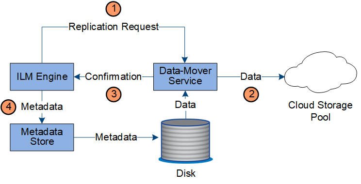

= Verwaltung von Kopien
:allow-uri-read: 
:icons: font
:imagesdir: ../media/

[role="lead"]
Objektdaten werden von der aktiven ILM-Richtlinie und ihren ILM-Regeln gemanagt. ILM-Regeln erstellen replizierte oder Erasure-codierte Kopien, um Objektdaten vor Verlust zu schützen.

Unterschiedliche Typen und Standorte von Objektkopien können zu unterschiedlichen Zeiten der Lebensdauer des Objekts erforderlich sein. ILM-Regeln werden regelmäßig überprüft, um sicherzustellen, dass Objekte nach Bedarf platziert werden.

Objektdaten werden vom LDR-Service gemanagt.

== Content-Schutz: Replikation

Wenn für die Anweisungen zur Content-Platzierung einer ILM-Regel replizierte Kopien von Objektdaten erforderlich sind, werden von den Storage-Nodes, die den konfigurierten Storage-Pool bilden, Kopien auf Festplatte erstellt und gespeichert.

=== Datenfluss

Die ILM-Engine im LDR-Service steuert die Replikation und stellt sicher, dass die korrekte Anzahl von Kopien an den richtigen Standorten und für die richtige Zeit gespeichert wird.

image::../media/replication_data_flow.png[Diagramm mit dem im umgebenden Text beschriebenen Prozess]

. Die ILM-Engine fragt den ADC-Service ab, um den besten Ziel-LDR-Service innerhalb des durch die ILM-Regel festgelegten Storage-Pools zu ermitteln. Er sendet dann diesen LDR-Service einen Befehl, um die Replikation zu initiieren.
. Der Ziel-LDR-Dienst fragt den ADC-Dienst nach dem besten Quellspeicherort ab. Anschließend sendet er eine Replikationsanfrage an den Quell-LDR-Service.
. Der Quell-LDR-Service sendet eine Kopie an den Ziel-LDR-Service.
. Der Ziel-LDR-Service benachrichtigt die ILM Engine, dass die Objektdaten gespeichert wurden.
. Die ILM-Engine aktualisiert den Metadatenspeicher mit Objektspeichermetadaten.

== Content Protection: Erasure Coding

Wenn eine ILM-Regel Anweisungen zur Erstellung von Erasure-codierten Kopien von Objektdaten enthält, werden Objektdaten im Rahmen des entsprechenden Erasure Coding-Schemas in Daten- und Paritätsfragmente unterteilt und diese Fragmente über die im Erasure Coding-Profil konfigurierten Storage-Nodes verteilt.

=== Datenfluss

Die ILM-Engine, die eine Komponente des LDR-Service ist, steuert das Erasure Coding-Verfahren und stellt sicher, dass das Erasure Coding-Profil auf Objektdaten angewendet wird.

image::../media/erasure_coding_data_flow.png[Verfahren Zur Einhaltung Von Datenkonsistenz]

. Die ILM-Engine fragt den ADC-Service ab, um zu bestimmen, welcher DDS-Service den Erasure Coding-Vorgang am besten ausführen kann. Sobald die ILM-Engine ermittelt wurde, sendet sie eine „Initiierung“-Anforderung an den Service.
. Der DDS-Dienst weist ein LDR an, den Code der Objektdaten zu löschen.
. Der Quell-LDR-Service sendet eine Kopie an den für das Erasure Coding ausgewählten LDR-Service.
. Nach der entsprechenden Anzahl von Paritäts- und Datenfragmenten verteilt der LDR-Service diese Fragmente auf die Storage-Nodes (Chunk-Services), aus denen sich der Speicherpool des Erasure Coding-Profils besteht.
. Der LDR-Service benachrichtigt die ILM-Engine und bestätigt, dass Objektdaten erfolgreich verteilt werden.
. Die ILM-Engine aktualisiert den Metadatenspeicher mit Objektspeichermetadaten.

== Content-Sicherung: Cloud Storage Pool

Wenn für die Anweisungen zur Content-Platzierung einer ILM-Regel eine replizierte Kopie von Objektdaten in einem Cloud Storage-Pool gespeichert wird, werden Objektdaten in den externen S3-Bucket oder Azure Blob-Storage-Container dupliziert, der für den Cloud Storage-Pool angegeben wurde.

=== Datenfluss

Die ILM-Engine, die eine Komponente des LDR-Service ist, und der Data Mover-Service steuern die Verschiebung von Objekten in den Cloud-Speicherpool.

. Die ILM-Engine wählt einen Data Mover-Service zur Replizierung in den Cloud-Storage-Pool aus.
. Der Data Mover-Service sendet die Objektdaten an den Cloud-Speicherpool.
. Der Data Mover-Service benachrichtigt die ILM-Engine, dass die Objektdaten gespeichert wurden.
. Die ILM-Engine aktualisiert den Metadatenspeicher mit Objektspeichermetadaten.

== Content-Schutz: Archivierung

Ein Archivierungsvorgang besteht aus einem definierten Datenfluss zwischen dem StorageGRID System und dem Client.

Wenn die ILM-Richtlinie erfordert, dass eine Kopie der Objektdaten archiviert wird, sendet die ILM-Engine, die eine Komponente des LDR-Service ist, eine Anforderung an den Archiv-Node, der wiederum eine Kopie der Objektdaten an das Ziel-Archiv-Storage-System sendet.

image::../media/archiving_data_flow.png[Diagramm mit dem im umgebenden Text beschriebenen Prozess]

. Die ILM-Engine sendet eine Anforderung an den ARC-Service, eine Kopie auf Archivmedien zu speichern.
. Der ARC-Dienst fragt den ADC-Service nach dem besten Quellspeicherort ab und sendet eine Anfrage an den Quell-LDR-Dienst.
. Der ARC-Dienst ruft Objektdaten aus dem LDR-Dienst ab.
. Der ARC-Dienst sendet die Objektdaten an das Archivmedienziel.
. Das Archivmedium benachrichtigt den ARC-Dienst, dass die Objektdaten gespeichert wurden.
. Der ARC-Dienst benachrichtigt die ILM-Engine, dass die Objektdaten gespeichert wurden.

