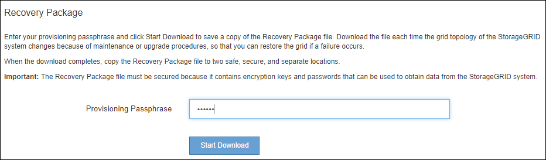

= Laden Sie das Recovery Package herunter
:allow-uri-read: 
:icons: font
:imagesdir: ../media/

[role="lead"]
Das Recovery-Paket ist eine ZIP-Datei zum Herunterladen, die Implementierungsspezifische Dateien und Software enthält, die zur Installation, Erweiterung, Aktualisierung und Wartung eines StorageGRID Systems erforderlich sind.

Die Recovery Package-Datei enthält auch systemspezifische Konfigurations- und Integrationsinformationen, einschließlich Server-Hostnamen und IP-Adressen sowie hochvertrauliche Passwörter, die während der Systemwartung, beim Upgrade und bei der Erweiterung benötigt werden. Das Wiederherstellungspaket ist für die Wiederherstellung nach dem Ausfall des primären Admin-Knotens erforderlich.

Bei der Installation eines StorageGRID-Systems müssen Sie die Recovery Package-Datei herunterladen und bestätigen, dass Sie erfolgreich auf den Inhalt dieser Datei zugreifen können. Zudem sollten Sie die Datei jedes Mal herunterladen, wenn sich die Grid-Topologie des StorageGRID Systems aufgrund von Wartungs- oder Upgrade-Verfahren ändert.

Nach dem Herunterladen der Recovery Package-Datei und der Bestätigung können Sie den Inhalt extrahieren, kopieren Sie die Recovery Package-Datei an zwei sichere und getrennte Speicherorte.

IMPORTANT: Die Recovery Package-Datei muss gesichert sein, weil sie Verschlüsselungsschlüssel und Passwörter enthält, die zum Abrufen von Daten vom StorageGRID-System verwendet werden können.

.Verwandte Informationen
* xref:../upgrade/index.adoc[Software-Upgrade]
* xref:../expand/index.adoc[Erweitern Sie Ihr Raster]
* xref:../maintain/index.adoc[Recovery und Wartung]

