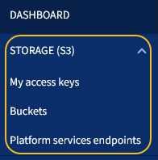

= Entdecken Sie den Tenant Manager
:allow-uri-read: 
:icons: font
:imagesdir: ../media/

[role="lead"]
Der MandantenManager ist die browserbasierte grafische Schnittstelle, die Mandantenbenutzer darauf zugreifen, um ihre Storage-Konten zu konfigurieren, zu managen und zu überwachen.

Wenn sich Mandantenbenutzer beim Mandanten-Manager anmelden, stellen sie eine Verbindung zu einem Admin-Node her.

== Mandanten-Manager Dashboard

Nachdem ein Grid-Administrator ein Mandantenkonto erstellt hat, indem er den Grid Manager oder die Grid Management API verwendet, können sich Mandantenbenutzer beim Mandanten-Manager anmelden.

Mit dem Mandanten-Manager Dashboard können Mandantenbenutzer die Storage-Auslastung auf einen Blick überwachen. Im Bereich Storage-Nutzung finden Sie eine Liste der größten Buckets (S3) oder Container (Swift) für den Mandanten. Der Wert für „genutzter Speicherplatz“ ist die Gesamtmenge der Objektdaten im Bucket oder Container. Das Balkendiagramm stellt die relative Größe dieser Buckets oder Container dar.

Der über dem Balkendiagramm angezeigte Wert ist eine Summe des Speicherplatzes, der für alle Buckets oder Container des Mandanten verwendet wird. Wurde zum Zeitpunkt der Kontoerstellung die maximale Anzahl an Gigabyte, Terabyte oder Petabyte angegeben, so wird auch die Menge des verwendeten Kontingents und der verbleibenden Menge angezeigt.

image::../media/tenant_dashboard_with_buckets.png[Mandanten-Manager Dashboard]

== Storage-Menü (nur S3-Mandanten)

Das Menü Storage wird nur für S3-Mandantenkonten angezeigt. Über dieses Menü können S3-Benutzer Zugriffsschlüssel managen, Buckets erstellen und löschen und Plattform-Service-Endpunkte managen.

=== Meine Zugriffsschlüssel

S3-Mandantenbenutzer können die Zugriffschlüssel wie folgt managen:

* Benutzer mit der Berechtigung zum Verwalten Ihrer eigenen S3-Anmeldedaten können ihre eigenen S3-Zugriffsschlüssel erstellen oder entfernen.
* Benutzer mit Root-Zugriffsberechtigung können die Zugriffsschlüssel für das S3-Stammkonto, ihr eigenes Konto und alle anderen Benutzer verwalten. Root-Zugriffsschlüssel bieten auch vollständigen Zugriff auf die Buckets und Objekte des Mandanten, sofern nicht ausdrücklich von einer Bucket-Richtlinie deaktiviert wurde.
+

NOTE: Die Verwaltung der Zugriffstasten für andere Benutzer erfolgt über das Menü Access Management.

=== Buckets

S3-Mandantenbenutzer mit entsprechenden Berechtigungen können die folgenden Aufgaben für Buckets ausführen:

* Buckets erstellen
* Aktivieren der S3-Objektsperre für einen neuen Bucket (vorausgesetzt, dass die S3-Objektsperre für das StorageGRID-System aktiviert ist)
* Aktualisieren Sie die Einstellungen für die Konsistenzstufe
* Übernehmen Sie eine Standardeinstellung für die Aufbewahrung
* Konfiguration der Cross-Origin Resource Sharing (CORS)
* Aktivieren und deaktivieren Sie Einstellungen für das Update der letzten Zugriffszeit für die Buckets, die zum Mandanten gehören
* Leere Buckets löschen
* Verwalten Sie die Objekte in einem Bucket mit xref:../tenant/use-s3-console.adoc[Experimentelle S3 Konsole]

Wenn ein Grid-Administrator die Nutzung von Plattform-Services für das Mandantenkonto aktiviert hat, kann ein S3-Mandantenbenutzer mit den entsprechenden Berechtigungen die folgenden Aufgaben ausführen:

* Konfigurieren Sie S3-Ereignisbenachrichtigungen, die an einen Ziel-Service gesendet werden können, der den AWS Simple Notification Service™ (SNS) unterstützt.
* Konfigurieren Sie die CloudMirror-Replizierung, mit der Mandanten Objekte automatisch in einen externen S3-Bucket replizieren können.
* Die Suchintegration konfiguriert: Sendet Objektmetadaten an einen Ziel-Suchindex, wenn ein Objekt erstellt, gelöscht oder seine Metadaten oder Tags aktualisiert werden.

=== Plattform-Services-Endpunkte

Wenn ein Grid-Administrator die Nutzung von Plattform-Services für das Mandantenkonto aktiviert hat, kann ein S3-Mandantenbenutzer mit der Berechtigung Endpunkte managen einen Zielendpunkt für jeden Plattform-Service konfigurieren.

== Öffnen Sie das Menü Management

Über das Menü Zugriffsmanagement können StorageGRID-Mandanten Benutzergruppen aus einer föderierten Identitätsquelle importieren und Verwaltungsberechtigungen zuweisen. Außerdem können Mandanten lokale Mandantengruppen und Benutzer managen, es sei denn, Single Sign On (SSO) gilt für das gesamte StorageGRID System.

image::../media/access_management_menu.png[Öffnen Sie Das Managementmenü]

.Verwandte Informationen
* xref:exploring-grid-manager.adoc[Entdecken Sie den Grid Manager]
* xref:../tenant/index.adoc[Verwenden Sie ein Mandantenkonto]

