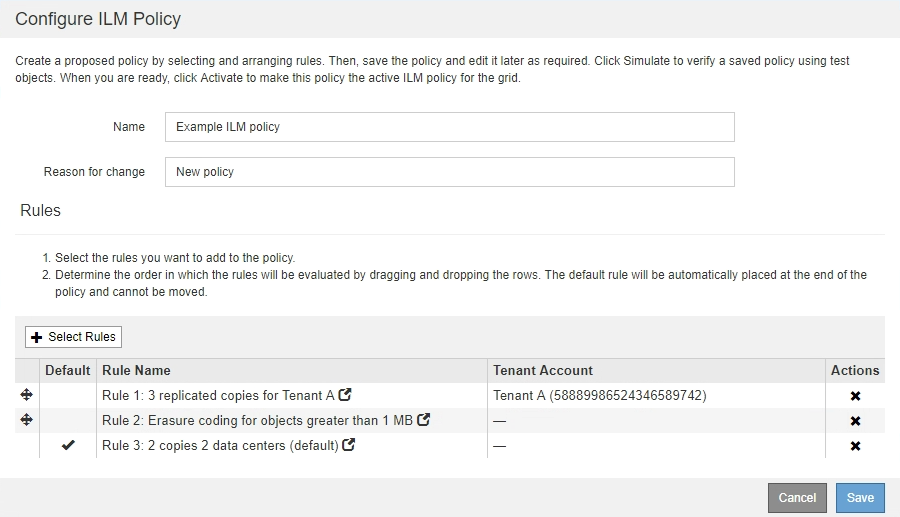

= Verwenden Sie das Information Lifecycle Management
:allow-uri-read: 
:icons: font
:imagesdir: ../media/

[role="lead"]
Mithilfe von Information Lifecycle Management (ILM) können Kunden die Platzierung, Dauer und Datensicherung für alle Objekte im StorageGRID System steuern. ILM-Regeln legen fest, wie StorageGRID Objekte im Laufe der Zeit speichert. Sie konfigurieren eine oder mehrere ILM-Regeln und fügen sie anschließend zu einer ILM-Richtlinie hinzu.

ILM-Regeln definieren:

* Welche Objekte sollten gespeichert werden. Eine Regel kann auf alle Objekte angewendet werden, oder Sie können Filter angeben, um zu identifizieren, für welche Objekte eine Regel gilt. Beispielsweise kann eine Regel nur für Objekte gelten, die mit bestimmten Mandantenkonten, bestimmten S3-Buckets oder Swift-Containern oder bestimmten Metadatenwerten verbunden sind.
* Speichertyp und -Standort. Objekte können auf Storage-Nodes, in Cloud-Storage-Pools oder auf Archiv-Nodes gespeichert werden.
* Der Typ der Objektkopien, die erstellt wurden. Kopien können repliziert oder Erasure Coding ausgeführt werden.
* Für replizierte Kopien die Anzahl der Kopien, die erstellt werden.
* Für Kopien mit Verfahren zur Einhaltung von Datenkonsistenz (Erasure Coding) wurde das Verfahren zur Einhaltung von Datenkonsistenz verwendet.
* Die Änderungen im Laufe der Zeit an dem Storage-Standort und den Koprottypen eines Objekts.
* Schutz von Objektdaten bei Aufnahme von Objekten in das Grid (synchrone Platzierung oder Dual-Commit)

Objekt-Metadaten werden nicht durch ILM-Regeln gemanagt. Stattdessen werden Objekt-Metadaten in einer Cassandra-Datenbank in einem sogenannten Metadaten-Speicher gespeichert. Drei Kopien von Objekt-Metadaten werden automatisch an jedem Standort aufbewahrt, um die Daten vor Verlust zu schützen. Die Kopien werden gleichmäßig auf alle Storage Nodes verteilt.

== Beispiel für eine ILM-Regel

Diese Beispiel-ILM-Regel gilt für die Objekte, die zu Mandant A gehören Es erstellt zwei replizierte Kopien dieser Objekte und speichert jede Kopie an einem anderen Standort. Die beiden Kopien werden „`forever,`“ aufbewahrt. Das bedeutet, dass StorageGRID sie nicht automatisch löscht. Stattdessen behält StorageGRID diese Objekte so lange bei, bis sie von einer Löschanfrage eines Clients oder nach Ablauf eines Bucket-Lebenszyklus gelöscht werden.

Diese Regel verwendet die ausgewogene Option für das Aufnahmeverhalten: Die Anweisung zur Platzierung an zwei Standorten wird angewendet, sobald Mandant A ein Objekt in StorageGRID speichert, es sei denn, es ist nicht möglich, sofort beide erforderlichen Kopien zu erstellen. Wenn z. B. Standort 2 nicht erreichbar ist, wenn Mandant A ein Objekt speichert, erstellt StorageGRID zwei Zwischenkopien auf Storage-Nodes an Standort 1. Sobald Standort 2 verfügbar wird, erstellt StorageGRID die erforderliche Kopie an diesem Standort.

image::../media/ilm_example_rule_2_copies_tenant_a.png[Beispiel einer ILM-Regel 2 kopiert Mandant A]

== Bewertung von Objekten durch eine ILM-Richtlinie

Die aktive ILM-Richtlinie für Ihr StorageGRID System steuert die Platzierung, Dauer und Datensicherung aller Objekte.

Wenn Clients Objekte in StorageGRID speichern, werden die Objekte anhand der bestellten ILM-Regeln in der aktiven Richtlinie bewertet:

. Wenn die Filter für die erste Regel in der Richtlinie mit einem Objekt übereinstimmen, wird das Objekt gemäß dem Aufnahmeverhalten der Regel aufgenommen und gemäß den Anweisungen zur Platzierung dieser Regel gespeichert.
. Wenn die Filter für die erste Regel nicht mit dem Objekt übereinstimmen, wird das Objekt anhand jeder nachfolgenden Regel in der Richtlinie ausgewertet, bis eine Übereinstimmung erfolgt.
. Stimmen keine Regeln mit einem Objekt überein, werden das Aufnahmeverhalten und die Anweisungen zur Platzierung der Standardregel in der Richtlinie angewendet. Die Standardregel ist die letzte Regel in einer Richtlinie und kann keine Filter verwenden. Die Lösung muss für alle Mandanten, alle Buckets und alle Objektversionen gelten.

== Beispiel für eine ILM-Richtlinie

In diesem Beispiel verwendet die ILM-Richtlinie drei ILM-Regeln.

In diesem Beispiel stimmt Regel 1 mit allen Objekten überein, die zu Mandant A gehören Diese Objekte werden als drei replizierte Kopien an drei Standorten gespeichert. Objekte, die zu anderen Mietern gehören, werden von Regel 1 nicht abgeglichen, so dass sie gegen Regel 2 ausgewertet werden.

Regel 2 entspricht allen Objekten anderer Mandanten, aber nur, wenn sie größer als 1 MB sind. Diese größeren Objekte werden mithilfe von 6+3 Erasure Coding an drei Standorten gespeichert. Regel 2 stimmt nicht mit Objekten 1 MB oder kleiner überein, daher werden diese Objekte gegen Regel 3 ausgewertet.

Regel 3 ist die letzte und Standardregel in der Richtlinie und verwendet keine Filter. Regel 3 erstellt zwei replizierte Kopien aller Objekte, die nicht mit Regel 1 oder Regel 2 übereinstimmt (Objekte, die nicht zu Mandant A gehören, die 1 MB oder kleiner sind).

image::../media/ilm_policy_and_rules.png[ILM-Richtlinie und -Regeln]

*Verwandte Informationen*

* xref:../ilm/index.adoc[Objektmanagement mit ILM]

