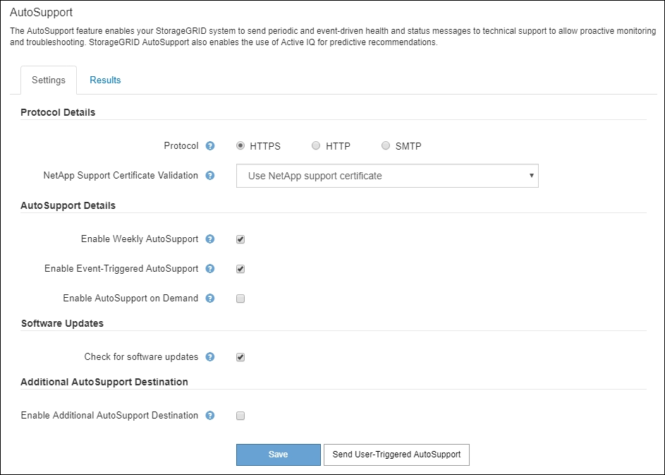

= Nutzen Sie StorageGRID Support-Optionen
:allow-uri-read: 
:icons: font
:imagesdir: ../media/

[role="lead"]
Der Grid Manager bietet Optionen, die Ihnen bei der Zusammenarbeit mit dem technischen Support helfen, falls ein Problem auf Ihrem StorageGRID-System auftritt.

== Konfigurieren Sie AutoSupport

Die AutoSupport-Funktion ermöglicht es Ihrem StorageGRID System, Gesundheits- und Statusmeldungen an den technischen Support zu senden. Durch den Einsatz von AutoSupport werden die Problembestimmung und -Behebung erheblich beschleunigt. Der technische Support überwacht auch den Storage-Bedarf Ihres Systems und hilft Ihnen dabei zu ermitteln, ob Sie neue Nodes oder Standorte hinzufügen müssen. Optional können Sie AutoSupport Meldungen so konfigurieren, dass sie an ein zusätzliches Ziel gesendet werden.

Sie konfigurieren AutoSupport mit dem Grid Manager (*SUPPORT* *Tools* *AutoSupport*). Die *AutoSupport* Seite hat zwei Registerkarten: *Einstellungen* und *Ergebnisse*.

=== Informationen, die in AutoSupport Meldungen enthalten sind

AutoSupport Meldungen enthalten Informationen, z. B. die folgenden:

* StorageGRID Softwareversion
* Betriebssystemversion
* Attributinformationen auf System- und Standortebene
* Aktuelle Warnmeldungen und Alarme (Altsystem)
* Aktueller Status aller Grid-Aufgaben, einschließlich historischer Daten
* Verwendung der Admin-Node-Datenbank
* Anzahl der verlorenen oder fehlenden Objekte
* Grid-Konfigurationseinstellungen
* NMS-Einheiten
* Aktive ILM-Richtlinie
* Bereitgestellte Grid-Spezifikations-Datei
* Diagnostische Metriken

Sie können die AutoSupport-Funktion und die einzelnen AutoSupport-Optionen bei der Erstinstallation von StorageGRID aktivieren oder später aktivieren. Wenn AutoSupport nicht aktiviert ist, wird eine Meldung im Grid-Manager-Dashboard angezeigt. Die Meldung enthält einen Link zur AutoSupport-Konfigurationsseite.

image::../media/autosupport_disabled_message.png[AutoSupport hat MSG deaktiviert]

Wenn Sie die Nachricht schließen, wird sie erst wieder angezeigt, wenn Ihr Browser-Cache gelöscht wird, auch wenn AutoSupport deaktiviert bleibt.

=== Verwenden Sie Active IQ

Active IQ ist ein Cloud-basierter digitaler Berater, der prädiktive Analysen und Community-Wissen aus der installierten Basis von NetApp nutzt. Kontinuierliche Risikobewertungen, prädiktive Warnungen, beschreibende Tipps und automatisierte Aktionen helfen Ihnen, Probleme zu vermeiden, bevor sie auftreten. Dies führt zu verbesserter Systemintegrität und höherer Systemverfügbarkeit.

Sie müssen AutoSupport aktivieren, wenn Sie die Active IQ Dashboards und Funktionen auf der NetApp Support-Website nutzen möchten.

https://docs.netapp.com/us-en/active-iq/index.html["Active IQ Digital Advisor Dokumentation"^]

== Erfassen von StorageGRID-Protokollen

Um bei der Fehlerbehebung zu helfen, müssen Sie möglicherweise Protokolldateien sammeln und an den technischen Support weiterleiten.

StorageGRID verwendet Log-Dateien, um Ereignisse, Diagnosemeldungen und Fehlerbedingungen zu erfassen. Die Datei bycast.log wird für jeden Grid-Node aufbewahrt und ist die primäre Fehlerbehebungsdatei. StorageGRID erstellt zudem Log-Dateien für einzelne StorageGRID-Services, Log-Dateien für Bereitstellungs- und Wartungsaktivitäten und Log-Dateien mit Drittanbieterapplikationen.

Benutzer, die über die entsprechenden Berechtigungen verfügen und die Provisionierungs-Passphrase für Ihr StorageGRID-System kennen, können mithilfe der Seite Protokolle im Grid Manager Protokolldateien, Systemdaten und Konfigurationsdaten erfassen. Wenn Sie Protokolle sammeln, wählen Sie einen Node oder Nodes aus und geben einen Zeitraum an. Daten werden in einem erfasst und archiviert `.tar.gz` Datei, die Sie auf einen lokalen Computer herunterladen können. Innerhalb dieser Datei gibt es für jeden Grid-Knoten ein Protokolldateiarchiv.

image::../media/support_logs_select_nodes.png[Screenshot der Log-Collection-UI]

== Verwenden Sie Kennzahlen und führen Sie Diagnosen durch

Bei der Fehlerbehebung eines Problems können Sie gemeinsam mit dem technischen Support detaillierte Metriken und Diagramme für Ihr StorageGRID System prüfen. Sie können außerdem vorkonfigurierte Diagnoseabfragen durchführen, um die Schlüsselwerte für Ihr StorageGRID System proaktiv einzuschätzen.

=== Seite „Kennzahlen“

Auf der Seite Metrics können Sie auf die Benutzeroberflächen von Prometheus und Grafana zugreifen. Prometheus ist Open-Source-Software zum Sammeln von Kennzahlen. Grafana ist Open-Source-Software zur Visualisierung von Kennzahlen.

IMPORTANT: Die auf der Seite Metriken verfügbaren Tools sind für den technischen Support bestimmt. Einige Funktionen und Menüelemente in diesen Tools sind absichtlich nicht funktionsfähig und können sich ändern.

image::../media/metrics_page.png[Seite „Kennzahlen“]

Über den Link im Bereich Prometheus auf der Seite Metriken können Sie die aktuellen Werte der StorageGRID Metriken abfragen und Diagramme der Werte im Zeitverlauf anzeigen.

image::../media/metrics_page_prometheus.png[Kennzahlen Seite Prometheus]

NOTE: Metriken, die _privat_ in ihren Namen enthalten, sind nur zur internen Verwendung vorgesehen und können ohne Ankündigung zwischen StorageGRID Versionen geändert werden.

Über die Links im Abschnitt Grafana der Seite Metriken können Sie im Laufe der Zeit auf vorkonfigurierte Dashboards mit Diagrammen zu StorageGRID-Metriken zugreifen.

image::../media/metrics_page_grafana.png[Seite „Kennzahlen“ Grafana]

=== Diagnoseseite

Die Seite Diagnose führt eine Reihe vorkonstruierter Diagnosesecks zum aktuellen Status des Rasters durch. Im Beispiel haben alle Diagnosen einen normalen Status.

image::../media/support_diagnostics_page.png[Support Diagnostics Seite]

Durch Klicken auf eine bestimmte Diagnose können Sie Details zur Diagnose und ihren aktuellen Ergebnissen anzeigen.

In diesem Beispiel wird die aktuelle CPU-Auslastung für jeden Node in einem StorageGRID System angezeigt. Alle Node-Werte liegen unter den Warn- und Warnschwellenwerten, sodass der Gesamtstatus der Diagnose normal ist.

image::../media/support_diagnostics_cpu_utilization.png[Support Diagnostics CPU-Auslastung]

.Verwandte Informationen
* xref:../admin/index.adoc[StorageGRID verwalten]
* xref:configuring-network-settings.adoc[Netzwerkeinstellungen konfigurieren]

