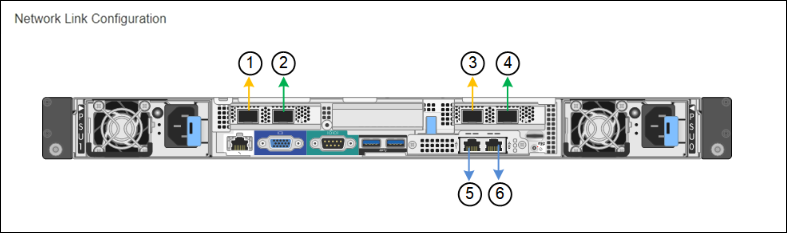

= Konfigurieren von Netzwerkverbindungen (SG100 und SG1000)
:allow-uri-read: 
:icons: font
:imagesdir: ../media/

[role="lead"]
Sie können Netzwerkverbindungen für die Ports konfigurieren, die zum Verbinden der Appliance mit dem Grid-Netzwerk, dem Client-Netzwerk und dem Admin-Netzwerk verwendet werden. Sie können die Verbindungsgeschwindigkeit sowie den Port- und Netzwerk-Bond-Modus einstellen.

.Was Sie benötigen
* Sie haben die für Ihren Kabeltyp und die Verbindungsgeschwindigkeit erforderlichen zusätzlichen Geräte erhalten.
* Sie haben die Netzwerk-Ports mit Switches verbunden, die Ihre gewählte Geschwindigkeit unterstützen.

Wenn Sie den aggregierten Port Bond-Modus, den LACP Network Bond-Modus oder VLAN-Tagging verwenden möchten:

* Sie haben die Netzwerk-Ports an der Appliance mit Switches verbunden, die VLAN und LACP unterstützen.
* Wenn mehrere Switches an der LACP-Verbindung beteiligt sind, unterstützen die Switches MLAG (Multi-Chassis Link Aggregation Groups) oder eine vergleichbare Position.
* Sie wissen, wie Sie die Switches für die Verwendung von VLAN, LACP und MLAG oder Ähnliches konfigurieren.
* Sie kennen das eindeutige VLAN-Tag, das für jedes Netzwerk verwendet werden soll. Dieses VLAN-Tag wird zu jedem Netzwerkpaket hinzugefügt, um sicherzustellen, dass der Netzwerkverkehr an das richtige Netzwerk weitergeleitet wird.

.Über diese Aufgabe
Die Abbildungen zeigen, wie die vier Netzwerk-Ports im Bond-Modus mit festen Ports verbunden sind (Standardkonfiguration).

*SG100 Festanschluss-Modus*

image::../media/sg100_fixed_port_draft.png[SG100-Bond-Modus mit Festanschluss]

*SG1000 Festanschlussmodus*

image::../media/sg1000_fixed_port.png[SG1000 Fixed Port Bond-Modus]

|===
| Legende | Welche Ports sind verbunden 

 a| 
C
 a| 
Die Ports 1 und 3 sind für das Client-Netzwerk verbunden, falls dieses Netzwerk verwendet wird.

 a| 
G
 a| 
Die Ports 2 und 4 sind für das Grid-Netzwerk verbunden.

|===
Die Abbildung zeigt, wie die vier Netzwerk-Ports im Bond-Modus für aggregierte Ports verbunden sind.

*SG100 Aggregat-Port-Bond-Modus*

image::../media/sg100_aggregate_ports.png[Aggregat Port Bond-Modus SG100]

*SG1000 Aggregat-Port-Bond-Modus*

image::../media/sg1000_aggregate_ports.png[Aggregat Port Bond-Modus SG1000]

|===
| Legende | Welche Ports sind verbunden 

 a| 
1
 a| 
Alle vier Ports werden in einer einzelnen LACP Bond gruppiert, sodass alle Ports für den Grid-Netzwerk- und Client-Netzwerk-Traffic verwendet werden können.

|===
In der Tabelle sind die Optionen für die Konfiguration der vier Netzwerkanschlüsse zusammengefasst. Die Standardeinstellungen werden fett dargestellt. Sie müssen nur die Einstellungen auf der Seite Link Configuration konfigurieren, wenn Sie eine nicht-Standardeinstellung verwenden möchten.

NOTE: Die LACP sende Hash-Richtlinie ist standardmäßig im layer2+3-Modus verfügbar. Bei Bedarf können Sie die Grid Management API verwenden, um sie in den layer3+4 Modus zu ändern.

* *Festes (Standard) Port Bond-Modus*
+
|===
| Netzwerk-Bond-Modus | Client-Netzwerk deaktiviert (Standard) | Client-Netzwerk aktiviert 

 a| 
Aktiv/Backup (Standard)
 a| 
** Die Ports 2 und 4 verwenden eine aktiv-Backup-Verbindung für das Grid Network.
** Die Ports 1 und 3 werden nicht verwendet.
** Ein VLAN-Tag ist optional.

 a| 
** Die Ports 2 und 4 verwenden eine aktiv-Backup-Verbindung für das Grid Network.
** Die Ports 1 und 3 verwenden eine aktiv-Backup-Verbindung für das Client-Netzwerk.
** VLAN-Tags können für beide Netzwerke angegeben werden.

 a| 
LACP (802.3ad)
 a| 
** Die Ports 2 und 4 verwenden eine LACP-Verbindung für das Grid-Netzwerk.
** Die Ports 1 und 3 werden nicht verwendet.
** Ein VLAN-Tag ist optional.

 a| 
** Die Ports 2 und 4 verwenden eine LACP-Verbindung für das Grid-Netzwerk.
** Die Ports 1 und 3 verwenden eine LACP Bond für das Client-Netzwerk.
** VLAN-Tags können für beide Netzwerke angegeben werden.

|===
* * Aggregat-Port-Bond-Modus*
+
|===
| Netzwerk-Bond-Modus | Client-Netzwerk deaktiviert (Standard) | Client-Netzwerk aktiviert 

 a| 
Nur LACP (802.3ad
 a| 
** Die Ports 1-4 verwenden einen einzelnen LACP Bond für das Grid Network.
** Ein einzelnes VLAN-Tag identifiziert Grid-Netzwerkpakete.

 a| 
** Die Ports 1-4 verwenden eine einzelne LACP-Verbindung für das Grid-Netzwerk und das Client-Netzwerk.
** Zwei VLAN-Tags ermöglichen die Trennung von Grid-Netzwerkpaketen von Client-Netzwerkpaketen.

|===

Weitere Informationen finden Sie im Artikel über GbE-Portverbindungen für die Services-Appliance.

Diese Abbildung zeigt, wie die beiden 1-GbE-Management-Ports des SG100 im Active-Backup Netzwerk-Bond-Modus des Admin-Netzwerks verbunden sind.

Diese Abbildungen zeigen, wie die beiden 1-GbE-Management-Ports auf der Appliance im Active-Backup Netzwerk-Bond-Modus des Admin-Netzwerks verbunden sind.

*SG100 Admin Netzwerkanschlüsse gebunden*

image::../media/sg100_bonded_management_ports.png[Fest gebundene Admin-Netzwerkports SG100]

*SG1000 Admin Netzwerkanschlüsse gebunden*

image::../media/sg1000_bonded_management_ports.png[Admin-Netzwerkports (SG1000) Bonded]

.Schritte
. Klicken Sie in der Menüleiste des StorageGRID-Appliance-Installationsprogramms auf *Netzwerke konfigurieren* *Link-Konfiguration*.
+
Auf der Seite Network Link Configuration wird ein Diagramm der Appliance angezeigt, in dem die Netzwerk- und Verwaltungsports nummeriert sind.

+
*SG100-Anschlüsse*

+

+
*SG1000-Ports*

+
image::../media/sg1000_configuring_network_ports.png[SG1000-Ports]

+
In der Tabelle „Link-Status“ werden der Verbindungsstatus und die Geschwindigkeit der nummerierten Ports (SG1000) angezeigt.

+
image::../media/sg1000_configuring_network_link_status.png[SG1000-Link-Status]

+
Das erste Mal, wenn Sie diese Seite aufrufen:

+
** *Verbindungsgeschwindigkeit* ist auf *Auto* eingestellt.
** *Port Bond Modus* ist auf *fest* eingestellt.
** *Network Bond Mode* ist für das Grid Network auf *Active-Backup* eingestellt.
** Das *Admin-Netzwerk* ist aktiviert, und der Netzwerk-Bond-Modus ist auf *unabhängig* eingestellt.
** Das *Client-Netzwerk* ist deaktiviert.
+
image::../media/sg1000_network_link_configuration_fixed.png[Konfiguration Der Netzwerkverbindung Wurde Behoben]

. Wählen Sie die Verbindungsgeschwindigkeit für die Netzwerkanschlüsse aus der Dropdown-Liste *Link Speed* aus.
+
Die Netzwerk-Switches, die Sie für das Grid-Netzwerk und das Client-Netzwerk verwenden, müssen ebenfalls für diese Geschwindigkeit konfiguriert sein. Für die konfigurierte Verbindungsgeschwindigkeit müssen Sie die entsprechenden Adapter oder Transceiver verwenden. Verwenden Sie die automatische Verbindungsgeschwindigkeit, wenn möglich, da diese Option sowohl die Verbindungsgeschwindigkeit als auch den FEC-Modus (Forward Error Correction) mit dem Link-Partner verhandelt.

. Aktivieren oder deaktivieren Sie die StorageGRID-Netzwerke, die Sie verwenden möchten.
+
Das Grid-Netzwerk ist erforderlich. Sie können dieses Netzwerk nicht deaktivieren.

+
.. Wenn das Gerät nicht mit dem Admin-Netzwerk verbunden ist, deaktivieren Sie das Kontrollkästchen *Netzwerk aktivieren* für das Admin-Netzwerk.
+
image::../media/admin_network_disabled.gif[Screenshot mit Kontrollkästchen zum Aktivieren oder Deaktivieren des Admin-Netzwerks]

.. Wenn das Gerät mit dem Client-Netzwerk verbunden ist, aktivieren Sie das Kontrollkästchen *Netzwerk aktivieren* für das Client-Netzwerk.
+
Die Client-Netzwerkeinstellungen für die Daten-NIC-Ports werden nun angezeigt.

. In der Tabelle finden Sie Informationen zum Konfigurieren des Port-Bond-Modus und des Netzwerk-Bond-Modus.
+
Dieses Beispiel zeigt:

+
** *Aggregate* und *LACP* ausgewählt für das Grid und die Client Netzwerke. Sie müssen für jedes Netzwerk ein eindeutiges VLAN-Tag angeben. Sie können Werte zwischen 0 und 4095 auswählen.
** *Active-Backup* für das Admin-Netzwerk ausgewählt.
+
image::../media/sg1000_network_link_configuration_aggregate.png[Network Link Configuration Aggregate]

. Wenn Sie mit Ihrer Auswahl zufrieden sind, klicken Sie auf *Speichern*.
+

NOTE: Wenn Sie Änderungen am Netzwerk oder an der Verbindung vorgenommen haben, über die Sie verbunden sind, können Sie die Verbindung verlieren. Wenn Sie nicht innerhalb einer Minute eine erneute Verbindung hergestellt haben, geben Sie die URL für das Installationsprogramm von StorageGRID-Geräten erneut ein. Verwenden Sie dazu eine der anderen IP-Adressen, die der Appliance zugewiesen sind: +
`*https://_services_appliance_IP_:8443*`

.Verwandte Informationen
xref:obtaining-additional-equipment-and-tools-sg100-and-sg1000.adoc[Zusätzliche Geräte und Werkzeuge (SG100 und SG1000)]
