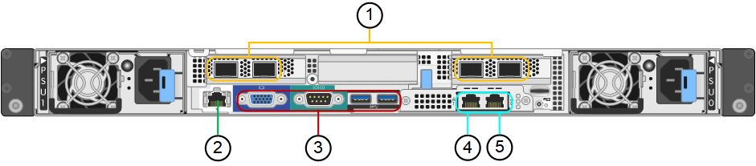

= SG100- und SG1000-Geräte im Überblick
:allow-uri-read: 
:icons: font
:imagesdir: ../media/

[role="lead"]
Die StorageGRID SG100 Services Appliance und die SG1000 Services Appliance können als Gateway-Node und als Admin-Node ausgeführt werden, um hochverfügbare Load-Balancing-Services in einem StorageGRID System bereitzustellen. Beide Appliances können gleichzeitig als Gateway-Nodes und Admin-Nodes (primär oder nicht primär) betrieben werden.

== Funktionen der Appliance

Beide Modelle der Service Appliance bieten die folgenden Funktionen:

* Gateway-Knoten oder Admin-Knoten Funktionen für ein StorageGRID-System.
* StorageGRID Appliance Installer zur Vereinfachung der Implementierung und Konfiguration von Nodes.
* Bei der Bereitstellung kann über einen vorhandenen Admin-Node oder über auf ein lokales Laufwerk heruntergeladene Software auf die StorageGRID-Software zugegriffen werden. Um den Implementierungsprozess weiter zu vereinfachen, wird während der Fertigung eine aktuelle Version der Software vorinstalliert.
* Ein Baseboard Management Controller (BMC) für das Monitoring und die Diagnose einiger Hardware des Geräts.
* Die Möglichkeit, eine Verbindung zu allen drei StorageGRID-Netzwerken herzustellen, einschließlich Grid-Netzwerk, Admin-Netzwerk und Client-Netzwerk:
+
** Das SG100 unterstützt bis zu vier 10- oder 25-GbE-Verbindungen mit dem Grid-Netzwerk und dem Client-Netzwerk.
** Das SG1000 unterstützt bis zu vier 10-, 25-, 40- oder 100-GbE-Verbindungen zum Grid-Netzwerk und dem Client-Netzwerk.

== SG100- und SG1000-Diagramme

Diese Abbildung zeigt die Vorderseite des SG100 und des SG1000 mit entfernter Blende.

NOTE: Von der Vorderseite sind die beiden Geräte identisch, mit Ausnahme des Produktnamens auf der Blende.

Die zwei über die orangefarbene Kontur angezeigten Solid State Drives (SSDs) werden zum Speichern des StorageGRID Betriebssystems verwendet und werden mithilfe von RAID1 für Redundanz gespiegelt. Wenn die SG100- oder SG1000-Services-Appliance als Admin-Node konfiguriert ist, werden diese Laufwerke zum Speichern von Audit-Protokollen, Kennzahlen und Datenbanktabellen verwendet.

Die übrigen Laufwerksschächte sind leer.

image::../media/sg1000_front_with_ssds.png[Vorderseite mit SSDs SG100 und SG1000]

== Anschlüsse auf der Rückseite des SG100

Diese Abbildung zeigt die Anschlüsse auf der Rückseite des SG100.

|===
|  | Port | Typ | Nutzung 

 a| 
1
 a| 
Netzwerkanschlüsse 1-4
 a| 
10/25-GbE, basierend auf Kabel- oder SFP-Transceiver-Typ (SFP28 und SFP+ Module werden unterstützt), Switch-Geschwindigkeit und konfigurierter Link-Geschwindigkeit
 a| 
Stellen Sie eine Verbindung zum Grid-Netzwerk und dem Client-Netzwerk für StorageGRID her.

 a| 
2
 a| 
BMC-Management-Port
 a| 
1 GbE (RJ-45)
 a| 
Stellen Sie eine Verbindung mit dem Management Controller der Hauptplatine des Geräts her.

 a| 
3
 a| 
Diagnose- und Supportports
 a| 
* VGA
* Seriell, 115200 8-N-1
* USB

 a| 
Nur zur Verwendung durch technischen Support reserviert.

 a| 
4
 a| 
Admin-Netzwerkport 1
 a| 
1 GbE (RJ-45)
 a| 
Schließen Sie die Appliance an das Admin-Netzwerk für StorageGRID an.

 a| 
5
 a| 
Admin – Netzwerkanschluss 2
 a| 
1 GbE (RJ-45)
 a| 
Optionen:

* Verbindung mit Management-Port 1 für eine redundante Verbindung zum Admin-Netzwerk für StorageGRID.
* Lassen Sie die Verbindung getrennt und für den vorübergehenden lokalen Zugriff verfügbar (IP 169.254.0.1).
* Verwenden Sie während der Installation Port 2 für die IP-Konfiguration, wenn DHCP-zugewiesene IP-Adressen nicht verfügbar sind.

|===

== Anschlüsse auf der Rückseite des SG1000

Diese Abbildung zeigt die Anschlüsse auf der Rückseite des SG1000.

image::../media/sg1000_rear_connectors.png[Hintere Steckverbinder SG1000]

|===
|  | Port | Typ | Nutzung 

 a| 
1
 a| 
Netzwerkanschlüsse 1-4
 a| 
10/25/40/100-GbE, basierend auf Kabel- oder Transceiver-Typ, Switch-Geschwindigkeit und konfigurierter Verbindungsgeschwindigkeit. QSFP28 und QSFP+ (40/100GbE) werden nativ unterstützt und SFP28/SFP+ Transceiver können mit einem QSA (separat erhältlich) für 10/25-GbE-Geschwindigkeiten verwendet werden.
 a| 
Stellen Sie eine Verbindung zum Grid-Netzwerk und dem Client-Netzwerk für StorageGRID her.

 a| 
2
 a| 
BMC-Management-Port
 a| 
1 GbE (RJ-45)
 a| 
Stellen Sie eine Verbindung mit dem Management Controller der Hauptplatine des Geräts her.

 a| 
3
 a| 
Diagnose- und Supportports
 a| 
* VGA
* Seriell, 115200 8-N-1
* USB

 a| 
Nur zur Verwendung durch technischen Support reserviert.

 a| 
4
 a| 
Admin-Netzwerkport 1
 a| 
1 GbE (RJ-45)
 a| 
Schließen Sie die Appliance an das Admin-Netzwerk für StorageGRID an.

 a| 
5
 a| 
Admin – Netzwerkanschluss 2
 a| 
1 GbE (RJ-45)
 a| 
Optionen:

* Verbindung mit Management-Port 1 für eine redundante Verbindung zum Admin-Netzwerk für StorageGRID.
* Lassen Sie die Verbindung getrennt und für den vorübergehenden lokalen Zugriff verfügbar (IP 169.254.0.1).
* Verwenden Sie während der Installation Port 2 für die IP-Konfiguration, wenn DHCP-zugewiesene IP-Adressen nicht verfügbar sind.

|===