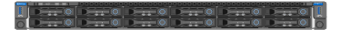

= Auspacken (SG100 und SG1000)
:allow-uri-read: 
:icons: font
:imagesdir: ../media/

[role="lead"]
Packen Sie vor der Installation des StorageGRID-Geräts alle Kartons aus und vergleichen Sie den Inhalt mit den Artikeln auf dem Verpackungsschein.

== Appliance-Hardware

* *SG100 oder SG1000*
+

* *Rail Kit mit Anweisungen*
+
image::../media/rail_kit.gif[Schienensatz]

== Stromkabel

Die im Lieferumfang der StorageGRID Appliance aufgeführten Netzkabel sind enthalten:

* * Zwei Netzkabel für Ihr Land*
+
image::../media/power_cords.gif[Stromkabel]

+
Ihr Schrank verfügt möglicherweise über spezielle Netzkabel, die Sie anstelle der Netzkabel verwenden, die Sie zur Einheit mit dem Gerät anschließen.

