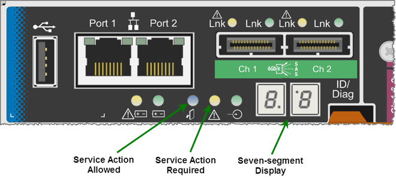

= E5600SG-Controller-Anzeigecodes für sieben Segmente
:allow-uri-read: 
:icons: font
:imagesdir: ../media/

[role="lead"]
Die sieben-Segment-Anzeige auf dem E5600SG-Controller zeigt Status- und Fehlercodes an, während das Gerät eingeschaltet wird und die Hardware initialisiert wird. Sie können diese Codes verwenden, um den Status zu bestimmen und Fehler zu beheben.

Beim Überprüfen von Status- und Fehlercodes auf dem E5600SG-Controller sollten Sie sich die folgenden Codes ansehen:

* *Allgemeine Startcodes*
+
Stellt die standardmäßigen Startereignisse dar.

* *Normale Startcodes*
+
Stellt die normalen Startereignisse dar, die im Gerät auftreten.

* *Fehlercodes*
+
Zeigen Sie Probleme während der Startereignisse an.

StorageGRID steuert nur die folgenden LEDs am E5600SG-Controller und erst nach dem Start des StorageGRID-Appliance-Installationsprogramms:

* LED für Serviceaktion zulässig
* LED für Serviceaktion erforderlich
* Sieben-Segment-Anzeige

Die Dezimalstellen auf der Anzeige von sieben Segmenten werden von der StorageGRID Appliance nicht verwendet:

* Der obere Dezimalpunkt neben der am wenigsten signifikanten Ziffer ist die Diagnose-LED der Plattform.
+
Diese Funktion wird während des Reset und der Erstkonfiguration der Hardware eingeschaltet. Andernfalls ist sie ausgeschaltet.

* Der untere Dezimalpunkt neben der wichtigsten Ziffer ist deaktiviert.

Um andere Probleme zu diagnostizieren, sollten Sie sich die folgenden Ressourcen ansehen:

* Weitere Informationen zu Hardware- und Umgebungsdiagnosen finden Sie in der Hardwarediagnose des Betriebssystems der E-Series.
+
Dazu gehört die Suche nach Hardware-Problemen wie Stromversorgung, Temperatur und Festplattenlaufwerken. Die Appliance überwacht sämtliche Umgebungsstatus der Plattform auf das Betriebssystem E-Series.

* Um Firmware- und Treiberprobleme zu ermitteln, sehen Sie sich die Link-LEDs an der SAS-Seite und den Netzwerkports an.
+
Weitere Informationen finden Sie in der Dokumentation zur E-Series E5600.

== Allgemeine Startcodes

Während des Startvorgangs oder nach einem harten Reset der Hardware leuchten die LEDs für die Serviceaktion zulässig und für die Serviceaktion erforderliche LEDs auf, während die Hardware initialisiert wird. Das siebenSegment-Display zeigt eine Reihe von Codes an, die für E-Series Hardware identisch sind und nicht für den E5600SG Controller spezifisch sind.

Während des Startvorgangs steuert das Field Programmable Gate Array (FPGA) die Funktionen und die Initialisierung der Hardware.

|===
| Codieren | Anzeige 

 a| 
19
 a| 
FPGA-Initialisierung

 a| 
68
 a| 
FPGA-Initialisierung

 a| 
...
 a| 
FPGA-Initialisierung.Dies ist eine schnelle Folge von Codes.

 a| 
AA
 a| 
Booten des Plattform-BIOS.

 a| 
FF
 a| 
BIOS-Hochfahren abgeschlossen.Dies ist ein Zwischenzustand, bevor der E5600SG-Controller die LEDs initialisiert und verwaltet, um den Status anzuzeigen.

|===
Nachdem die AA- und FF-Codes angezeigt wurden, werden entweder die normalen Startcodes angezeigt oder es werden Fehlercodes angezeigt. Außerdem sind die LEDs für zulässige Serviceaktion und Serviceaktion erforderlich deaktiviert.

== Normale Startcodes

Diese Codes stellen die normalen Startereignisse dar, die in chronologischer Reihenfolge im Gerät auftreten.

|===
| Codieren | Anzeige 

 a| 
HI
 a| 
Das Master-Boot-Skript wurde gestartet.

 a| 
PP
 a| 
Die FPGA-Plattform-Firmware wird auf Updates überprüft.

 a| 
HP
 a| 
Die Host Interface Card (HIC) wird auf Updates überprüft.

 a| 
RB
 a| 
Nach Firmware-Updates wird das System ggf. neu gebootet.

 a| 
FP
 a| 
Die Firmware-Update-Prüfungen wurden abgeschlossen. Starten des Prozesses (utmagent) für die Kommunikation mit dem E2700 Controller und das Management. Dieser Prozess erleichtert die Appliance-Bereitstellung.

 a| 
ER
 a| 
Das System synchronisiert sich mit dem Betriebssystem E-Series.

 a| 
HZ
 a| 
Die StorageGRID-Installation wird überprüft.

 a| 
HO
 a| 
Installationsmanagement und aktive Schnittstelle finden statt.

 a| 
HOCHVERFÜGBARKEIT
 a| 
Das Linux-Betriebssystem und die StorageGRID werden ausgeführt.

|===

== E5600SG-Controller-Fehlercodes

Diese Codes stellen Fehlerbedingungen dar, die beim Booten des Geräts auf dem E5600SG-Controller angezeigt werden können. Weitere zweistellige Hexadezimalcodes werden angezeigt, wenn bestimmte Hardware-Fehler auf niedriger Ebene auftreten. Wenn einer dieser Codes länger als ein oder zwei Sekunden andauert oder wenn Sie den Fehler nicht beheben können, indem Sie einem der vorgeschriebenen Fehlerbehebungsverfahren folgen, wenden Sie sich an den technischen Support.

|===
| Codieren | Anzeige 

 a| 
22
 a| 
Kein Master-Boot-Datensatz auf einem Boot-Gerät gefunden.

 a| 
23
 a| 
Kein SATA-Laufwerk installiert.

 a| 
2 A, 2 B
 a| 
Stuck-Bus, DIMM-SPD-Daten können nicht gelesen werden.

 a| 
40
 a| 
Ungültige DIMMs.

 a| 
41
 a| 
Ungültige DIMMs.

 a| 
42
 a| 
Speichertest fehlgeschlagen.

 a| 
51
 a| 
Fehler beim SPD-Lesen.

 a| 
92 bis 96
 a| 
PCI-Bus-Initialisierung

 a| 
A0 bis A3
 a| 
SATA-Laufwerk-Initialisierung

 a| 
AB
 a| 
Alternativer Startcode:

 a| 
AE
 a| 
Booten von OS:

 a| 
EA
 a| 
DDR3-Training fehlgeschlagen.

 a| 
E8
 a| 
Kein Speicher installiert.

 a| 
EU
 a| 
Das Installationsskript wurde nicht gefunden.

 a| 
EP
 a| 
Der „ManageSGA“-Code zeigt an, dass die vorGrid-Kommunikation mit dem E2700 Controller fehlgeschlagen ist.

|===
xref:troubleshooting-hardware-installation.adoc[Fehlerbehebung bei der Hardware-Installation (SG5600)]

https://mysupport.netapp.com/site/global/dashboard["NetApp Support"^]
